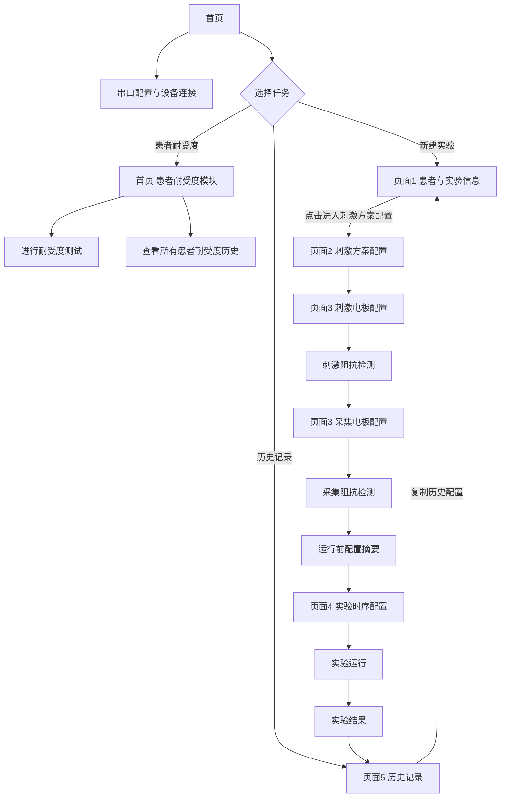
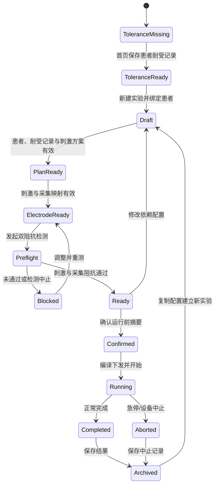

# EEG-tES 上位机产品需求文档（PRD）

版本号：V1.4.0（刺激范式、刺激模式与点位配置解耦版）

| 版本 | 日期 | 修订人 | 说明 |
| --- | --- | --- | --- |
| V1.0.0 | 2026-07-23 | Codex / 产品讨论稿 | 建立刺激方案前置、阻抗与耐受门禁、实验数据闭环 |
| V1.1.0 | 2026-07-23 | Codex / 产品讨论稿 | 按五页主流程重构；新增串口配置、五类刺激范式、阵列驱动点位、双阻抗检测、耐受测试、手动/自动时序和历史复用 |
| V1.2.0 | 2026-07-23 | Codex / 产品讨论稿 | 将耐受度测试升级为首页独立患者级模块；移除单次实验后段的耐受测试；新增耐受记录与实验引用规则 |
| V1.3.0 | 2026-07-29 | Codex / 产品讨论稿 | 拆分刺激范式与阵列层级；新增范式×阵列×点位角色矩阵、电流平衡规则、Sham 继承规则及点位动态槽位模型 |
| V1.4.0 | 2026-07-29 | Codex / 产品讨论稿 | 将刺激范式、刺激模式和具体点位选择解耦；普通模式固定 2 点，HD 模式支持 4–5 点，TI 模式固定 4 点 |

> 文档状态：产品与软硬件联合评审稿，尚未进入真实设备实现。
> 产品边界：本产品是 EEG 采集与经颅电刺激联合实验的上位机软件。当前项目是交互与流程原型，不构成医疗建议、治疗处方或医疗器械合规声明。
> 安全原则：电流、频率、脉宽、持续时间、阻抗、耐受上限、按键锁定时间和自动中止条件，不在前端写死。有效范围必须由设备能力、固件版本、刺激范式规则和研究协议共同决定。

---

# 一、产品概述

## 1.1 产品定位

EEG-tES 上位机用于控制一次完整的联合实验：

1. 连接并识别下位机；
2. 在患者进入实验前完成患者级耐受度测试并沉淀记录；
3. 建立患者与实验上下文，并引用该患者的耐受度记录；
4. 分别定义刺激范式、刺激模式和参数；
5. 分配刺激与采集电极；
6. 完成刺激、采集阻抗检测；
7. 配置实验时序并运行；
8. 保存、导出和追溯实验结果。

产品不是单纯的设备遥控器，而是连接“患者、方案、设备、检测、运行和结果”的实验工作台。

## 1.2 要解决的核心问题

| 问题 | 产品处理方式 |
| --- | --- |
| 操作者难以确认每个点位和硬件通道的角色 | 刺激范式定义波形，刺激模式定义点位数量，再在独立点位配置步骤中分配具体位置和通道 |
| 参数、点位、检测结果容易互相不一致 | 建立配置依赖指纹；上游配置变化后，下游结果自动失效 |
| 关键步骤可能遗漏 | 设置串口、患者耐受记录、配置、阻抗和二次确认门禁 |
| 实验中难以持续理解系统状态 | 同屏展示 EEG、滤波、设备、阻抗、阶段、计时和异常事件 |
| 历史实验难以复现 | 保存协议版本、患者、设备、检测结果、运行事件和数据文件 |

## 1.3 用户角色

产品只定义两个核心角色。

| 角色 | 描述 | 主要任务 |
| --- | --- | --- |
| 操作者 | 直接使用上位机的实验人员 | 建立实验、配置方案和电极、执行检测、运行实验、处理异常、导出结果 |
| 被实验的患者 | EEG 采集和经颅电刺激实际作用对象 | 提供身份与实验备注，在耐受测试中反馈感受，形成独立实验记录 |

## 1.4 产品目标

1. 让刺激方案先于点位配置，减少点位与硬件通道返工；
2. 让每一项检测都有明确前置条件、结果和失效规则；
3. 让真实设备能力决定可选模式和参数范围；
4. 让手动、自动两种运行方式可理解、可停止、可追溯；
5. 让历史配置可以复用，但历史检测结果不能被误当作本次实验结果。

## 1.5 本版本范围

### P0

- 串口配置与设备连接；
- 首页独立耐受度测试模块；
- 患者耐受度历史记录；
- 新建实验和患者录入；
- 导入历史配置；
- `tDCS / tACS / tRNS / tPCS / Sham` 五类刺激范式；
- 与刺激范式解耦的普通、HD、TI 三类刺激模式；
- 普通模式固定选择 2 个刺激点位；
- HD 模式选择 4–5 个刺激点位；
- TI 模式固定选择 4 个刺激点位；
- 刺激与采集电极配置；
- 刺激与采集阻抗检测；
- 在新建实验中引用患者已完成的耐受度记录；
- 运行前配置摘要；
- 手动、自动实验时序；
- EEG 实时信号与滤波控制；
- 运行、急停、结果保存和导出；
- 历史详情与复制配置。

### 暂不纳入 P0

- 自动推荐医学刺激处方；
- MRI 个体建模与电场优化；
- 闭环刺激算法；
- 任意自定义波形；
- 多靶点阵列；
- 真实权限、盲法审批和多中心同步；
- 在缺少设备资料时自行定义医疗安全上限。

---

# 二、信息架构与主流程

## 2.1 页面地图

| 页面 | 名称 | 核心任务 |
| --- | --- | --- |
| 首页 | 项目启动与患者耐受度 | 串口配置、患者耐受度测试、耐受度历史、新建实验、查看实验历史 |
| 页面 1 | 患者与实验信息 | 绑定患者，填写实验信息，选择是否复用历史配置 |
| 页面 2 | 刺激方案配置 | 分别选择刺激范式、刺激模式和参数，形成方案草稿 |
| 页面 3 | 电极配置与运行前检测 | 配置刺激/采集电极，完成双阻抗检测和摘要确认 |
| 页面 4 | 实验时序、运行与结果 | 配置手动/自动时序，运行实验，处理急停，保存和导出结果 |
| 页面 5 | 历史记录 | 查找患者与实验，查看协议和结果，复制配置建立新实验 |

> 命名修正：页面 3 的第二个弹窗命名为“运行前配置摘要”，不再与页面 4 的“实验时序配置”都叫“实验配置确认”。

## 2.2 主流程



## 2.3 页面间数据流

| 阶段 | 输入 | 主要处理 | 输出 |
| --- | --- | --- | --- |
| 首页 | 串口、设备、患者身份、耐受测试输入 | 连接设备；执行患者级耐受测试；沉淀和检索耐受记录 | DeviceSession 与 ToleranceRecord |
| 页面 1 | 患者、实验信息、历史配置、患者耐受记录 | 校验必填信息；创建并保存实验草稿；迁移历史配置；绑定患者耐受记录 | 已持久化的 Experiment Draft，并作为页面 2 的上下文 |
| 页面 2 | Experiment Draft、capability、刺激范式、刺激模式、参数 | 完成全部刺激配置；动态字段、组合能力、有效范围和波形校验 | 校验通过的 Stimulation Plan Draft |
| 页面 3 | 方案、头模点位、物理通道、耐受记录引用 | 电极映射、冲突检查、刺激/采集阻抗 | Preflight Results |
| 页面 4 | 已确认配置、时序 | 编译、下发、运行、采集事件和 EEG | Experiment Run 与 Result |
| 页面 5 | 患者、实验、协议和运行记录 | 检索、查看、复制 | 新实验草稿或导出文件 |

## 2.4 全局状态



## 2.5 全局依赖与失效规则

每个检测结果必须保存其依赖指纹。

| 被修改内容 | 自动失效内容 |
| --- | --- |
| 患者 | 当前实验的耐受记录引用、刺激阻抗、采集阻抗、运行前确认 |
| 设备或固件 | 参数兼容结果、全部阻抗、运行前确认；患者历史耐受记录本体不删除 |
| 刺激范式或关键参数 | 当前实验的耐受记录匹配关系、已编译程序和运行前确认；点位映射保留 |
| 刺激模式 | 按新模式重新校验刺激映射；不兼容映射、刺激阻抗和运行前确认失效 |
| 刺激点位、极性或通道 | 刺激阻抗、运行前确认；患者级耐受记录保持独立 |
| 采集点位、参考、地、采样率 | 采集阻抗、运行前确认 |
| 实验时序 | 运行前确认；不影响已完成的电极阻抗结果 |

失效后的结果显示为 `STALE`，不得仍显示为通过。

## 2.6 历史配置复用原则

历史配置可以复用：

- 刺激范式、刺激模式和参数；
- 刺激与采集点位；
- 极性、参考、地和硬件通道映射；
- 采集参数；
- 研究阈值或实验时序模板。

历史配置不能复用为本次通过结果：

- 刺激阻抗；
- 采集阻抗；
- 患者耐受记录本体；复制后必须按患者与刺激范式重新匹配并建立引用；
- 设备连接状态；
- 运行前确认；
- 上一次运行结果。

导入后所有物理检测状态均为“待检测”，历史数值只能在详情中标记为参考信息。

---

# 三、页面与功能需求

## 3.1 首页

### 3.1.1 页面内容

- 品牌和产品入口；
- 串口配置；
- 新建实验；
- 查看历史记录；
- 当前设备连接摘要。

### 3.1.2 串口配置

| 字段 | 类型 | 规则 |
| --- | --- | --- |
| 设备类型 | 选择器 | 决定适配器和 capability 解析方式 |
| 串口 | 选择器 | 展示系统可访问端口，支持刷新 |
| 波特率 | 选择器 | 默认值由设备适配器提供 |
| 连接/断开 | 按钮 | 防止重复连接；断开前确认当前无运行任务 |
| 设备摘要 | 只读 | 序列号、固件、通道数、支持范式、连接状态 |

连接成功后，上位机必须从下位机读取 capability，不能仅以串口打开成功作为“设备可用”。

### 3.1.3 患者耐受度模块

首页提供两个 Tab：

1. **进行耐受度测试**
   - 录入或选择患者；
   - 选择刺激范式；
   - 连接设备后按研究协议规定的步长逐步增减输出；
   - 记录最终耐受阈值、单位、患者反馈、测试人和备注；
   - 停止、异常和患者不适必须立即停止输出并写入事件；
   - 保存后形成独立 `ToleranceRecord`，不直接依附某一次实验。
2. **所有患者的耐受度历史记录**
   - 按患者 ID、姓名、刺激范式、测试时间和测试人检索；
   - 展示阈值、单位、反馈、状态、备注、设备/固件及记录 ID；
   - 允许查看详情，不允许覆盖原记录；再次测试生成新记录。

耐受度记录最少字段：

| 字段 | 必填 | 说明 |
| --- | --- | --- |
| recordId | 是 | 系统生成，全局唯一 |
| patientId / patientName | 是 | 对应被实验患者 |
| paradigm | 是 | 记录适用的刺激范式 |
| threshold / unit | 是 | 最终耐受阈值及单位 |
| testedAt | 是 | 测试完成时间 |
| operatorId / operatorName | 是 | 实际测试人员 |
| feedback | 是 | 患者主观反馈 |
| note | 否 | 皮肤感受、停止原因、特殊说明 |
| device / firmware / protocolVersion | 正式版必填 | 追踪测试条件 |
| status | 是 | 完成、未通过或中止 |

### 3.1.4 耐受记录与新实验的关系

- 新建实验时先按患者 ID 查询已完成耐受记录；
- 选择刺激范式后，再匹配同一患者、同一刺激范式的记录；
- 匹配成功后，实验保存 `toleranceRecordId` 和必要快照，不复制或修改原记录；
- 未找到匹配记录时，阻止进入电极与运行流程，并引导返回首页完成测试；
- **本版本暂不实现有效期判断**：不因记录时间自动失效，只提示测试时间；有效期、复测周期和跨设备复用规则列入 TBD。

### 3.1.5 业务规则

- 未连接设备时可以创建实验草稿和浏览历史；
- 进行耐受测试、进入阻抗或运行前必须有有效设备会话；
- 切换设备后重新执行方案兼容性校验；
- 运行中禁止切换串口或设备；
- 通信异常必须显示原始错误码、时间和建议动作。

## 3.2 页面 1：患者与实验信息

### 3.2.1 页面目标

建立一次唯一实验上下文，并绑定明确患者。

### 3.2.2 字段

| 字段 | 必填 | 说明 |
| --- | --- | --- |
| 患者 ID | 是 | 可以从已有系统查询，也可以临时生成 |
| 姓名/显示名 | 按数据策略 | 原型可展示；正式产品按隐私策略处理 |
| 性别、年龄/出生日期 | [待确认] | 是否需要取决于研究方案 |
| 实验 ID | 是 | 系统生成且全局唯一 |
| 实验名称 | 是 | 便于历史检索 |
| 实验类型 | 是 | EEG+tES 为 P0 默认 |
| 操作者 | 是 | 来自登录身份或本地操作者配置 |
| 实验备注 | 否 | 文本 |
| 配置来源 | 是 | 空白新建 / 导入历史配置 |

### 3.2.3 导入历史配置

1. 根据患者、实验名、时间、刺激范式筛选历史；
2. 显示历史配置版本、设备兼容性和可复用范围；
3. 选择后生成新的实验草稿，不覆盖历史实验；
4. 显示已导入内容清单；
5. 对不兼容字段显示“已转换、需确认、不可用”；
6. 将历史阻抗、耐受和运行状态清零为待执行。

### 3.2.4 操作与跳转

- 页面主按钮文案为“进入刺激方案配置”；
- 患者未绑定、实验必填信息不完整或数据校验失败时，按钮不可用，并在对应字段旁显示原因；
- 点击按钮时，系统先保存当前 `Experiment Draft`，成功后携带 `experimentId` 进入页面 2；
- 保存失败时保留当前填写内容、停留在页面 1，并明确提示失败原因；
- 从历史记录复制配置时，也必须先回到页面 1 确认患者和实验上下文，再点击该按钮进入页面 2，不允许绕过刺激方案检查直接进入电极配置。

### 3.2.5 验收

- 不绑定患者不能进入页面 2；
- 一个实验只能绑定一个患者；
- 修改患者后，页面 3 的检测结果全部失效；
- 复制历史配置产生新的实验 ID 和配置版本。
- 点击“进入刺激方案配置”后，已保存的实验草稿能够在页面 2 被完整恢复；
- 页面 1 不提供直接进入电极配置或阻抗检测的入口。

## 3.3 页面 2：刺激方案配置

### 3.3.1 页面目标

本页承载本次实验的全部刺激方案配置，包括刺激范式、刺激模式、范式参数、模式特有的通道参数、波形预览、设备/协议限制、校验和方案草稿保存。配置完成后，再到页面 3 决定具体选择哪些头模点位及其物理通道映射。

页面 2 从页面 1 已保存的 `Experiment Draft` 进入；页面 3 不再提供刺激参数配置入口，也不得绕过本页直接开始电极配置或阻抗检测。

本产品采用三层独立模型：

1. **刺激范式**：定义刺激随时间如何变化，例如 tDCS、tACS、tRNS、tPCS、Sham；
2. **刺激模式**：定义本次刺激需要多少个刺激点位，即普通模式、HD 模式、TI 模式；
3. **点位配置**：在页面 3 将具体头模位置映射到刺激模式要求的点位槽位。

刺激范式不决定点位数量，具体点位也不绑定某一种刺激范式。只有设备 capability 或研究协议明确不支持某个“范式 × 模式”组合时，系统才禁用该组合。

### 3.3.2 配置顺序

1. 选择刺激范式；
2. 独立选择刺激模式；
3. 填写范式参数；
4. 查看设备和协议限制；
5. 校验并保存完整的 `Stimulation Plan Draft`；
6. 仅当全部必填配置和硬限制校验通过后，开放“进入电极配置与检测”；
7. 进入页面 3 分配刺激点位。

### 3.3.3 刺激范式

| 范式 | 说明 |
| --- | --- |
| tDCS | 恒定直流刺激，通常包含缓升、平台和缓降 |
| tACS | 正弦交流刺激 |
| tRNS | 随机噪声刺激 |
| tPCS | 脉冲电流刺激 |
| Sham | 用于研究对照的伪刺激，继承所关联真实方案的关键参数 |

### 3.3.4 刺激模式

刺激模式只规定点位数量和通道拓扑，不规定具体头模位置，也不替代刺激范式。

| 刺激模式 | 点位数量 | 页面 3 选择规则 | 典型硬件要求 |
| --- | ---: | --- | --- |
| 普通模式 | 固定 2 个 | 恰好选择 2 个不重复刺激点位 | 至少 2 个可用刺激连接 |
| HD 模式 | 4–5 个 | 至少选择 4 个，最多选择 5 个不重复刺激点位 | 至少 4 个可用刺激连接；选择第 5 点时设备必须声明支持 |
| TI 模式 | 固定 4 个 | 恰好选择 4 个不重复刺激点位 | 至少 4 个可用刺激连接，并支持 TI 模式所需的通道同步 |

> 本文中的“TI 模式”是产品信息架构中的四点位刺激模式标识，用于定义点位数量和硬件通道组合；它不替代“刺激范式”字段。最终协议名称和硬件语义以设备 capability 为准。

产品文案统一使用“刺激模式”，不再使用含义不清的“阵列与参数”或“范式二级模式”。

### 3.3.5 范式、模式与点位的独立关系

三层数据必须分别保存：

| 层级 | 核心字段 | 决定内容 | 不决定内容 |
| --- | --- | --- | --- |
| 刺激范式 | `paradigmId` | 波形类型和范式参数 | 点位数量、具体点位 |
| 刺激模式 | `stimulationModeId` | 点位数量范围、逻辑通道数量 | 具体点位、时间波形 |
| 点位配置 | `stimulationPointMappings[]` | 头模位置到逻辑/物理通道的映射 | 刺激范式 |

产品规则：

- 切换刺激范式但刺激模式未变时，已选择点位默认保留；仅范式参数、波形预览和依赖该范式的检测结果失效；
- 切换刺激模式时，系统按新模式重新校验点位数量；可兼容的点位保留，超过上限的点位必须由操作者确认删除，不得静默清空；
- 操作者可以先完成范式和模式配置，再到页面 3 选择具体点位；
- 点位数量校验只读取刺激模式，不根据 tDCS、tACS、tRNS、tPCS 或 Sham 分别写死；
- 设备 capability 仍可限制某个范式和模式是否能够组合，但不能把两者合并为一个字段；
- Sham 如引用已有真实方案，应继承来源方案的刺激模式和点位配置，并在本次实验中保持只读。

#### P0 模式支持

| 刺激模式 | 最少点位 | 最多点位 | P0 决策 |
| --- | ---: | ---: | --- |
| 普通模式 | 2 | 2 | 启用 |
| HD 模式 | 4 | 5 | 设备 capability 支持时启用 |
| TI 模式 | 4 | 4 | 设备 capability 支持时启用 |

### 3.3.6 范式参数矩阵

范式参数与刺激模式分开配置。刺激模式只在需要时追加“通道分配、同步关系、电流平衡”等模式参数，不改变范式本身的核心参数。

| 范式 | 必要参数 | 条件参数 |
| --- | --- | --- |
| tDCS | 目标电流、总时长、缓升、缓降 | 极性/方向配置、平台时长 |
| tACS | 幅值、频率、相位、总时长、缓升、缓降 | 直流偏置、幅值口径 |
| tRNS | 幅值、低截止、高截止、总时长、缓升、缓降 | 噪声分布、随机种子 |
| tPCS | 脉冲幅值、频率、脉宽或占空比、总时长、缓升、缓降 | 波形、极性、相位 |
| Sham | 模拟来源、短刺激时长、总等待时长、缓升、缓降 | 幅值、频率、相位、重复次数、尾段刺激 |

| 刺激模式 | 追加配置 |
| --- | --- |
| 普通模式 | 两个逻辑刺激通道的角色、方向或相位关系 |
| HD 模式 | 4–5 个逻辑通道的分配、电流方向与总电流平衡 |
| TI 模式 | 4 个逻辑通道的配对关系、频率/相位同步及设备要求的平衡参数 |

### 3.3.7 参数最小值与最大值

文档不预设未经验证的医学数值。每个参数使用下列结构：

```text
effectiveMin = max(deviceMin, firmwareMin, paradigmMin, protocolMin)
effectiveMax = min(deviceMax, firmwareMax, paradigmMax, protocolMax)
```

| 字段 | 说明 |
| --- | --- |
| 参数名与单位 | 例如 current_mA、frequency_Hz、duration_ms |
| deviceMin / deviceMax | 下位机物理能力 |
| firmwareMin / firmwareMax | 当前固件实现范围 |
| paradigmMin / paradigmMax | 范式定义允许范围 |
| protocolMin / protocolMax | 研究方案设置的更严格范围 |
| step | 控件步长，不等于医学推荐值 |
| precision | 下位机支持的小数精度 |
| effectiveMin / effectiveMax | 页面实际允许范围 |
| limitSource | 本次生效边界的来源 |

页面应同时显示有效范围和限制来源。若交集为空，方案状态为 `BLOCKED`。

### 3.3.8 参数波形示意图

参数区下方展示由当前表单值实时计算的波形示意图，用于帮助操作者理解参数之间的关系。该示意图完全在上位机前端生成，不连接下位机、不发送控制指令，也不代表设备实测输出。

#### 基本展示

| 元素 | 规则 |
| --- | --- |
| 横轴 | 时间；根据预览窗口自动使用 `ms` 或 `s`，同时标注预览窗口与完整刺激时长 |
| 纵轴 | 单位 `mA`；按范式语义决定显示电流幅值或带符号电流，不使用一套正负刻度覆盖所有范式 |
| 波形 | 修改任一相关参数后立即重新计算，不需要额外点击“生成” |
| 关键参数 | 在图侧同步显示 3–4 个决定波形形态的参数及单位 |
| 说明 | 固定标识“参数示意图 · 根据当前配置实时生成” |

#### 各范式示意内容

| 范式 | 示意图变化依据 | 关键参数 |
| --- | --- | --- |
| tDCS | 目标电流决定平台高度；缓升、缓降和总时长决定折线各阶段宽度 | 目标电流、总时长、缓升、缓降 |
| tACS | 峰值振幅决定纵向高度；频率决定周期密度；相位决定起始位置；另以完整时程包络展示缓升、稳定刺激和缓降 | 峰值振幅、峰峰值、频率、相位、总时长、缓升/缓降 |
| tRNS | 幅值决定纵向范围；频带决定噪声变化特征 | 幅值、低/高截止、总时长 |
| tPCS | 脉冲幅值、频率、脉宽或占空比共同决定脉冲序列 | 幅值、频率、脉宽、占空比 |
| Sham | 短刺激、缓升、缓降和总等待时长共同形成开始阶段与等待阶段 | 模拟幅值、短刺激、总等待、缓升/缓降 |

#### 电流符号规则

- tDCS 的“目标电流”字段表示非负电流幅值，页面输入范围不包含负数；
- tDCS 方案级示意图纵轴从 `0` 到目标电流，只显示缓升、平台和缓降，不显示负值；
- tDCS 电流方向由点位配置中的阳极 `A` 与阴极 `C` 表达，不通过目标电流字段的正负号表达；
- 只有 tACS、零均值 tRNS 等波形本身跨越零线时，方案级示意图才显示正负纵轴；
- tACS 的“峰值振幅（基线→峰值）”字段采用 peak-to-baseline 定义。例如输入 `1 mA` 时，瞬时电流范围为 `−1 mA` 至 `+1 mA`，峰峰值为 `2 mA p-p`；
- tACS 同时展示两种视图：代表窗口用于观察正弦频率、相位及瞬时正负变化，完整时程包络用于观察缓升、稳定刺激和缓降；
- 若下位机协议采用峰峰值而非峰值振幅作为输入，能力描述必须显式声明 `amplitudeConvention`，上位机应先换算后再生成预览和下发参数；
- 若未来展示具体物理通道电流，必须在标题中标明通道与极性，并采用设备协议定义的符号约定，避免与方案级“幅值”混淆。

#### 与下位机的边界

- 页面 2 的示意图只读取当前页面参数状态；
- 切换范式、刺激模式或参数时只更新前端示意图和本地配置状态，不触发串口或网络通信；
- 点击正式下发、进入检测或开始实验后，才按照设备协议与下位机交互；
- 若未来增加设备输出回传，应使用“实测波形”独立区域展示，并与本示意图通过标题、颜色和数据来源明确区分；
- 普通、HD、TI 都是点位数量/通道拓扑模式，不是独立时间波形；波形预览始终由刺激范式生成，模式相关的通道分配与平衡信息单独展示。

### 3.3.9 校验

- 范式必须被设备和固件支持；
- 范式与刺激模式组合必须存在于 capability 支持矩阵；
- 刺激模式所需通道数不得超过可用刺激通道；
- 系统必须能够为当前组合生成完整点位槽位 schema；
- 参数必须处于有效范围；
- 缓升 + 缓降不得超过总时长；
- 多通道总电流和回流平衡满足设备规则；
- tPCS 未明确单相/双相脉冲和角色规则时禁止进入点位配置；
- Sham 必须绑定来源真实方案，并继承其刺激模式与点位配置；
- 任一硬限制失败时禁止进入页面 3；
- 只有 `Experiment Draft` 已保存且 `Stimulation Plan Draft` 状态为 `READY` 时，页面 3 才可进入；
- 进入页面 3 后若返回修改刺激方案，重新保存的方案版本必须使既有刺激/采集阻抗与运行前摘要失效，要求重新完成页面 3 校验。

## 3.4 页面 3：刺激电极配置

### 3.4.1 页面目标

根据页面 2 的刺激模式约束，把抽象的点位槽位映射为具体头模点位和下位机刺激通道。

### 3.4.2 共享头模规则

- 使用固定 20 点静态头模；
- 刺激和采集页使用同一头模尺寸、位置和坐标；
- 初始未分配点位为白色；
- 新选择点位为蓝色；
- 阻抗完成后按结果语义色显示；
- 切换刺激/采集角色不得移动头模或点位；
- 点击一个点位不得改变其他点位的状态。

### 3.4.3 刺激点位

页面根据刺激模式生成点位槽位。槽位数量由模式决定，具体头模点位由操作者独立选择。

| 刺激模式 | 点位槽位 | 选择规则 |
| --- | --- | --- |
| 普通模式 | `P1`、`P2` | 恰好 2 个点位；同一点不可重复选择 |
| HD 模式 | `HD1–HD4` 必选、`HD5` 可选 | 4 个点位即可满足数量要求，第 5 个点位为可选；最多 5 个 |
| TI 模式 | `TI1–TI4` | 恰好 4 个点位；根据设备 schema 形成两个通道配对 |

点位数量满足后，系统再根据刺激范式、设备 capability 和研究协议显示必要的通道角色、方向、相位或电流分配字段。点位选择本身不因范式不同而改变数量规则。

点位槽位至少包含：

| 字段 | 类型 | 必填 | 说明 | 示例 |
| --- | --- | --- | --- | --- |
| slotId | String | 是 | 当前阵列内唯一槽位 ID | `STIM_A` |
| roleType | Enum | 否 | 设备或协议要求的方向、回流、相位或通道角色 | `CHANNEL_A` |
| displayLabel | String | 是 | 界面展示名称 | `点位 1` |
| pointId | String | 否 | 已映射头模点位 | `F3` |
| physicalChannelId | String | 否 | 下位机物理刺激通道 | `STIM_CH_01` |
| amplitudeMa | Decimal | 条件必填 | 当前槽位电流幅值 | `1.0` |
| phaseDeg | Decimal | 条件必填 | tACS 等交流模式的相位 | `180` |
| currentDirection | Enum | 条件必填 | 固定方向模式的电流方向 | `SOURCE` |
| lockedBySource | Boolean | 是 | 是否由 Sham 来源方案锁定 | `false` |

### 3.4.4 检查规则

| 检查 | 规则 | 反馈 |
| --- | --- | --- |
| 数量 | 普通模式为 2；HD 模式为 4–5；TI 模式为 4 | 超过上限立即阻止；不足时点击下一步弹窗提示 |
| 角色 | 点位数量由模式校验；方向、相位和通道角色按设备 schema 单独校验 | 冲突时阻断并高亮相关点和缺失字段 |
| 距离 | 使用设备/研究协议提供的最小距离 | 不满足时显示关联点和要求来源 |
| 重复占用 | 同一点不能同时承担冲突角色 | 阻断 |
| 硬件通道 | 点位必须映射到可用刺激端口 | 通道冲突时阻断 |
| 电流平衡 | 双通道和多通道均执行设备定义的平衡校验；多通道显示每通道值及总和 | 显示差额、相关通道和修复建议 |
| Sham 继承 | 刺激模式、点位和相关角色必须与来源方案一致 | 禁止直接修改，引导返回来源方案 |

#### 点位选择交互

- 点击未分配点位，只更新当前正在编辑的槽位；
- 已完成检测的点位仍可重新选择；重新选择只使依赖该槽位的检测结果失效；
- 固定数量槽位达到上限后，再选新点位时替换当前槽位，不批量清空其他点位；
- 切换刺激范式但模式未变时保留点位，只重新校验范式相关参数和通道角色；
- 切换刺激模式后按新数量规则重新校验点位；兼容点位优先保留，不得批量清空；
- 任意一次点位变化均重新执行数量、角色、距离、通道冲突和电流平衡校验。

### 3.4.5 刺激阻抗检测

前置条件：

- 设备已连接且空闲；
- 方案、阵列、角色和物理通道映射有效；
- 当前无其他检测或运行任务；
- 下位机返回 `PREPARE_ACCEPTED`。

操作：

1. 点击“确认刺激电极并检测阻抗”；
2. 上位机编译当前刺激映射；
3. 下发阻抗检测命令；
4. 逐通道显示检测中和结果；
5. 检测中显示“停止阻抗检测”；
6. 完成后保存结果和依赖指纹。

停止规则：

- 点击停止后发送 `ABORT_MEASUREMENT`；
- 收到确认前保持“正在停止”；
- 本轮未完成结果标记为 `ABORTED/UNKNOWN`；
- 若存在与当前指纹一致的上一次完整结果，可在详情中保留，但不能用本轮部分数据覆盖；
- 点位或映射变化后旧结果标记 `STALE`。

## 3.5 页面 3：采集电极配置

### 3.5.1 页面目标

在不占用刺激点位和刺激硬件通道的前提下，配置 EEG 采集计划。

### 3.5.2 字段

| 字段 | 默认/规则 |
| --- | --- |
| 采集点位 | 从剩余可用点位选择 |
| 参考电极 | 必填；可选方式由采集设备决定 |
| 地电极 | 必填；不得与冲突角色重复 |
| 采样率 | P0 默认 500 Hz；允许范围来自采集设备 capability |
| 高通 | 初始值来自协议或设备模板 |
| 低通 | 初始值来自协议或设备模板 |
| 陷波 | 初始值来自协议或设备模板 |
| 硬件通道 | 系统自动建议，允许在规则范围内调整 |

### 3.5.3 业务规则

- 已被刺激占用的点位默认不可选择为采集点；
- 如硬件明确支持复用，需由专门 capability 和协议规则开放，P0 不默认允许；
- 采集通道数不得超过设备能力；
- 参考、地和采集点不能产生硬件端口冲突；
- 页面 2 或刺激点位改变后，重新检查采集可用点位和通道。

### 3.5.4 采集阻抗检测

流程与刺激阻抗相同，但命令和结果类型独立：

- 点击“确认采集电极并检测阻抗”；
- 检测中支持停止；
- 逐点显示接触结果；
- 结果绑定采集点位、参考、地、采样率、设备和时间；
- 修改采集配置只使采集阻抗和运行前摘要失效，不应批量改变刺激点状态。

## 3.6 页面 3：运行前门禁

### 3.6.1 页面职责

页面 3 不再执行耐受度测试，只负责：

- 刺激电极映射与刺激阻抗检测；
- 采集电极映射与采集阻抗检测；
- 检查当前患者是否已匹配首页保存的耐受度记录；
- 在双阻抗通过且耐受记录匹配后，开放运行前配置摘要。

### 3.6.2 耐受记录引用规则

- 页面只展示所引用耐受记录的记录 ID、刺激范式、阈值、测试时间、测试人和患者反馈；
- 页面不得修改或覆盖耐受记录；
- 更换患者或刺激范式后重新匹配耐受记录；
- 找不到匹配记录时，阻止进入运行前配置摘要，并引导操作者返回首页完成耐受度测试；
- 当前版本不校验有效期，但必须保留测试时间，并在后续版本接入有效期、复测周期和跨设备复用规则。

## 3.7 页面 3 弹窗 2：运行前配置摘要

### 3.7.1 页面目标

在进入实验时序配置前，对本次实验的身份、方案、物理映射和检查结果进行二次确认。

### 3.7.2 摘要内容

1. 患者与实验信息；
2. 设备、序列号和固件；
3. 刺激范式、刺激模式和参数；
4. 刺激点位、角色和硬件通道；
5. 采集点位、参考、地、采样率和滤波默认值；
6. 刺激阻抗结果；
7. 采集阻抗结果；
8. 所引用耐受记录的记录 ID、阈值、测试时间、测试人和患者反馈；
9. 警告、阻断项及其来源；
10. 配置版本和最后更新时间。

### 3.7.3 操作

- 返回修改；
- 确认并进入页面 4；
- 只要存在 `BLOCKED / STALE / UNKNOWN` 必要项，确认按钮不可用；
- 确认后生成可审计的配置快照；
- 页面 4 修改时序不会改变该物理配置快照，但会产生新的运行配置版本。

## 3.8 页面 4：实验时序配置

### 3.8.1 手动模式

手动模式的采集期和刺激期均由操作者显式开始。

建议状态：

1. 待机；
2. 点击“开始采集”；
3. 采集完成或停止；
4. 等待操作者点击“开始刺激”；
5. 刺激完成；
6. 进入结果。

可配置项：

- 采集期时长和单位；
- 刺激期时长和单位；
- 是否记录刺激前基线；
- 是否保留刺激后的恢复采集；
- 阶段间是否自动进入等待。

### 3.8.2 自动模式

自动模式一次启动后按时序自动完成。

可配置项：

- 采集期；
- 刺激期；
- 恢复期（如协议需要）；
- 循环次数；
- 循环间隔；
- 中止策略。

### 3.8.3 时长规则

- 时长内部统一存储为毫秒；
- 输入支持 `s / min`，切换单位时自动换算且实际时长不变；
- 页面展示值与内部计时值分离，内部统一换算为毫秒执行；
- 运行开始后锁定时序输入；
- 最大值由设备、协议和数据存储能力共同限制；
- 循环次数必须在设备与研究协议允许范围内；
- 页面底部时序概览同步显示真实配置。

## 3.9 页面 4：实验运行

### 3.9.1 EEG 实时信号

- 只展示已选择的采集通道；
- 显示通道名、量纲、时间窗和信号状态；
- 支持在线插值预览开关（如存在）；
- 高通、低通和陷波分别提供开关；
- 三个滤波开关均可独立开启或关闭，当前状态必须明确显示，不能只作为静态标签；
- 滤波参数和开关变化写入运行事件；
- 原始数据保存策略与显示滤波策略分离。

### 3.9.2 运行监控

| 信息 | 说明 |
| --- | --- |
| 设备 | 连接、通信、固件和错误码 |
| 阻抗/接触 | 当前可用监测值及其时间 |
| 阶段 | 待机、采集、刺激、恢复、完成、中止 |
| 运行时间 | 本次运行真实累计时间 |
| 时序 | 当前阶段、已完成阶段、剩余阶段 |
| 刺激 | 当前输出值、范式和运行状态 |
| EEG | 通道数据、掉线和伪迹状态 |
| 异常 | 时间、来源、等级和处理结果 |

### 3.9.3 紧急停止

- 未运行时不可点击；
- 运行中始终可见且可点击；
- 点击后立即发 `ABORT`，进入“正在停止”；
- 收到下位机确认后冻结运行计时并保存中止点；
- 手动模式中止后，可以按设备和协议规则从当前流程继续或重新开始当前阶段；
- 自动模式中止后不从中断点续跑，只能重新开始一次新的自动运行；
- 重新开始必须生成新的 Run ID，旧中止记录不可覆盖。
- 正常完成后显示“再进行一次”，使用当前配置创建新的 Run ID 并再次运行；
- 同一 Experiment 可以包含多个 Run，每次运行独立保存开始时间、结束时间、状态、时长、循环和异常事件。

### 3.9.4 设备事件

至少处理：

- `DEVICE_CONNECTED / DISCONNECTED`；
- `PREPARE_ACCEPTED / REJECTED`；
- `IMPEDANCE_PROGRESS / COMPLETE / ABORTED`；
- `TOLERANCE_VALUE_APPLIED / ABORTED`；
- `RUN_STARTED / PHASE_CHANGED / COMPLETE / ABORTED`；
- `HARDWARE_FAULT / SAFETY_LIMIT / COMM_TIMEOUT`。

## 3.10 页面 4：实验结果

### 3.10.1 结果状态

- 已完成；
- 已中止；
- 设备异常结束；
- 数据不完整；
- 待补充备注。

### 3.10.2 保存内容

- 患者与实验 ID；
- 配置版本和运行配置版本；
- 设备、固件和串口会话摘要；
- 刺激范式、刺激模式、参数和点位；
- 采集计划和滤波设置；
- 刺激/采集阻抗结果；
- 所引用患者耐受记录的 ID 和必要快照；
- 阶段开始/结束时间；
- 操作者操作；
- 急停和异常事件；
- EEG 数据及其校验信息；
- 完成或中止原因。

### 3.10.3 导出

导出至少包含：

- 实验摘要；
- 配置 JSON；
- 事件日志；
- 刺激/采集阻抗记录；
- 患者耐受记录引用及快照；
- EEG 数据文件；
- 文件清单与校验值；
- 协议/配置版本号。

格式、命名和数据脱敏方式见待确认项。

## 3.11 页面 5：历史记录

### 3.11.1 列表字段

- 实验 ID；
- 患者 ID/显示名；
- 实验人员；
- 实验时间；
- 刺激范式和刺激模式；
- 配置/协议版本；
- 设备；
- 最近一次运行状态；
- Run 次数；
- 实验数据摘要；
- 导出状态。

### 3.11.2 详情

- 页面 3 运行前配置摘要；
- 患者信息、实验人员和实验基本信息；
- 页面 4 时序和每次 Run 的实际执行结果；
- 每次 Run 的 Run ID、开始/结束时间、状态、时长、循环、急停和异常事件；
- 刺激/采集阻抗结果和患者耐受记录引用；
- EEG 数据文件、通道、采样率、数据量和校验信息；
- 协议版本和配置变更历史。

### 3.11.3 复制历史配置

- 复制后进入页面 1；
- 生成新的实验 ID；
- 默认沿用方案、点位、阈值和时序；
- 患者可保留或重新选择；
- 所有物理检测结果和运行状态重置；
- 若当前设备不兼容，在页面 2 显示转换和阻断项。

---

# 四、上位机与下位机落地方案

## 4.1 分工原则

| 上位机负责 | 下位机负责 |
| --- | --- |
| 患者、实验和配置管理 | 能力声明与真实硬限制 |
| 刺激范式、刺激模式和参数编辑 | 波形生成、定时和通道输出 |
| 点位到物理通道映射 | 物理通道控制和电流平衡 |
| 流程门禁和依赖失效 | 硬件安全互锁 |
| 运行监控和数据归档 | 实时测量、故障检测和安全停止 |

上位机校验不能代替下位机安全校验。所有 `PREPARE / ARM / START` 命令，下位机都必须再次验证。

## 4.2 Capability 数据

连接后下位机至少返回：

```json
{
  "deviceModel": "string",
  "serialNumber": "string",
  "firmwareVersion": "string",
  "stimChannelCount": 0,
  "eegChannelCount": 0,
  "supportedParadigms": [],
  "supportedMontages": [],
  "parameterSchemas": {},
  "impedanceMeasurement": {},
  "filterCapabilities": {},
  "safetyLimits": {},
  "protocolVersion": "string"
}
```

页面 2 根据 `parameterSchemas` 动态渲染字段、单位、精度、步长和边界。

## 4.3 编译和下发

1. 上位机生成配置草稿；
2. 校验患者、方案、阵列、点位和物理通道；
3. 编译为设备协议对象；
4. 发送 `PREPARE`；
5. 下位机校验并返回接受或拒绝原因；
6. 患者耐受记录已匹配且刺激/采集阻抗通过后发送 `ARM`；
7. 运行时发送 `START`；
8. 任意时间可发送 `ABORT`；
9. 下位机持续回传状态和事件。

## 4.4 核心数据对象

| 对象 | 关键字段 |
| --- | --- |
| Patient | patientId、displayName、source、privacyLevel |
| Experiment | experimentId、patientId、operatorId、type、status |
| DeviceSession | device、serial、firmware、capabilityHash、connection |
| StimulationPlan | paradigm、mode、parameters、schemaVersion |
| ElectrodeMap | position、role、polarity、logicalChannel、hardwareChannel |
| AcquisitionPlan | positions、reference、ground、sampleRate、filters |
| ImpedanceResult | type、channels、values、thresholdSource、fingerprint、status |
| ToleranceRecord | recordId、patientId、paradigm、threshold、unit、testedAt、operatorId、feedback、note、device、firmware、protocolVersion、status |
| ExperimentToleranceReference | experimentId、toleranceRecordId、snapshot、matchedAt |
| RunConfig | mode、phases、cycles、fingerprint |
| ExperimentRun | runId、startedAt、endedAt、status、abortReason |
| RunEvent | timestamp、source、code、severity、payload |
| ResultArtifact | type、path、checksum、formatVersion |

## 4.5 幂等、恢复与审计

- 每次命令包含 commandId；
- 重复 commandId 不重复执行；
- 上位机断线重连后查询下位机真实状态；
- 未知状态不得直接显示成功；
- 关键配置、检测、开始、急停、导出都写审计事件；
- 运行记录不可被新运行覆盖。

---

# 五、异常与边界

## 5.1 全局反馈等级

| 等级 | 含义 | 能否继续 |
| --- | --- | --- |
| PASS | 当前条件满足 | 是 |
| WARNING | 存在建议或可确认风险 | 视规则而定 |
| BLOCKED | 必要条件缺失或违反硬限制 | 否 |
| STALE | 结果依赖发生改变 | 否 |
| UNKNOWN | 尚未获取真实状态 | 否 |
| ABORTED | 操作者或设备中止当前动作 | 需重新确认 |

## 5.2 关键异常

| 异常 | 产品行为 |
| --- | --- |
| 串口占用/无权限 | 保留输入，显示端口和系统错误，不进入已连接 |
| capability 获取失败 | 禁止真实检测和运行，可保存草稿 |
| 设备中途断开 | 下位机安全停止；上位机记录异常并查询恢复状态 |
| 参数范围交集为空 | 页面 2 阻断，列出冲突来源 |
| 点位不足 | 点击下一步时弹窗说明缺少数量和角色 |
| 点位超过 | 选择时立即阻止或要求替换，不允许无效草稿进入检测 |
| 通道冲突 | 同时高亮点位、逻辑通道和硬件通道 |
| 阻抗停止 | 本轮标记中止/未知，保留事件 |
| 患者无匹配耐受记录 | 阻止进入运行前摘要，返回首页完成患者级耐受度测试 |
| 患者或刺激范式改变 | 当前实验耐受记录引用失效，按患者与范式重新匹配 |
| 运行急停 | 冻结计时，保存中止原因；手动可按规则继续，自动必须新 Run 重跑 |
| 导出失败 | 结果仍保存，导出任务可重试 |

---

# 六、验收标准

## 6.1 主流程

1. 首页可以配置串口、连接设备、新建实验、进入历史，并在两个 Tab 中完成患者耐受度测试或查看全部患者耐受记录；
2. 页面 1 可以录入患者或导入历史配置；患者与实验必填信息有效后，点击“进入刺激方案配置”先保存 `Experiment Draft`，再进入页面 2；
3. 页面 2 承载完整刺激方案配置，只显示当前设备支持的范式、模式和参数；全部硬限制校验通过并保存 `Stimulation Plan Draft` 后才可进入页面 3；
4. 页面 3 根据刺激模式限制点位数量：普通模式 2 个、HD 模式 4–5 个、TI 模式 4 个；
5. 刺激与采集阻抗均可开始、显示进度、停止和重新检测；
6. 新建实验必须引用当前患者、当前刺激范式对应的已完成耐受记录；页面 3 不再重复执行耐受测试；
7. 页面 3 摘要完整展示患者、方案、电极、双阻抗结果和耐受记录引用；
8. 页面 4 手动模式要求分别启动采集和刺激；
9. 页面 4 自动模式一次启动后按循环配置运行；
10. 急停后保存真实中止状态；自动模式重新运行生成新 Run ID；
11. 正常完成后可点击“再进行一次”，同一 Experiment 下新增独立 Run 记录；
12. 时长支持 `s / min` 切换且实际运行时长保持一致；
13. 高通、低通和陷波可以分别开启或关闭并记录状态；
14. 结果可以保存和导出；
15. 历史详情可查看实验人员、患者、实验数据及多次 Run 结果，并可复制为新实验。

## 6.2 配置与状态

- 点击一个点位不改变其他点位；
- 刺激和采集共享头模坐标；
- 仅修改刺激范式且刺激模式未变时保留点位映射，但刺激阻抗、运行前确认和耐受记录匹配关系按依赖规则失效；
- 修改刺激模式后按新模式重新校验点位数量，不兼容的点位映射必须由操作者处理；
- 修改采集设置只使采集阻抗和运行前确认失效；
- 历史配置导入后，所有物理检测状态为待检测；
- 检测和运行中的停止按钮有明确等待和完成状态；
- 未运行时紧急停止不可点击；
- 运行时紧急停止始终可操作。

## 6.3 设备协议

- capability 决定页面字段和范围；
- `PREPARE` 被拒绝时不允许 `ARM/START`；
- 重复命令不会重复输出；
- 断线重连后以上位机查询到的下位机状态为准；
- 所有完成状态均来自下位机事件或明确的模拟器事件，不由前端计时器伪造。

## 6.4 数据

- 患者、实验、配置版本、设备会话、Run ID 和导出文件可以互相追踪；
- 完成和中止运行都保留事件；
- 导出文件包含格式版本和校验值；
- 历史记录不得被复制操作覆盖；
- 原始 EEG 与显示滤波结果能够区分。

---

# 七、待确认项

以下内容会阻塞真实设备实现，必须由产品、设备、算法、研究和风险人员共同确认。

| 编号 | 待确认项 | 建议责任方 |
| --- | --- | --- |
| TBD-01 | 五类刺激范式与普通、HD、TI 三类刺激模式的真实设备支持矩阵 | 设备/固件 |
| TBD-02 | 每个参数的单位、最小值、最大值、精度和步长 | 设备/算法/研究 |
| TBD-03 | HD 模式 4 点与 5 点的具体硬件拓扑、电流分配和第 5 点启用条件 | 设备/算法 |
| TBD-04 | 多靶点模式的最大通道数、极性组合和总电流平衡 | 设备/算法 |
| TBD-05 | tRNS 噪声带宽、分布和随机种子是否可配置 | 算法/设备 |
| TBD-06 | tPCS 的脉宽、占空比、波形和极性字段 | 算法/设备 |
| TBD-07 | Sham 直流/交流的模拟算法、盲法和尾段刺激规则 | 研究/风险 |
| TBD-08 | 耐受测试“2%”的计算基数 | 产品/研究/设备 |
| TBD-09 | 各范式增减按钮的锁定时长和最大测试电流 | 设备/研究/风险 |
| TBD-10 | 刺激和采集阻抗阈值、分级及持续监测能力 | 设备/研究 |
| TBD-11 | 患者耐受记录的有效期、复测周期、匹配粒度和跨设备/固件复用规则；本版本暂不做自动失效 | 产品/研究/风险 |
| TBD-12 | 采样率除 500 Hz 外的支持范围和默认滤波参数 | 采集设备/研究 |
| TBD-13 | 手动模式急停后可继续的阶段、复核条件和设备命令 | 设备/风险 |
| TBD-14 | 自动模式循环上限、间隔和中止策略 | 产品/设备/研究 |
| TBD-15 | 串口默认波特率、握手、重连和固件升级策略 | 设备/固件 |
| TBD-16 | 患者字段、身份来源、隐私、脱敏和保留周期 | 产品/数据/合规 |
| TBD-17 | 导出格式、文件命名、数据字典和校验机制 | 数据/研究 |
| TBD-18 | 原始 EEG、显示滤波数据和事件 marker 的同步方式 | 采集/算法/数据 |
| TBD-19 | tACS/tRNS 双通道在设备协议中的正式通道命名、相位关系和电流平衡口径 | 设备/算法 |
| TBD-20 | Sham 是否必须引用已批准的真实方案，以及来源方案变更后的锁定、盲法和审计规则 | 产品/研究/风险 |
| TBD-21 | TI 模式 4 个点位的正式物理通道配对、同步和频率/相位约束 | 设备/算法 |

## 建议评审顺序

1. 设备 capability 与参数 schema；
2. 五类范式、三类刺激模式和点位/通道模型；
3. 阻抗、耐受和安全停止；
4. 手动/自动时序与恢复策略；
5. 数据、导出和历史复用；
6. UI 视觉与最终交互细节。

---

# 八、参考文档

- `docs/tes-competitive-product-logic-analysis-20260722.md`
- `docs/EEG-tES_PRD_待确认项_V1.0.md`
- `docs/product-interaction-spec.md`
- `docs/product-presentation-guide.md`
- `NE_P2_UM004_EN_NIC2.1.2_1.pdf`（仅用于理解同类系统的信息架构和设备概念，不直接复制安全参数）
