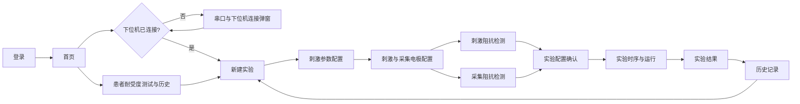

# EEG-tES 脑机实验系统产品交互说明 V2.0

> 文档版本：V2.0  
> 更新日期：2026-08-21  
> 文档性质：产品交互说明 / 原型验收依据  
> 适用范围：EEG 采集与经颅电刺激联合实验上位机  
> 状态：依据最新页面和已确认流程重新编写

## 1. 文档依据与边界

本文件是重新建立的产品交互文档，不沿用旧文档中的页面顺序和业务结论。规则优先级如下：

1. 用户最新提供的页面和本轮确认的业务逻辑；
2. 当前已经确认的产品流程与状态门禁；
3. 当前原型中仍然适用的交互规则；
4. 旧版 Markdown 文档仅作历史参考，不得覆盖本文件。

本产品当前为上位机交互原型。界面中的刺激参数范围、阻抗阈值、耐受测试方法、Sham 协议及下位机指令，最终应以设备能力、通信协议和专业审核结果为准。本文件不能替代医疗器械注册、临床使用或电气安全规范。

## 2. 产品角色

### 2.1 操作者

系统的直接使用者，负责：

- 登录系统并连接下位机；
- 创建实验并绑定患者；
- 配置刺激方案、刺激电极和采集电极；
- 执行阻抗检测、确认实验配置；
- 启动、监控、中止实验；
- 查看、导出和复用历史实验数据。

### 2.2 被实验的患者

EEG 采集与经颅电刺激的实际作用对象。患者通常不直接操作系统，但其身份、耐受记录、刺激配置、采集数据和实验结果贯穿整个流程。

## 3. 最新端到端流程



主流程必须遵循：

**登录 → 首页设备检测 → 新建实验 → 刺激参数配置 → 电极配置与阻抗检测 → 实验配置确认 → 实验运行 → 实验结果 → 历史记录。**

关键变化：新建实验后不再直接进入电极页，而是先进入独立的刺激参数配置页。患者耐受度测试从实验中段移至首页，不在电极页重复执行。

## 4. 全局状态与门禁

### 4.1 设备连接门禁

- 登录成功进入首页时，系统自动检测下位机连接状态。
- 未连接时，自动弹出“串口与下位机”弹窗。
- “开始实验”和“耐受度测试”必须在设备连接成功后才可进入。
- “实验记录”和历史结果允许离线查看。
- 用户关闭连接弹窗后仍可浏览离线功能；再次点击依赖设备的功能时重新打开弹窗。
- 顶部设备状态应在所有业务页面持续可见，并区分未连接、连接中、已连接和异常。

### 4.2 实验草稿

- 新建实验页提交后创建唯一的 `Experiment Draft`。
- 草稿至少包含实验 ID、患者 ID、创建时间、备注、引用的耐受记录和导入配置来源。
- 刺激方案通过校验后才允许进入电极配置。
- 刺激方案、电极配置或物理通道发生修改时，下游相关校验结果失效。

### 4.3 数据失效规则

- 修改刺激范式、阵列、方向、刺激参数或 HD 通道电流：刺激阻抗和实验配置确认结果失效；既有点位与通道重新校验，仅清除和新方案不兼容的映射。
- 修改刺激点位或刺激物理通道：刺激阻抗结果失效。
- 修改采集点位、参考电极、地电极或采样率：采集阻抗结果失效。
- 历史配置只复制参数和点位模板，不继承阻抗结果、实验准入结论或旧实验运行状态。

## 5. 登录页

### 5.1 页面目标

完成操作者身份验证，并进入首页。

### 5.2 页面元素

- 账号输入框；
- 密码输入框；
- 记住密码；
- 忘记密码；
- 登录按钮。

### 5.3 交互规则

- 账号、密码均为必填项。
- 点击登录后显示提交中状态，防止重复提交。
- 校验失败时，在对应字段附近显示可理解的错误原因。
- 登录成功后进入首页，并立即触发下位机连接检测。
- “记住密码”只能存储符合安全规范的凭证信息，不应明文保存密码。

## 6. 首页

首页提供四个主入口：

1. 开始实验；
2. 实验记录；
3. 串口与下位机；
4. 耐受度测试。

### 6.1 开始实验

- 已连接下位机：进入新建实验页。
- 未连接下位机：阻止跳转并打开连接弹窗。

### 6.2 实验记录

- 进入历史记录页。
- 不依赖下位机连接，可离线查看既有结果。

### 6.3 串口与下位机

- 每次登录成功进入首页时，系统立即自动检测下位机连接状态；
- 检测结果为未连接或连接异常时，直接打开“串口与下位机连接”弹窗，不需要操作者先点击入口；
- 已连接时不自动弹窗，只在首页和顶部状态区显示“已连接”；
- 操作者仍可主动点击“串口与下位机”入口，查看或修改当前连接配置。

### 6.4 耐受度测试

耐受度模块位于首页，并包含两个页签：

- 耐受度测试；
- 患者耐受历史。

每条耐受记录至少包含：患者 ID、耐受阈值、单位、刺激类型、测试时间、测试人、备注和完成状态。

新实验应引用一条适用的已完成耐受记录。耐受记录有效期暂不作为当前版本门禁，后续由业务和专业团队定义。

## 7. 串口与下位机连接弹窗

### 7.1 自动触发规则

1. 登录成功并进入首页后，系统立即发起下位机连接检测；
2. 检测期间显示连接状态加载反馈，避免将“检测中”误判为“未连接”；
3. 检测完成且下位机未连接、连接已失效或状态异常时，系统立即自动打开本弹窗；
4. 弹窗打开后保留最近一次有效连接配置，允许操作者直接重试、搜索或修改参数；
5. 检测结果为已连接时，不自动打开弹窗；
6. 操作者关闭未连接弹窗后，可以继续浏览实验记录等离线内容，但“开始实验”和“耐受度测试”仍不可进入；再次点击这些入口时重新打开本弹窗。

### 7.2 字段

- 设备 IP；
- 本机端口；
- 设备端口；
- 设备选择；
- 搜索设备；
- 当前连接状态。

### 7.3 状态

- 未连接：红色提示，保存按钮用于发起连接；
- 搜索中：禁止重复搜索，并显示进度；
- 连接中：配置字段暂时锁定；
- 已连接：绿色状态，保存当前有效配置；
- 连接失败：保留输入，提示具体原因并允许重试。

### 7.4 交互

- “搜索设备”刷新可选设备列表。
- 选择设备后可自动回填已识别的连接参数。
- 点击保存时先做格式校验，再发起连接。
- 连接成功后关闭弹窗，并同步刷新全局设备状态。
- 点击取消不建立连接；依赖设备的功能仍保持门禁。

## 8. 新建实验

### 8.1 页面结构

- 页签：新建实验、历史记录；
- 实验摘要；
- 被试信息；
- 导入实验参数包；
- 主操作：进入刺激方案配置。

### 8.2 实验摘要

- 实验 ID：系统自动生成，当前实验内唯一且只读；
- 日期：系统自动生成，可按业务要求允许校正。

### 8.3 被试信息

- 被试 ID：必填；
- 备注：选填；
- 导入历史配置：根据患者历史实验选择可复用模板。

患者 ID 应关联患者耐受记录。缺少适用耐受记录时，系统提示用户先到首页完成耐受测试；当前版本不处理有效期到期规则。

### 8.4 导入参数包

- 支持选择 `.expp` 实验参数包；
- 导入前校验文件格式、版本、设备兼容性和字段完整性；
- 导入成功后展示摘要，不直接视为已通过校验；
- 导入失败时说明具体错误，不覆盖当前已填写内容。

### 8.5 下一步

点击“进入刺激方案配置”时：

1. 校验被试 ID；
2. 校验耐受记录引用状态；
3. 保存实验草稿；
4. 跳转至独立刺激参数配置页。

## 9. 刺激参数配置

### 9.1 页面目标与职责边界

刺激参数配置是新建实验后的独立页面，用于形成可校验、可保存和可追踪的 `Stimulation Plan`。本页负责：

- 选择刺激范式；
- 选择当前范式支持的阵列和方向/波形模式；
- 配置范式参数；
- 在 HD 模式下配置回流电极通道及电流；
- 展示患者耐受值引用和参数校验状态；
- 展示随参数实时变化的刺激示意图；
- 保存刺激方案草稿，并在校验通过后进入电极配置与检测。

本页不选择具体头皮点位，不执行阻抗检测，也不配置实验运行阶段、循环次数和采集时长。具体点位由电极页完成，实验时序由时序与运行页完成。

### 9.2 页面布局

页面包含：

- **顶部状态区**：返回入口、患者 ID、实验 ID、设备状态和操作者；
- **左侧范式导航**：tDCS、tACS、tRNS、tPCS、Sham，并展示每种范式的中文说明；
- **内容标题区**：显示“刺激范式：当前范式”和右上角主操作“进入电极配置与检测”；
- **模式配置区**：根据范式显示阵列选择、方向或波形模式；
- **参数设置区**：显示滑杆、数值输入、单位、耐受值引用和 HD 通道配置；
- **示意图区**：展示与当前范式、模式和参数对应的计划波形。

范式、阵列和模式均使用产品化分段控件或导航控件，不使用浏览器原生 `select`。

### 9.3 范式与页面结构矩阵

| 刺激范式 | 阵列选择 | 模式选择 | 主要参数 | HD 附加配置 |
| --- | --- | --- | --- | --- |
| tDCS | 双通道 / HD 模式 | 正向 / 负向 | 目标电流、缓升缓降时间 | 回流电极电流分配 |
| tACS | 双通道 / HD 模式 | 双通道：正向 / 双向；HD：双向 | 目标电流或峰值电流、频率 | 回流电极电流分配 |
| tRNS | 不显示 | 不显示 | 目标电流 | 无 |
| tPCS | 不显示 | 正向 / 双向 | 目标电流、频率、脉冲相关时间参数 | 无 |
| Sham | 双通道 / HD 模式 | 双通道：直流 / 交流；HD 直流：正向 / 负向；HD 交流：无方向选择 | 双通道直流：目标电流、缓升缓降时间；双通道交流：目标电流、频率；HD：峰值电流及对应时间/频率参数 | HD 时显示 4 个回流通道及电流分配 |

切换范式后，只显示矩阵中适用于该范式的控件，不保留无关字段占位。

### 9.4 公共交互规则

- 切换范式时载入该范式的已保存值或默认值，并立即重新校验。
- 切换阵列或模式时，参数区和示意图同步切换到对应结构。
- 滑杆和数值输入双向同步；任一侧修改后，另一侧立即更新。
- 数值输入必须展示单位，禁止只依赖滑杆位置表达精确值。
- 输入为空、格式错误、超出设备能力或超出协议范围时，在字段附近提示具体原因。
- 页面示例中的电流、频率和时间范围是当前原型展示值；正式范围、步进和精度由设备 capability、固件和研究协议共同决定。
- 参数变化后示意图实时更新；示意图只表示计划参数，不表示下位机实时输出。
- 切换范式、阵列、模式或关键参数后，已完成的刺激阻抗结果立即失效。
- 若新的阵列结构仍兼容既有刺激点位，可保留点位并重新校验；只有不兼容的点位、角色或通道映射才被清除，不批量清空仍然有效的映射。
- 页面离开前保存当前方案草稿；保存失败时保留输入并禁止进入电极页。

### 9.5 患者耐受值引用

- 目标电流字段旁展示当前患者最近一次适用的已完成耐受记录。
- 存在适用记录时，显示耐受值和单位，例如“该用户近期耐受度测试值：2 mA”。
- 当前范式没有可引用的耐受值时显示“-”，不得伪造或自动换算耐受阈值。
- 目标电流超过适用耐受值时显示阻断错误，并禁止进入电极配置。
- 本页只引用耐受记录，不允许修改或覆盖首页保存的患者级耐受数据。

### 9.6 tDCS

#### 双通道

- 阵列：双通道；
- 模式：正向 / 负向；
- 参数：目标电流、缓升缓降时间；
- 目标电流以正的幅值输入，电流方向由正向/负向模式和后续电极极性共同决定；
- 示意图展示缓升、恒定输出和缓降三个区间。

#### HD 模式

- 页面保留正向/负向模式；
- 参数包括峰值或目标电流、缓升缓降时间和回流电极电流分配；
- HD 通道分配与校验遵守第 9.10 节；
- 当前素材未单独提供 tDCS HD 完整页面，具体字段排布以后续确认页面为准，但不得复用旧的固定 `CH1–CH5` 假设。

### 9.7 tACS

#### 双通道

- 阵列：双通道；
- 模式：正向 / 双向；
- 参数：目标电流、频率；
- 正向模式的示意波形保持在单一方向变化；
- 双向模式的示意波形允许跨越 0 基线；
- 横轴使用适合频率预览的时间单位，当前页面示例为毫秒。

#### HD 模式

- 阵列切换为 HD 模式后，模式固定为“双向”，不显示不可用的正向选项；
- 参数包括峰值电流、频率和回流电极电流分配；
- 峰值电流区域显示当前“已分配电流”汇总；
- 回流通道配置和电流平衡遵守第 9.10 节；
- 配置未完成或校验未通过时，“进入电极配置与检测”禁用。

### 9.8 tRNS

- 不显示阵列选择和模式选择；
- 参数区只显示目标电流；
- 目标电流受设备能力、研究协议和适用耐受记录约束；
- 示意图展示随机噪声形态；
- 示意图只表达噪声范式和幅值范围，不代表实际随机序列、频谱质量或设备输出。

### 9.9 tPCS

- 不显示阵列选择；
- 模式：正向 / 双向；
- 参数：目标电流、频率和脉冲相关时间参数；
- 示意图根据频率和脉冲时间参数展示脉冲序列；
- 当前页面字段名称为“占空比”，数值单位却为 `µs`。百分比占空比应使用 `%`，微秒通常表示脉冲宽度；在产品、算法和设备协议统一术语前，该字段不能进入正式设备协议。

### 9.10 HD 回流电极电流分配

tACS HD 和 Sham HD 页面使用统一的回流电极分配组件；tDCS HD 在页面确认后应复用同一规则。组件采用中性的“回流电极”命名；若界面展示阴极/阳极，必须根据当前模式和方向动态显示，不能在正负极性变化后仍固定写成“回流阴极”。

- 页面提供 `CH1–CH8` 可用回流通道池。
- 每个通道包含启用开关、电流数值输入和单位。
- 当前规则要求选择 4 个回流通道；未启用通道的输入框禁用并显示 0。
- 开启通道后允许在设备范围内输入独立电流，不要求 4 个通道等值。
- 页面实时汇总已启用通道的分配电流，并在峰值电流区域显示“已分配 x mA”。
- 已分配总电流必须满足当前方案定义的峰值/主通道电流及设备平衡规则。
- 通道数量不足、超过数量、数值为空、通道超限或总电流不平衡时，显示具体差值并禁止进入电极页。
- 通道编号属于逻辑刺激通道，具体头皮点位仍在电极配置页映射。

### 9.11 Sham

#### 9.11.1 模式层级

Sham 先选择阵列，再选择直流/交流模式；只有 HD 直流模式继续选择电流方向：

```text
Sham
├─ 双通道
│  ├─ 直流模式
│  └─ 交流模式
└─ HD 模式
   ├─ 直流模式
   │  ├─ 正向
   │  └─ 负向
   └─ 交流模式
```

- 阵列选择：双通道 / HD 模式；
- 第二层模式：直流模式 / 交流模式；
- HD 直流选择后显示第三层方向控件：正向 / 负向；
- 双通道直流、双通道交流和 HD 交流不显示方向控件；
- 切换任一层级后，参数区、通道分配、波形和校验状态同步切换并重新校验；兼容值可以保留，不兼容字段才清除。

#### 9.11.2 双通道直流模式

- 阵列：双通道；
- 模式：直流模式；
- 参数：目标电流、缓升缓降时间；
- 不显示正向/负向控件，也不显示 HD 回流通道分配；
- 示意图在协议规定的开始和结束窗口显示两个同方向的短时三角形直流脉冲，其余时间保持 0 基线；
- 当前页面示例为正向脉冲，但实际方向和极性关系必须由研究协议及后续电极角色确定。

#### 9.11.3 双通道交流模式

- 阵列：双通道；
- 模式：交流模式；
- 参数：目标电流、频率；
- 不显示正向/负向控件，也不显示 HD 回流通道分配；
- 示意图在协议规定的开始和结束窗口显示短时交流波包，中间时段保持 0 基线；
- 波形跨越 0 基线，幅值和频率随当前参数更新。

#### 9.11.4 HD 直流模式

- 阵列：HD 模式；
- 模式：直流模式；
- 方向：正向 / 负向；
- 参数：峰值电流、缓升缓降时间、4 个回流通道及各通道电流；
- 回流通道从 `CH1–CH8` 中启用 4 个，通道数量和电流输入遵守第 9.10 节；
- 峰值电流不单独输入，由已启用回流通道电流绝对值之和实时计算，并显示“已分配 x mA”；
- 正向时，主刺激电流为正，4 个回流通道显示负号，示意波形位于 0 基线上方；
- 负向时，主刺激电流为负，4 个回流通道显示正号，示意波形位于 0 基线下方；
- 分配区标题使用“回流电极电流分配”，或随方向动态显示为正向“回流阴极”、负向“回流阳极”；禁止在负向状态仍固定显示“回流阴极”；
- 通道输入使用正的幅值，正负号由方向模式自动附加，操作者不直接输入带符号数值；
- 切换正向/负向时保留兼容的通道选择和幅值，但重新计算主刺激方向、回流符号、峰值电流和示意图。

正向与负向必须满足电流守恒：

```text
正向：主刺激电流 = +Σ 回流通道幅值；每个回流通道为负
负向：主刺激电流 = -Σ 回流通道幅值；每个回流通道为正
```

若分配总电流超过设备或协议允许的峰值，峰值电流区域显示红色超限提示，并禁用“进入电极配置与检测”。页面示例中的“已分配 2.7 mA，超出最大值”只用于说明错误状态，不作为固定上限。

#### 9.11.5 HD 交流模式

- 阵列：HD 模式；
- 模式：交流模式；
- 不显示正向/负向控件；
- 参数：峰值电流、频率、4 个回流通道及各通道电流；
- 峰值电流由已启用回流通道的分配结果实时汇总；
- 回流通道配置和电流平衡遵守第 9.10 节；
- 示意图在开始和结束窗口显示跨越 0 基线的短时交流波包，中间时段保持 0 基线。

#### 9.11.6 Sham 校验与协议约束

任一 Sham 组合必须同时校验：

- 当前阵列、模式和方向受设备支持；
- 目标/峰值电流、频率和缓升缓降时间在设备与协议范围内；
- HD 模式恰好启用 4 个回流通道；
- HD 单通道电流、分配总和、主刺激方向和回流符号正确；
- 分配总电流不超过设备或研究协议允许的最大值；
- 示意图与当前阵列、直流/交流模式和正向/负向状态一致。

Sham 的刺激窗口、幅值、频率、缓升缓降和持续时间必须来自正式研究协议，前端不得根据示意图自行推断，也不得把示意波形视为实际设备输出。

### 9.12 示意波形规范

示意图区至少包含：

- 横轴名称、刻度和时间单位；
- 纵轴名称、刻度和电流单位；
- 0 基线；
- 当前范式和模式对应的波形；
- 与当前参数对应的幅值、频率或缓升缓降关系；
- “参数示意图，非下位机实测输出”说明。

各范式的主要预览语义：

- tDCS：缓升—恒定—缓降；
- tACS：连续正弦波，正向/双向模式的基线关系不同；
- tRNS：随机噪声示意；
- tPCS：脉冲序列；
- Sham 直流：开始和结束窗口的短时直流刺激；HD 正向波形位于 0 基线上方，HD 负向波形位于 0 基线下方；
- Sham 交流：开始和结束窗口的短时交流刺激。

tDCS 示意图必须使用原始 Figma 波形资产及其源坐标位置，不得使用近似手绘路径替换。

### 9.13 草稿保存与下游失效

- 进入本页时读取当前实验草稿中的刺激方案版本。
- 参数修改后页面进入“未保存”状态；保存成功后生成新的 `stimulationPlanVersion`。
- 新版本使旧刺激阻抗和实验配置确认结果失效。
- 阵列或模式变化时重新检查已有点位和物理通道，只清除与新结构不兼容的映射。
- 采集配置未变化时，不自动清除采集点位和采集阻抗结果。
- 历史配置或参数包导入后仍需执行本页全部校验，不继承历史阻抗和准入结论。

### 9.14 进入电极页的门禁

必须同时满足：

- 下位机已连接且当前空闲；
- 当前范式、阵列和模式受设备支持；
- 全部必填参数完整、格式正确且在设备/协议范围内；
- 目标电流未超过适用的患者耐受值；
- HD 模式的通道数量、电流总和和单通道值全部通过校验；
- Sham 参数与当前研究协议一致；
- 患者、实验草稿和耐受记录有效；
- 刺激方案草稿保存成功且版本为最新；
- 当前不存在未处理的阻断错误。

点击“进入电极配置与检测”时再次执行完整校验。校验失败时停留本页并定位到具体范式、模式、字段或 HD 通道；校验成功后保存草稿并进入电极配置页。

## 10. 电极配置与阻抗检测

### 10.1 页面职责

- 刺激逻辑通道与头皮点位映射；
- 采集点位、参考电极、地电极和采样率配置；
- 点位冲突、通道冲突和数量校验；
- 刺激阻抗和采集阻抗检测。

页面由顶部状态区、左侧头模工作区和右侧操作面板组成。顶部持续展示返回入口、患者 ID、实验 ID、设备连接状态和操作者；右侧通过“刺激电极 / 采集电极”页签切换当前角色，底部固定“查看并确认实验配置”主操作。

### 10.2 统一头模规则

- 刺激与采集共用同一头模、尺寸、位置和坐标映射；
- 所有点位初始为白色未分配状态；
- 选中后显示蓝色；
- 阻抗检测完成后才显示对应语义颜色；
- 切换刺激/采集页签或前/后视角不得移动、缩放头模和点位；
- 每个点位独立保存角色、极性、物理通道、阻抗结果和结果版本，编辑一个点位不得批量改变其他点位；
- 已完成检测的点位仍可点击编辑，编辑后恢复为蓝色待检测态；
- 刺激和采集可见性控制默认均为勾选。取消勾选只将对应已分配点位降至 30% 透明度，不得删除分配、清空结果或把点位显示成白色未分配态。

### 10.3 刺激点位与通道

点位数量由阵列模式决定，而非由刺激范式直接决定：

- 普通/双通道模式：2 个点位，包括 1 个主刺激/阳极点位和 1 个回流/阴极点位；
- HD 模式：5 个点位，包括 1 个主刺激/峰值电流点位和 4 个回流电极点位；具体阴极/阳极角色由当前刺激模式和方向确定；
- TI 模式：4 个点位（进入实现范围后启用）。

通道分配规则：

- 当前版本仅开放 `FP2、F3、FC5、T7、Cz、T8、CP5、P3` 共 8 个头模点位用于刺激电极映射；
- 切换到“刺激电极”页签后，上述 8 个可用点位保持正常显示，其余点位统一以半透明状态展示且不可选择；
- 半透明只表示“当前不支持作为刺激点位”，不得改变这些点位已有的采集分配或阻抗数据；切换回“采集电极”页签后，按采集点位规则恢复显示；
- 普通双通道模式下，操作者先选择阳极或阴极角色，再点击允许的头模点位；
- 刺激点分配后显示蓝色，并在头模和列表统一追加 `·A` 或 `·C` 极性后缀；
- 页面顶部持续提示当前仅支持的 8 个刺激点位，避免操作者把半透明状态误解为设备异常或点位已被占用；
- 双通道模式下，主刺激和回流电极分别映射到设备定义的双通道角色；
- HD 模式下，主刺激点位映射到主刺激角色，4 个回流点位分别绑定刺激方案中已启用的 4 个 `CH1–CH8` 回流逻辑通道；
- 电极页不得重新选择或修改 HD 回流通道电流，只允许把已保存的逻辑通道映射到具体头皮点位和物理端口；
- 每个点位的通道可通过下拉控件修改；
- 同一物理通道只能被一个点位占用；
- 用户选择已被占用的通道时，不允许形成重复状态。推荐一次性互换两个点位的通道，并提示“已交换 CHx 与 CHy”；
- 删除点位后释放其通道，新点位优先获得最小的空闲通道号。

### 10.4 点位冲突

系统检查：

- 刺激点位数量是否满足阵列；
- 同一物理点位是否被刺激和采集重复占用；
- 同一硬件通道是否重复；
- 极性、主通道和回流通道是否完整；
- 点位距离是否满足规则。

阻断错误应同时定位到头模点位和右侧列表，并提供可执行的修正提示。

### 10.5 采集配置

- 只能从未被刺激占用的可用点位中选择 EEG 采集电极；
- 点击可用点位后，该点显示蓝色并加入右侧采集列表，阻抗值显示为 `- kΩ`、状态显示“未检测”；
- 再次点击已选点位可取消分配并释放对应采集通道；
- 配置参考电极、地电极和采样率；
- 参考电极、地电极、采样率可显示系统默认值，并允许在设备能力范围内修改；
- 默认采样率为 500 Hz；
- 至少选择产品要求的最小采集通道数。

### 10.6 阻抗等级与通过语义

当前页面使用以下阻抗图例：

| 阻抗范围 | 等级 | 页面颜色 |
| --- | --- | --- |
| `≤ 10 kΩ` | 优 | 绿色 |
| `> 10 kΩ 且 ≤ 20 kΩ` | 良 | 蓝色 |
| `> 20 kΩ 且 ≤ 30 kΩ` | 中 | 黄色 |
| `> 30 kΩ 且 ≤ 40 kΩ` | 差 | 橙色 |
| `> 40 kΩ` | 不良 | 红色 |

当前原型中，单点为“优”或“良”才计入通过；任一必检点为“中”“差”“不良”、脱落或未知时，本类阻抗整体未通过。量程、边界和整体通过标准最终必须由设备 capability、固件和研究协议下发，前端不得把原型阈值作为真实设备的固定安全参数。

颜色不能作为唯一信息。头模和阻抗列表必须同时展示点位名、阻抗值及文字等级。

### 10.7 通用检测状态

刺激和采集阻抗是两套独立任务，但使用相同状态机：

1. **未配置**：尚未选择必需点位，面板展示“未开始检测”；点击检测时提示缺失项，不发送设备命令。
2. **待检测**：点位和通道完整，列表显示全部必检点、`- kΩ` 和“未检测”。
3. **检测中**：按钮变为“停止检测”，设备逐点返回结果；已返回点实时更新，未返回点保持“检测中/未知”。
4. **已通过**：收到完整结束事件，且全部必检点满足通过标准。
5. **未通过**：本轮完成但至少一个必检点未达标；问题点保留对应值、等级和颜色。
6. **正在停止/已停止**：点击停止后等待设备确认，本轮未完成点标记为未知，本轮结果不能用于准入。
7. **检测异常**：设备断连、超时、拒绝或数据不完整时显示具体原因并允许重试，不能把部分结果误判为通过。
8. **结果已失效**：依赖配置发生变化后，旧结果保留在审计记录中，当前页面恢复待检测并提示重新检测。

检测中可以显示暂态结果；只有收到本轮完整结束事件后，才生成最终“已通过/未通过”结论。重新检测创建新的测量记录，不覆盖历史记录。检测进行中锁定所有会破坏当前映射的编辑操作。

### 10.8 刺激阻抗检测

发起检测前必须满足：刺激方案仍然有效，所需点位、极性和物理通道完整，阵列、距离及通道冲突已解决，下位机已连接且空闲，并且当前没有采集阻抗或实验运行任务。

检测流程：

1. 点击“检测”，再次校验刺激方案版本和点位映射；
2. 校验通过后下发刺激阻抗命令，按钮切换为“停止检测”；
3. 设备逐通道更新头模和列表，点位始终保留 `·A` / `·C` 后缀；
4. 完成后保存点位、极性、物理通道、阻抗值、等级、设备、时间和配置指纹；
5. 全部刺激点通过时显示“已通过”，否则显示“未通过”并保留问题点，不自动取消点位分配。

页面示例中，`FC5·A = 45 kΩ` 为红色“不良”，`P3·C = 13 kΩ` 为蓝色“良”，因此刺激阻抗整体未通过。电极页不再次执行耐受度测试，只核对本实验引用的患者耐受记录。

### 10.9 采集阻抗检测

发起检测前必须满足：采集点数量达标，REF、GND、采样率和物理通道有效，与刺激点位及其他通道不存在冲突，采集设备已连接且空闲，并且当前没有刺激阻抗或实验运行任务。

检测流程：

1. 点击“检测”，校验采集点、REF、GND、采样率、通道和设备状态；
2. 校验通过后下发采集阻抗命令，按钮切换为“停止检测”；
3. 设备逐点返回结果，头模与列表同步更新，列表较长时内部滚动；
4. 全部必检点返回且均为“优/良”时显示“已通过”；
5. 存在“中/差/不良”、脱落、未知或未完成点时显示“未通过”，底部确认按钮保持禁用；
6. 未通过不会取消采集点位，操作者处理电极接触后可在相同配置上重新检测。

页面示例中，`P3 = 8.1 kΩ` 为“优”、`F8 = 13 kΩ` 为“良”；`Cz = 21 kΩ`、`F3 = 34 kΩ`、`F4 = 45 kΩ` 分别为“中”“差”“不良”，因此该轮采集阻抗整体未通过。

### 10.10 结果失效与确认入口

- 修改刺激范式、模式、阵列、关键参数、刺激点位、极性、刺激物理通道或相关设备，使刺激阻抗失效；
- 修改采集点位、采集物理通道、REF、GND、采样率或采集设备，使采集阻抗失效；
- 一类配置变化只使其对应阻抗及依赖它的确认结果失效，不自动修改另一类点位和阻抗；
- 阻抗列表只在面板内部滚动，底部“查看并确认实验配置”固定可见；
- 只有刺激与采集阻抗均通过，且患者、方案、设备和耐受记录仍有效时，底部确认入口才启用。

## 11. 实验配置确认

### 11.1 开放条件

“查看并确认实验配置”默认禁用。只有刺激方案有效、刺激与采集映射完整、两类阻抗均已通过、耐受记录适用、设备连接正常且不存在检测中/失效/未知/阻断状态时才启用。

### 11.2 弹窗内容

点击后打开“实验配置二次确认”，汇总：

- **患者与实验**：患者 ID、实验 ID、实验人员；
- **刺激方案**：刺激范式、模式/阵列、关键参数、刺激时长及缓升缓降；
- **电极与采集**：带 `·A` / `·C` 后缀的刺激点位、EEG 点位、REF、GND 和采样率；
- **安全校验**：引用的患者耐受记录，以及刺激与采集阻抗均通过的结论。

弹窗展示当前配置快照。打开后若收到设备断连、阻抗失效或其他阻断事件，确认按钮立即禁用并提示返回处理。

### 11.3 确认与返回

- 关闭弹窗不清空已完成配置和检测结果；
- 点击“确认参数配置并开始实验”前再次执行全部准入校验；
- 校验成功后生成带版本号和时间戳的运行前配置快照，并进入实验时序与运行页，该操作本身不直接输出刺激；
- 返回修改后，只使依赖被修改字段的检测与确认结果失效，并要求重新完成相关检测和二次确认。

## 12. 实验时序与运行

### 12.1 页面入口与职责

实验配置二次确认成功后进入“时序与运行”页。该页负责：

- 选择手动模式或自动模式；
- 配置本轮采集、消隐、刺激、恢复时长及自动循环次数；
- 展示采集通道的实时 EEG 波形和阶段时间轴；
- 展示设备通信、当前阶段、刺激电流、阻抗、运行时间和异常事件；
- 启动、监控、紧急停止、结束实验并进入结果页。

进入本页时沿用已确认的患者、实验、刺激方案、电极和阻抗快照，不允许在本页修改刺激参数或电极映射。

### 12.2 页面布局

页面由以下区域组成：

- **顶部状态区**：返回入口、患者 ID、实验 ID、设备状态和操作者；
- **模式切换**：手动模式 / 自动模式；
- **EEG 工具栏**：灵敏度、纸速、高通、低通、陷波、X 光标和 Y 光标；
- **实时波形区**：按采集点位逐通道展示 EEG，支持纵向滚动；
- **阶段时间轴**：用不同底色区分采集和刺激区间，显示当前时间指针及可视窗口滑块；
- **右侧运行面板**：运行监控、刺激参数摘要、时序控制及底部主操作。

### 12.3 模式与参数编辑规则

- 未开始时允许切换手动/自动模式；任一阶段开始后锁定模式、阶段顺序、时长、单位和循环次数。
- 采集期和刺激期支持输入时长，单位支持秒和分钟；内部统一换算为设备协议使用的时间单位。
- 消隐期与恢复期默认由刺激方案或研究协议给出。当前页面以只读字段展示；若未来允许修改，必须受协议范围校验。
- 自动模式额外展示循环次数，默认值和上下限来自研究协议或设备能力。
- 时长为空、非数字、超限或换算后超出设备能力时，就近提示并禁用启动。
- 页面示例中的 `采集 1000 s、消隐 10 s、刺激 10 s、恢复 10 s` 仅用于说明交互，不是固定业务参数。
- 切换模式会重新生成阶段时间轴；兼容的时长可以保留，但任何尚未开始的旧运行状态必须重置。

### 12.4 EEG 实时信号与查看工具

- 只展示本实验已配置的采集通道，每行包含点位名、纵轴刻度、波形和通道颜色。
- 待机且尚未收到数据时显示空网格；开始采集后按设备时间持续追加波形。
- 刺激期间仍持续采集并展示 EEG，但必须标记该区间可能包含刺激伪迹。
- 刺激区间在波形背景和底部时间轴上使用独立语义色，并显示“刺激中”标签；采集区间使用采集语义色。
- 灵敏度和纸速只改变显示比例，不修改已保存的原始数据。
- 高通、低通和陷波分别显示开启/关闭状态；显示滤波不得静默覆盖原始数据，导出时需记录滤波配置。
- X 光标用于读取同一时间点，Y 光标用于读取通道幅值；开启后显示辅助线、点位名和数值提示。
- 底部滑块用于查看长时间数据窗口。拖动只改变可视范围，不暂停采集或改变实验阶段。
- 缺包、延迟、时钟漂移、插值和模拟数据必须明确标注，不能冒充真实硬件信号。

### 12.5 运行监控

右侧“运行监控”持续展示：

- 通信链路状态；
- 当前阶段和阶段进度环；
- 刺激电流；
- 当前阻抗或平均阻抗；
- 本轮累计运行时长；
- 自动模式当前循环/总循环；
- 异常事件及数量。

非刺激阶段若展示的是方案目标电流，应标记为“计划刺激电流”；只有设备返回实时测量值时才标记为“实时刺激电流”，避免把计划值误认为正在输出。

状态必须同时使用文字和颜色。运行中状态至少包括：待机、采集进行中、消隐进行中、待刺激、刺激进行中、恢复进行中、正在停止、已停止、已完成和异常。

### 12.6 手动模式阶段

手动模式固定包含四个阶段：

| 顺序 | 阶段 | 触发方式 | 完成后状态 |
| --- | --- | --- | --- |
| 1 | 采集 | 操作者点击“开始采集” | 自动进入消隐 |
| 2 | 消隐 | 采集完成后自动执行 | 进入“待刺激” |
| 3 | 刺激 | 操作者点击“开始刺激” | 自动进入恢复 |
| 4 | 恢复 | 刺激完成后自动执行 | 本轮完成 |

手动模式的“手动”指采集与刺激分别由操作者确认启动，不代表操作者逐一触发消隐和恢复。

### 12.7 手动模式交互流程

1. **待机**：四个阶段均为“待执行”，时长可编辑；“紧急停止”禁用，“开始采集”启用。
2. **采集进行中**：开始接收 EEG，阶段 1 高亮为“进行中”，其余阶段等待；底部只保留可用的“紧急停止”。
3. **消隐进行中**：阶段 1 标记完成，阶段 2 自动倒计时；期间继续采集 EEG，不输出刺激。
4. **待刺激**：阶段 1、2 完成，阶段 3 显示“待执行/待刺激”；“开始刺激”启用，紧急停止在未运行输出时可保持禁用。
5. **刺激进行中**：阶段 3 高亮，波形区和时间轴标记刺激区间，运行监控显示刺激进行中及实时/目标电流。
6. **恢复进行中**：刺激输出已结束，阶段 3 标记完成，阶段 4 自动倒计时；当前阶段必须显示“恢复进行中”，不能继续显示“刺激进行中”。
7. **完成**：四阶段全部显示“已完成”，冻结本轮时长和阶段记录，主按钮变为“结束实验并查看结果”。

### 12.8 自动模式时序

自动模式按照配置自动运行完整循环：

```text
开始实验
  ↓
采集 → 消隐 → 刺激 → 恢复
  ↓
未达到循环次数：进入下一循环的采集
  ↓
达到循环次数：实验完成
```

- 点击一次“开始实验”后，系统自动推进阶段，不再要求操作者点击“开始刺激”。
- 循环次数为 `N` 时，完整执行 `N` 次采集、消隐、刺激和恢复。
- 右侧列表显示当前循环内各阶段状态；运行监控同时显示当前循环和总循环。
- 底部时间轴预先展示全部循环的采集与刺激区间，短暂的消隐/恢复阶段也必须保留真实时间占位，不能从时间基准中删除。
- 刺激区间在波形区高亮并显示“刺激中”；非刺激阶段持续采集 EEG。
- 一个阶段完成后立即记录结束时间，再进入下一阶段；页面不能只依靠前端倒计时推断设备实际状态。

### 12.9 自动模式状态

1. **待机**：显示循环次数和完整时序预览，“开始实验”启用。
2. **采集进行中**：当前采集阶段高亮，EEG 持续追加，紧急停止启用。
3. **消隐/刺激/恢复进行中**：按设备事件依次切换，高亮当前阶段并更新进度。
4. **已停止**：当前阶段标记“已停止”，后续阶段保持待执行，时间轴显示停止位置；主按钮变为“重新实验”。
5. **已完成**：所有循环完成，阶段状态和运行时间冻结，主按钮变为“结束实验”。

自动模式点击“重新实验”时必须创建新的运行轮次，并从第一循环的采集阶段开始，不能从中断点续跑，也不能覆盖已停止轮次的记录。

### 12.10 紧急停止与异常

- 待机、待刺激和完成状态下，“紧急停止”禁用；任一自动运行阶段或手动运行阶段中启用，并使用红色高风险样式。
- 点击后立即发送停止/中止命令，页面进入“正在停止”，禁用重复点击。
- 收到设备确认后停止阶段计时和刺激输出，将当前轮次标记为“已停止”，并记录操作者、时间、模式、循环、阶段、原因和设备响应。
- 未收到确认前不得显示“已安全停止”；设备断连或停止超时必须升级为异常状态并持续提示。
- 手动模式停止后不自动进入下一阶段；是否允许安全恢复由设备与业务规则决定，否则从新轮次重新开始。
- 自动模式停止后只能从新的完整轮次重新开始。
- 设备断连、阻抗突变、硬件故障或协议错误应按安全策略自动停止，并在页面展示具体异常及处理指引。

### 12.11 完成、数据查看与结果入口

- 正常完成后冻结运行时间、阶段时间线、设备事件和异常记录。
- “结束实验并查看结果”生成本轮 `Experiment Run` 快照并进入结果页；进入结果页前不得丢失实时 EEG 缓冲区或设备事件。
- 完成后可使用 X/Y 光标和时间滑块查看已采集数据，不得改变已冻结的原始记录。
- 结果页展示实验概览、采集配置、刺激配置和导出选项；文件名必须校验，EDF、CSV 故障日志和参数文件可按权限选择导出。
- “再进行一次/重新实验”创建新的 `runId` 和轮次编号，复用已确认配置但重新校验设备、阻抗有效性和运行门禁，不覆盖上一轮数据。

## 13. 实验结果

### 13.1 左侧结果摘要

- 实验 ID；
- 实验时间；
- 患者 ID；
- 运行时长；
- 异常事件数；
- 采集配置：REF/GND、点位、采样率；
- 刺激配置：范式、阵列、主通道电流、回流分配、通道与点位映射。

### 13.2 波形预览

- 支持按轮次切换；
- 每个采集通道独立展示；
- 标明电压单位和时间单位；
- 底部缩略时间轴展示采集期、刺激期等阶段；
- 可拖动缩略轴查看局部时段；
- 事件标记应与波形时间对齐。

### 13.3 导出

支持按权限选择导出：

- EDF 脑电数据；
- CSV 故障与事件日志；
- 实验参数和配置；
- 完整实验结果包。

导出文件应包含实验 ID、患者 ID、协议版本、设备与固件版本、采样率、通道映射、时间基准和完整性校验信息。

## 14. 历史记录

### 14.1 列表字段

- 实验 ID；
- 患者 ID；
- 刺激方案；
- 刺激电流；
- 选中点位；
- 实验次数；
- 实验记录时间；
- 状态；
- 操作。

### 14.2 查看结果

进入实验结果页；包含操作者、患者、实验配置、每次运行结果、事件和导出记录。

### 14.3 复制配置

- 复制刺激方案、点位模板、采集参数和时序模板；
- 创建新的实验 ID 和草稿；
- 不复制阻抗结果、实验准入结论、运行结果和旧异常状态；
- 新实验必须重新确认患者、耐受记录、设备兼容性和物理检测。

## 15. 核心数据对象

### 15.1 Patient

- patientId；
- 基础信息；
- 备注；
- 耐受历史。

### 15.2 Experiment Draft

- experimentId；
- patientId；
- operatorId；
- createdAt；
- toleranceRecordId；
- stimulationPlanId；
- electrodeMapping；
- acquisitionConfig；
- timingPlan；
- validationState。

### 15.3 Stimulation Plan

- stimulationPlanId / stimulationPlanVersion；
- paradigm；
- arrayMode；
- stimulationMode（如 Sham 的直流/交流）；
- directionMode；
- parameters；
- toleranceRecordId / toleranceValue；
- hdReturnChannelIds；
- channelCurrents；
- assignedTotalCurrent；
- waveformPreviewVersion；
- deviceCapabilityVersion；
- validationState。

### 15.4 Experiment Run

- runId；
- experimentId；
- runIndex；
- runMode；
- cycleCount / currentCycle；
- timingPlanSnapshot；
- startAt / endAt；
- phaseTimeline；
- deviceEvents；
- impedanceSnapshots；
- acquisitionDataReference；
- stopReason；
- resultState。

## 16. 通用反馈与异常

- 空状态：说明当前缺少什么以及下一步动作；
- 加载状态：防止重复操作，并保留上下文；
- 禁用状态：同时说明禁用原因；
- 成功反馈：明确保存、连接、检测或导出对象；
- 错误反馈：使用中文业务解释，技术错误码作为辅助信息；
- 高风险操作：需要清晰确认，不使用模糊文案；
- 网络或设备断开：冻结危险操作，保留草稿，允许恢复或安全退出。

## 17. 待确认事项

1. tPCS 当前“占空比 + µs”究竟表示占空比还是脉冲宽度；
2. tACS“正向 / 双向”的电气与协议含义；
3. 各刺激范式的最终参数范围、步进和下位机能力；
4. Sham 的正式刺激时序与波形规则；
5. 患者耐受记录的有效期和重新测试条件；
6. 点位距离冲突的计算标准；
7. 手动模式急停后的继续边界；
8. 实验数据、患者信息和导出文件的权限与脱敏规则。

## 18. 核心验收标准

- 登录进入首页时立即自动检测下位机；未连接或异常时直接弹出连接弹窗，已连接时不弹出；
- 新建实验成功后首先进入刺激参数配置页；
- 每个范式只展示适用的模式和参数；
- tRNS 不显示阵列和模式控件，tPCS 只显示正向/双向模式；
- tACS 切换为 HD 后固定为双向，并显示 `CH1–CH8` 回流电极通道池；
- Sham 必须完整支持双通道直流、双通道交流、HD 直流正向、HD 直流负向和 HD 交流五种页面状态；只有 HD 直流显示正向/负向控件；
- Sham HD 直流正向的回流通道自动显示负号，负向自动显示正号；分配区不得在负向状态错误地固定标为“回流阴极”；
- 参数变化能实时更新示意波形；
- HD 必须选择 4 个回流通道；通道数量、电流范围或分配总和不合法时不能继续；
- Sham HD 分配电流超过设备或协议上限时显示明确的红色超限错误，并禁用“进入电极配置与检测”；
- 电极页不重复配置刺激参数；
- 切换到刺激电极时，仅 8 个支持点位正常显示并可选择，其余点位半透明且不可选择；
- 逻辑通道唯一，不能出现两个点位同时占用 CH1 或其他同一物理通道；
- 刺激与采集阻抗独立检测，配置修改只使关联结果失效；
- 实验开始前必须完成患者、方案、电极、阻抗和二次确认门禁；
- 手动模式分别由操作者启动采集和刺激，消隐与恢复自动推进；
- 自动模式一次启动后按循环次数完成全部阶段，不等待人工触发刺激；
- 运行开始后模式、时长、单位和循环次数全部锁定；
- EEG 波形、阶段时间轴和右侧状态始终指向同一设备时间；
- 紧急停止可追踪，自动模式停止后重新实验必须从第一循环开始；
- 多次运行形成独立轮次，结果页可以切换；
- 历史复制创建新草稿，不继承旧物理检测和运行结论。
