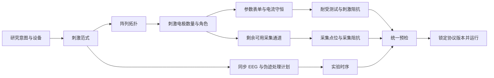
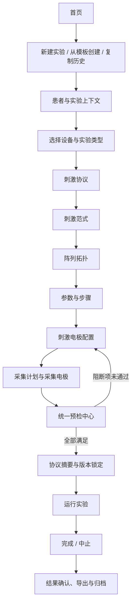
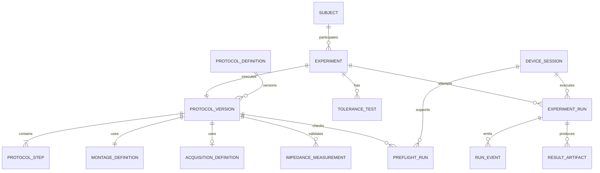
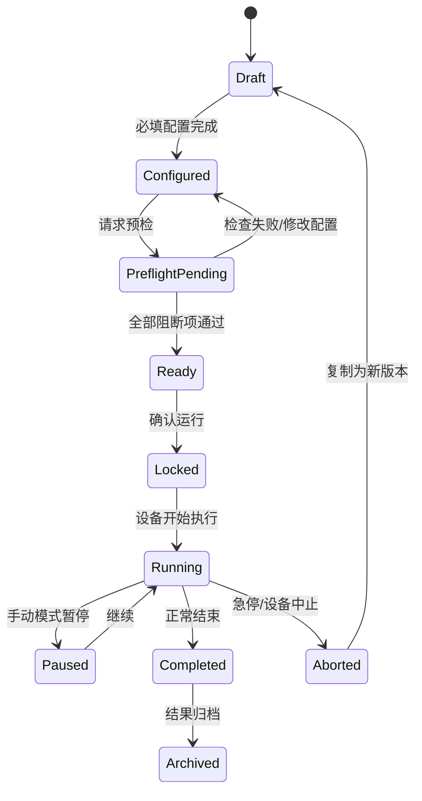

# EEG-tES 竞品、产品逻辑与实现落地分析报告

> 版本：2026-07-22
> 结论状态：产品方案建议稿，尚未进入实现
> 适用范围：当前 EEG-tES 前端原型及后续研究型 EEG+tES 工作站
> 产品边界：本文讨论研究与实验工作流，不代表当前原型已达到医疗器械、临床使用或监管合规标准。

---

## 阅读导航

- **先看结论**：第 0、5、17 节；
- **看竞品**：第 3、4 节；
- **看未来产品逻辑**：第 6–11 节；
- **看研发落地**：第 12–15 节；
- **看仍需决策的问题**：第 16 节；
- **看证据和边界**：第 18、19 节。

---

## 0. 一页决策摘要

### 0.1 核心判断

当前产品确实需要调整流程，但不应只做“把刺激电极配置移到第一步”这一项界面排序改动。

更准确的产品决策是：

> **保留“实验对象与实验上下文”为第 0 步；把“刺激协议定义”作为第一个专业配置步骤。协议确认后，先配置刺激阵列，再配置采集通道，最后进行统一预检。**

推荐主流程：

`实验上下文 → 协议来源 → 刺激范式 → 阵列拓扑 → 刺激电极与参数 → 采集电极与采集计划 → 统一预检 → 实验运行 → 结果与归档`

这里前置的是一个完整的 **Stimulation Protocol（刺激协议）**，至少包括：

- 使用哪种刺激范式；
- 使用哪种电极阵列/拓扑；
- 哪些电极承担刺激、回流或参考角色；
- 每个刺激通道的波形参数；
- 实验由哪些步骤构成、各步骤持续多久；
- 是 active、sham 还是盲法运行；
- 目标设备能否执行该协议；
- 哪些修改会使耐受测试、阻抗检测和预检结果失效。

### 0.2 为什么必须前置

刺激方案决定了后续大部分约束：



如果先选采集电极，再决定刺激类型和阵列，会出现以下返工：刺激通道占用了已经选择的采集通道、TI/HD 需要更多电极、设备通道数不够、同步 EEG 的采集阶段与伪迹策略不兼容、刺激参数变化使已有耐受与阻抗结果失效。

### 0.3 当前版本最需要修正的五个结构问题

1. **刺激范式与阵列拓扑混在同一层。** 当前 `tDCS / tACS / TI / HD` 同属于一个下拉，但 `HD` 是阵列/空间拓扑，不是与 tDCS、tACS 同级的波形范式。
2. **协议不是一等对象。** 当前参数、点位、耐受、阻抗、时序散落在页面状态中，无法形成一个可版本化、可复用、可审计的实验协议。
3. **安全结果缺少依赖关系。** 修改刺激类型、参数或点位后，系统没有统一的“哪些结果必须失效、为什么失效”的数据机制。
4. **设备能力没有参与表单和校验。** 当前参数范围、通道数量和类型可用性由界面写死，无法适配不同设备或固件。
5. **实验记录缺少数据血缘。** 运行结果没有明确绑定患者、协议版本、设备、通道映射、预检结果、事件日志与导出物。

### 0.4 建议的版本优先级

- **P0：重构领域模型和流程顺序。** 拆分范式/拓扑，建立协议版本、设备能力、统一预检、依赖失效和运行锁定。
- **P1：补充研究能力。** 加入 tRNS、pulsed tDCS、AM-tACS、协议模板、sham/盲法、触发器与完整结果记录。
- **P2：高级能力。** 个体模型、电场预览、自动阵列优化、任意波形、闭环与远程研究。

---

## 1. 研究范围、方法与证据等级

### 1.1 本次研究回答的问题

1. 代表性 EEG/tES 或 tES 产品如何组织协议、点位、参数、安全与运行？
2. 为什么刺激配置应在专业流程中前置？前置到什么程度？
3. 新增刺激类型时，产品分类应如何设计才不会继续堆叠分支？
4. 当前原型在字段、状态、数据血缘与安全逻辑上缺少什么？
5. 如何在不破坏现有静态头模和 20 点交互规则的前提下逐步落地？

### 1.2 证据等级

本文用三类标签区分内容：

- **[公开事实]**：来自厂商官网、产品说明或用户提供的官方手册。
- **[分析推断]**：根据公开流程和界面逻辑得到的产品判断，不等于厂商明确表述。
- **[本产品建议]**：针对 EEG-tES 当前原型提出的方案。

### 1.3 竞品选择

| 产品 | 选择原因 | 主要对标维度 |
| --- | --- | --- |
| Neuroelectrics NIC2 + Starstim | 与当前产品最接近：多通道 tES、EEG、组合协议、点位映射、阻抗与运行监控 | 端到端协议工作站 |
| Brainbox Nurostym tES | 刺激范式丰富、协议预设、研究集成、盲法和安全控制较完整 | 参数模型与研究设计 |
| Soterix HD-Explore + MxN-PRO | 目标、头模型、阵列、电流分配与执行设备之间的关系清晰 | HD/TI/多通道与目标驱动设计 |
| neuroConn DC-STIMULATOR 系列 | 不同设备的通道数、范式和同步能力差异明显 | 设备能力约束与多模态集成 |
| Sooma tDCS / Flow | 临床/居家场景中“处方协议先锁定、执行者后运行”的代表 | 协议治理、角色与结果回传 |

临床型产品不是当前研究型工作站的直接竞品，但适合作为“协议治理与执行分离”的对照组。

---

## 2. 当前产品基线与结构性问题

### 2.1 当前端到端流程

当前原型的主要流程是：

`首页 → 新建实验/历史记录 → 被试 ID 与参数包 → 采集点位 → 采集阻抗 → 刺激点位与极性 → 刺激参数 → 耐受测试 → 刺激阻抗 → 实验运行 → 结束与导出`

这一流程已经具备以下有价值的基础：

- 新实验默认 20 个点位未分配；
- 采集/刺激共享同一个头模和同一套坐标；
- 点位状态独立，点击一个点位不改变其他点位；
- 刺激点位保留 `·A / ·C` 极性语义；
- 修改点位后可以重新检测；
- 刺激阻抗前已有参数配置和耐受测试两步流程；
- 运行阶段已有手动/自动、阶段计时、急停、恢复与导出原型。

这些规则应继续保留。问题主要出在**上游信息结构和状态依赖还没有产品化**。

### 2.2 当前实现中的关键证据

| 现状 | 代码/文档证据 | 问题 |
| --- | --- | --- |
| `tDCS / tACS / TI / HD` 是一个平铺列表 | `src/App.jsx` 的 `stimModes` | 波形范式与阵列拓扑混层 |
| 新实验进入后默认采集角色 | `startNewExperiment()` 设置 `role="acquisition"` | 没有刺激协议作为上游 |
| 所有刺激参数由页面局部状态保存 | `targetCurrent`、`tacsFrequency`、`carrierFrequencyA/B`、`hdCurrents` 等 | 无协议实体、无版本、难以导入导出 |
| 设备能力未建模 | 参数范围与通道数量直接写在控件中 | 换设备后必须修改界面代码 |
| 点位距离冲突是 `Pz`/`P4` 特例 | `distanceConflict` 条件写死 | 不能扩展到任意几何或电极尺寸 |
| 全绿是进入实验的主要条件 | `canEnterExperiment` | 无法表达警告、豁免、设备检查、版本一致性等条件 |
| `.expp` 只选择文件 | `ExperimentSetup` 文件输入 | 没有解析、模式兼容和导入报告 |
| 导出摘要是固定数据 | `exportSummaryRows` | 被试 ID 甚至映射为电流值，缺少真实数据血缘 |
| 历史记录字段混淆 | 历史表中的 ID 类似设备地址 | 实验、设备、患者标识未分离 |

### 2.3 当前刺激分类为什么会失控

目前的分类相当于：

```text
刺激模式
├── tDCS
├── tACS
├── TI
└── HD
```

但真实关系更接近：

```text
刺激协议
├── 波形/范式
│   ├── tDCS
│   ├── tACS
│   ├── tRNS
│   ├── Pulsed tDCS
│   ├── AM-tACS
│   ├── TI
│   └── Custom / Analogue
├── 阵列/拓扑
│   ├── Bipolar / 1×1
│   ├── 4×1 HD
│   ├── Multi-channel
│   ├── Concentric / Ring
│   └── Optimized / Target-driven
└── 研究控制
    ├── Active / Sham
    ├── Single / Double blind
    ├── Trigger / Marker
    └── Manual / Automatic / Closed-loop
```

`HD-tDCS`、`HD-tACS` 都可能成立，因此 HD 应是**阵列拓扑或通道架构**；TI 则既有特定波形结构，也通常需要两组独立通道和特殊阵列约束。它们不能继续作为同一种“mode”分支处理。

### 2.4 当前阈值和字段还存在的产品风险

- 阻抗图例中 `≤110 kΩ` 与后续 `10–20 / 20–30 / ...` 范围重叠，应确认是否原本为 `≤10 kΩ`；在硬件接入前不能把原型阈值当医疗规则。
- 耐受测试只有一个数值，没有记录作用患者、协议版本、阵列、刺激范式、测量时间、操作者、主观反馈与失效原因。
- “点位全绿”不能替代统一准入判断；阻抗只是一类预检结果。
- 缺少电极尺寸、接触面积、材质、介质、帽型、通道端口、线缆映射等字段，无法支撑电流密度提示和现场搭建。
- 缺少 EEG 与刺激同步时的伪迹策略、消隐规则、参考/地电极和采样设置。

---

## 3. 竞品逐项拆解

## 3.1 Neuroelectrics NIC2 + Starstim

### 产品定位

**[公开事实]** NIC2 被定义为 Starstim/Enobio 的端到端管理环境，包含在线执行、离线查看和协议编辑器；Starstim 支持多通道 tES、EEG 以及二者组合。厂商公开资料列出 tDCS、tACS、tRNS、自定义波形、TI，以及 bipolar、4×1、优化阵列等能力。

### 核心对象：Protocol，而不是单个页面

用户提供的 NIC2.1.2 手册第 15 页明确说明：所有实验都通过 protocol 管理；一个协议对应一次实验，一个实验可以包含一个或多个 step。实验可以是 EEG-only、stimulation-only 或 EEG+tES。

协议设计顺序为：

1. 输入唯一协议名称；
2. 定义 step 名称、时长与顺序；
3. 选择设备模板与 mount；
4. 在头图中查看可用/已占用位置；
5. 给通道分配 EEG 或 Stimulation 功能；
6. 保存或取消。

手册还规定，同一协议多个 step 可以改变通道功能，但 mount 必须保持一致。这说明“物理搭建”和“时序功能”是两个层次。

### 刺激配置模型

**[公开事实]** NIC2 将刺激配置分为 Basic 和 Advanced：

- Basic：一个刺激通道和一个或多个回流通道；
- Advanced：多个刺激通道、一个回流通道，并允许每个通道独立组合 tDCS、tACS、tRNS；
- 双极 tDCS：先选择类型，再定义阳极、电流、阴极和回流比例；
- HD/多极 tDCS：中心刺激电极 + 多个环形回流电极，回流比例分配；
- 复杂波形：每通道可定义 DC 幅度、AC 幅度、AC 频率、AC 相位和随机噪声幅度；
- 自定义波形：按毫秒采样的多通道文件，每个时间点所有通道电流和必须为零。

### 校验与运行

**[公开事实]** 协议摘要在加载前展示：总时长、每一步名称/时长、EEG 通道数、刺激通道数、头图映射、通道—帽位连接关系和刺激剂量。Stim Preview 被推荐作为加载刺激协议前的确认步骤。刺激阻抗应在启动刺激协议前检测，运行中持续监测，超过设备规则可自动终止。

### 对本产品的启示

可直接复用：

- protocol/step 是顶层对象；
- 先确认协议，再进入物理电极配置；
- 将 mount 与每步 channel function 分开；
- 运行前提供协议摘要和统一确认；
- 复杂波形使用每通道参数模型，并校验电流守恒；
- 阻抗结果应绑定协议/阵列版本，修改后失效。

不应照搬：

- NIC2 信息密度高，学习成本较大；
- current prototype 更适合用引导式步骤而非把所有编辑器放在一个工作区；
- NIC2 的具体阻抗阈值、设备电流限制不能直接作为本产品默认值。

主要证据：用户提供的 NIC2.1.2 手册第 15–24、47–59 页，以及 Neuroelectrics 的 NIC2、Starstim 官方产品页。

## 3.2 Brainbox Nurostym tES

### 产品定位与能力

**[公开事实]** Nurostym 面向研究设计，公开支持 tDCS、tACS、tRNS、pulsed tDCS、AM-tACS 和 analogue input；允许配置 sham、双盲、触发事件、电极形状/尺寸和刺激幅度，并能保存最多 8 个协议预设。

### 安全与复用机制

**[公开事实]** 产品强调：

- 自动计算电流密度，并在可能造成不适或不良影响时提示；
- 具有最大刺激阻抗限制；
- Study Mode 可隐藏 active/sham 等关键参数；
- Limit Mode 可限制设备只能在预定义条件下运行；
- I/O 接口支持与外部实验设备集成。

### 对本产品的启示

- 新增类型不应靠复制一套页面，应使用“类型注册表 + 参数 schema”；
- 电极面积不是装饰字段，它与电流密度和安全提示相关；
- 协议模板、锁定和盲法是研究复现能力的一部分；
- 安全限制需要来源：设备硬限制、研究协议限制、系统建议必须分开显示；
- 外部触发、事件标记和同步不能等到运行页再临时设置，应属于协议。

主要证据：Brainbox 的 Nurostym 官方产品页中 Protocol Management、Complex Trigger Mode、Safety Features 与设备参数章节。

## 3.3 Soterix HD-Explore + MxN-PRO

### 产品定位

**[公开事实]** HD-Explore 采用三步模型：选择头模型与电极模型、选择阵列、查看电流分布。它支持常规 tES、HD-tES 和 TI，并允许标准头、个体头/MRI 与不同人群模型。MxN-PRO 可提供多通道独立波形控制，并与 EEG、fNIRS、LSL、触发器及神经导航集成。

### 关键产品逻辑

Soterix 的工作流不是从“点哪个电极”开始，而是从“目标和头模型”开始，再导出可执行的阵列和每电极电流。

**[分析推断]** 这说明复杂刺激产品存在两个层次：

1. **Planning plane**：目标、头模型、阵列优化、电场预测；
2. **Execution plane**：设备能力、通道映射、阻抗、运行和记录。

### 对本产品的启示

- HD 应作为阵列/通道结构，不是刺激波形；
- TI 需要专门的通道组模型，而不是只增加两个频率滑杆；
- 未来如果加入个体化，应输出一份可执行的“阵列处方”，再由现场配置页面加载；
- 电场预览可以是 P2 能力，不应阻塞 P0 的协议和安全模型重构；
- 规划结果必须记录头模型来源、版本、目标区域、避让区域和优化约束。

主要证据：Soterix Medical 的 HD-Explore、MxN-PRO 与 MxN-GO EEG 官方产品资料。

## 3.4 neuroConn DC-STIMULATOR 系列

### 产品定位

**[公开事实]** neuroConn 产品线根据设备提供不同通道数与能力：单通道、MR、最多 16 通道的 MC 等；支持 tDCS、tACS、tRNS，并在部分设备上支持 EEG/fMRI 结合、触发器、远程访问和盲法。

### 对本产品的启示

同一个“刺激类型”在不同设备上不一定具有相同能力：

- 通道数量不同；
- 频率/相位/电流范围不同；
- 是否支持 EEG 同步、fMRI、trigger、remote 不同；
- 是否支持多通道独立波形不同。

因此前端不能建立一个全局固定参数表。正确方式是：

`刺激范式 schema ∩ 设备 capability manifest ∩ 当前研究限制 = 当前可编辑参数与校验规则`

主要证据：neuroConn DC-STIMULATOR 产品组合、MR 产品页及 neurocare 官方下载资料。

## 3.5 Sooma tDCS 与 Flow：协议治理的对照组

### 产品定位

**[公开事实]** Sooma 由临床端创建/调整治疗协议，设备按协议执行，患者 App 负责分步引导，剂量、依从性和患者报告结果回流到临床端。设备使用预设电极位置、持续阻抗/电阻监测和受控剂量。Flow 也强调由合格临床人员通过平台调整治疗计划，患者执行。

### 对本产品的启示

研究型工作站需要更高自由度，但仍应借鉴：

- 设计与执行分离；
- 执行时锁定协议版本；
- 患者只能绑定到一个明确协议版本和一次运行；
- 运行结果必须回写到协议、患者与执行记录；
- 模板不是“复制 UI 默认值”，而是有来源、版本和权限的对象。

当前产品仍只保留两个核心用户：**操作者**和**被实验的患者**。未来若需要协议审批，可将“协议设计权限”和“实验执行权限”作为操作者权限，而不必增加第三个产品角色。

主要证据：Sooma Portal 与 Flow Clinician Platform 的官方说明。这里借鉴的是协议治理和结果回传，不是把当前研究原型直接改造成居家治疗产品。

---

## 4. 横向竞品矩阵

| 维度 | NIC2 / Starstim | Nurostym | Soterix | neuroConn | Sooma / Flow |
| --- | --- | --- | --- | --- | --- |
| 核心对象 | Protocol + Steps | Protocol Preset | Target/Head/Montage | Device Program | Patient Treatment Protocol |
| 首要配置 | 协议、步骤、mount | 刺激范式与研究参数 | 目标、头模型、阵列 | 设备模式与程序 | 临床协议/治疗计划 |
| 刺激范式 | tDCS/tACS/tRNS/TI/Custom | tDCS/tACS/tRNS/Pulsed/AM/Analogue | 常规/HD/TI + arbitrary | tDCS/tACS/tRNS 等 | 受控 tDCS/tACS 能力 |
| 阵列维度 | Bipolar/4×1/optimized/multi-channel | 电极形状与尺寸 | conventional/HD/optimized/TI | 受设备通道限制 | 预设或有限自定义位置 |
| EEG | EEG-only、tES-only、组合 | 可与外部 EEG 等集成 | 可与 EEG/fNIRS 集成 | 部分设备支持同步 EEG | 不是研究 EEG 工作站 |
| 运行前确认 | 摘要、连接映射、剂量、Stim Preview、阻抗 | 参数确认、安全提示、预设 | 电场可视化与目标检查 | 多级监测和设备程序 | 协议锁定、固定位置、引导 |
| 盲法 | Sham、单/双盲 | Sham、双盲、Study Mode | 研究设备能力 | Study Mode | 患者执行信息受限 |
| 运行监控 | LiveView、阻抗、记录、标记 | 设备 UI、触发与限制 | 执行设备 + 集成 | 阻抗/触发/多模态 | 依从性、剂量、结果回传 |
| 复用 | 导入、导出、复制协议 | 最多 8 个预设 | 保存阵列/模型 | 保存程序/研究模式 | 按患者分配受控协议 |
| 最值得借鉴 | 协议一等对象与组合流程 | schema、安全和研究控制 | 范式与拓扑拆分、目标驱动 | 设备能力清单 | 协议治理和执行锁定 |

### 4.1 竞品共同模式

不同产品背后的共同模式是：

1. **先定义可执行意图，再配置物理电极；**
2. **刺激范式、阵列拓扑、设备能力是不同维度；**
3. **运行前存在摘要/预览/阻抗/限制等一组准入条件；**
4. **运行时协议被锁定，变更需要形成新版本或重新预检；**
5. **记录包含协议、设备、事件和结果，不只是导出一段 EEG。**

---

## 5. 为什么刺激协议应成为第一个专业配置步骤

## 5.1 不是信息架构偏好，而是依赖关系

刺激协议前置主要有六个原因：

### 原因 1：范式决定参数 schema

tDCS 需要直流幅度与缓升缓降；tACS 需要频率、相位和幅度口径；tRNS 需要噪声幅度与频带；TI 需要至少两组载波、通道分组和派生干涉频率。若先进入点位页面，系统并不知道要显示多少组通道、哪些参数或哪些角色。

### 原因 2：阵列决定电极数量和角色

双极、4×1、HD 多通道、TI 双通道组需要的电极数和角色完全不同。先选采集点位会占用刺激需要的位置和硬件通道。

### 原因 3：设备能力决定“能不能配置”

同一范式在不同设备上可能受通道数、最大电流、频率、独立相位和固件限制。设备与范式必须先确定，页面才能过滤不可执行的阵列和参数。

### 原因 4：刺激决定 EEG 采集策略

刺激期间是否同步 EEG、是否需要 pre/post EEG、消隐时长、参考/地、伪迹标记、采样率和可用通道都受刺激协议影响。采集不是与刺激完全并行的另一套配置，而是协议的组成部分。

### 原因 5：安全验证需要稳定输入

耐受测试、刺激阻抗、电流密度、剂量、距离冲突和电流守恒都依赖确定的范式、阵列和参数。如果这些输入仍可随意变化，检测结果就没有可复用价值。

### 原因 6：结果必须可复现

实验结果需要回答“哪个患者、使用哪个协议版本、什么阵列、什么参数、什么设备、经过什么预检、发生过什么事件”。协议晚于点位产生，会导致运行记录无法形成稳定血缘。

## 5.2 推荐顺序与不推荐顺序

不推荐：

`采集点位 → 采集阻抗 → 刺激点位 → 再选择类型 → 再补参数`

也不推荐只做：

`刺激点位 → 刺激参数 → 采集点位`

推荐：

`患者/实验 → 协议来源 → 设备 → 刺激范式 → 阵列拓扑 → 参数与步骤 → 刺激点位 → 采集点位 → 统一预检`

### 5.3 需要保留的例外

- 如果导入经过验证的协议模板，类型、阵列、参数和点位可一次载入，但必须显示导入报告并要求确认。
- 如果硬件使用固定 cap/mount，用户可以先选择 mount；但这仍是刺激协议设计的一部分，不等于先自由选择采集点位。
- 纯 EEG 实验可以跳过刺激协议，但要显式选择“EEG-only”，不能通过未选刺激点位来隐式推断。
- 复用历史实验时应复制为新协议草稿或引用已发布版本，不能直接编辑历史记录。

---

## 6. 推荐的产品分类体系

## 6.1 一级：实验类型

| 类型 | 定义 | 后续流程 |
| --- | --- | --- |
| EEG-only | 只采集 EEG | 采集配置 → 采集预检 → 运行 |
| tES-only | 只刺激 | 刺激协议 → 刺激预检 → 运行 |
| EEG+tES | 采集与刺激组合 | 刺激协议 → 采集计划 → 统一预检 → 运行 |

当前产品默认可保持 EEG+tES，但新建实验时应明确显示，不再隐式假设。

## 6.2 二级：刺激范式 `stimulationParadigm`

| ID | 用户名称 | 核心参数 | 特殊约束 |
| --- | --- | --- | --- |
| `tdcs` | tDCS | 电流、缓升、平台、缓降、时长 | 极性与电流守恒 |
| `tacs` | tACS | 幅度、频率、相位、offset、缓升缓降、时长 | 必须定义幅度口径 |
| `trns` | tRNS | 噪声幅度、分布、频带/滤波、时长 | 设备频带能力 |
| `pulsed_tdcs` | Pulsed tDCS | 电流、频率、脉宽/占空比、时长 | pulse 参数一致性 |
| `am_tacs` | AM-tACS | 载波、调制频率、调制度、相位、幅度 | 载波/包络关系 |
| `ti` | TI | A/B 载波频率、电流、相位、通道组 | 两组通道与派生包络 |
| `custom` | Custom waveform | 文件、采样率、循环方式、通道列映射 | 文件结构与逐采样电流守恒 |
| `analogue_input` | Analogue input | 输入源、缩放、同步、限幅 | 硬件与实时安全限制 |

P0 不需要全部实现，但模型应允许未来新增，而不是重构一次加一个分支。

## 6.3 三级：阵列拓扑 `montageTopology`

| ID | 名称 | 说明 |
| --- | --- | --- |
| `bipolar` | 双极 / 1×1 | 一个主要刺激电极 + 一个回流电极 |
| `one_by_n` | 1×N | 一个主要刺激电极 + 多个回流电极 |
| `hd_4x1` | 4×1 HD | 中心电极 + 四个环形回流电极 |
| `multichannel` | 多通道 | 多个独立刺激通道，按设备能力配置 |
| `ti_dual_pair` | TI 双通道组 | A/B 两组载波通道与各自回路 |
| `optimized` | 目标优化阵列 | 从模型/外部工具导入位置与每电极电流 |

### 关键规则

- `HD` 从刺激范式下拉移除；用户选择 `tDCS + 4×1 HD` 或 `tACS + multichannel`。
- `TI` 仍可作为范式，但默认阵列被限制为兼容 TI 的拓扑。
- 范式与拓扑组合由兼容矩阵控制，而不是允许任意组合后再报错。

## 6.4 四级：研究控制 `studyControl`

- active / sham；
- single blind / double blind；
- 单次/循环；
- manual / automatic；
- trigger source / marker mapping；
- pre / during / post EEG；
- offline / online / closed-loop（远期）。

这些不是“刺激类型”，应独立建模。

---

## 7. 新的端到端产品流程

## 7.1 总体流程



## 7.2 第 0 步：患者与实验上下文

### 页面目标

建立一次独立实验的身份和边界，后续所有点位、参数、检测、事件与结果都挂在该实验下。

### 最小字段

| 字段 | 必填 | 来源 | 说明 |
| --- | --- | --- | --- |
| `experimentId` | 是 | 系统生成 | 不得使用设备地址代替 |
| `subjectId` | 是 | 数据接入/临时录入 | 去标识化患者编号 |
| `subjectSource` | 是 | 系统 | `registry / manual / imported` |
| `operatorId` | 是 | 登录上下文 | 当前操作者 |
| `experimentType` | 是 | 操作者 | EEG-only / tES-only / EEG+tES |
| `purpose` | 建议 | 操作者 | 研究目的或任务名称 |
| `sessionIndex` | 建议 | 系统/操作者 | 同一患者第几次实验 |
| `scheduledAt` | 否 | 系统/操作者 | 计划时间 |
| `note` | 否 | 操作者 | 不替代结构化字段 |

### 产品规则

- 支持从已有患者数据接入，也支持临时录入；页面应明确标注来源。
- 患者身份修改后，已导入的历史耐受数据不能自动继续有效，需要重新确认。
- 新实验必须生成新 `experimentId`；复制历史只复制协议，不复制旧运行结果。

## 7.3 第 1 步：协议来源

提供四个入口：

1. **从空白创建**：高级研究场景；
2. **使用模板**：标准研究方案；
3. **复制历史实验**：生成新草稿，保留来源；
4. **导入协议包**：解析文件、显示兼容报告，再生成草稿。

导入报告至少显示：

- 协议格式和版本；
- 创建产品/软件版本；
- 要求的设备和通道数；
- 当前设备是否兼容；
- 未识别字段；
- 自动转换字段；
- 阻断错误；
- 导入后形成的内部协议版本。

当前 `.expp` 不能只显示文件名；必须有解析状态：`未解析 / 解析中 / 可导入 / 有警告 / 不兼容`。

## 7.4 第 2 步：选择刺激范式

页面不建议使用一个简短下拉直接列出所有类型。推荐使用：

- 常用范式卡片：tDCS、tACS、tRNS、TI；
- “更多研究范式”：Pulsed tDCS、AM-tACS、Custom；
- 每张卡片显示一句用途描述、需要的通道组、设备兼容状态；
- 不可用类型直接显示原因，例如“当前设备不支持独立双载波通道”。

选择后立即创建对应的参数 schema，但不立即开始刺激输出或阻抗检测。

## 7.5 第 3 步：选择阵列拓扑

阵列选项根据范式和设备过滤：

- tDCS：Bipolar、1×N、4×1 HD、Multi-channel、Optimized；
- tACS：Bipolar、Multi-channel、Optimized；
- tRNS：按设备能力提供 Bipolar/Multi-channel；
- TI：TI dual-pair / multi-pair；
- Custom：按文件通道列数和设备通道数生成兼容选项。

阵列卡片显示：

- 需要的最少/推荐通道数；
- 电极角色结构；
- 是否需要独立通道；
- 是否支持同步 EEG；
- 是否需要从外部模型导入电流分配。

## 7.6 第 4 步：参数与协议步骤

页面应同时表达两层：

1. **协议步骤**：pre-EEG、stimulation、rest、post-EEG 等；
2. **刺激参数**：属于某个 stimulation step 的波形、时长与电流。

推荐步骤编辑器：

| 步骤 | 名称 | 默认功能 | 可编辑内容 |
| --- | --- | --- | --- |
| 1 | 基线采集 | EEG | 时长、采样设置、marker |
| 2 | 消隐/准备 | Rest | 时长 |
| 3 | 刺激 | EEG+tES 或 tES | 范式参数、时长、sham、trigger |
| 4 | 恢复采集 | EEG | 时长、采样设置 |

允许增删和排序，但物理 mount 在一次协议内保持稳定。P0 可以先保留现有四阶段，数据模型按多步骤设计。

## 7.7 第 5 步：刺激电极配置

复用当前共享头模和 20 点坐标，但页面由协议驱动：

- 顶部先显示已选范式、阵列、设备和所需角色；
- 右侧面板不再默认只显示“阳极/阴极”；角色由拓扑决定；
- 4×1 显示 `中心刺激 1 / 回流 4` 的完成度；
- TI 显示 `通道组 A / 通道组 B`，每组的 source/return 或配对关系；
- multi-channel 显示每通道电流和电流平衡；
- 点位冲突由通用规则引擎计算，不写死为 Pz/P4；
- 连接端口、帽位和电极标签同时显示，形成现场搭建清单。

点位状态仍遵守现有 durable rules：未分配白色、分配后蓝色、完成阻抗后显示语义色、取消可见性仅降透明度、不改变数据。

## 7.8 第 6 步：采集计划与采集电极

刺激电极确定后，系统可以明确显示：

- 哪些头位已经被刺激占用；
- 当前设备还剩多少 EEG 通道；
- 哪些步骤采集 EEG；
- 刺激时是否同步采集；
- 参考、地、EOG/ECG/EXT 等扩展通道；
- 采样率、带宽、参考方式和数据格式；
- 消隐与 marker 方案。

若同步 EEG 与当前刺激/设备不兼容，直接在配置阶段阻断，而不是运行时才失败。

## 7.9 第 7 步：统一预检中心

把目前分散的“耐受、阻抗、全绿”升级为一个可解释的 Preflight Center。

预检分组：

| 分组 | 检查项举例 | 结果类型 |
| --- | --- | --- |
| 身份与协议 | 患者已绑定、协议已保存、版本未变化 | pass/block |
| 设备 | 已连接、固件兼容、通道数足够、电量/通信正常 | pass/warn/block |
| 阵列 | 角色完整、位置有效、通道映射完成、无冲突 | pass/block |
| 电流与剂量 | 电流守恒、每电极/总电流、设备限制、剂量摘要 | pass/warn/block |
| 电极接触 | 刺激阻抗、采集阻抗、结果时间与版本一致 | pass/warn/block |
| 患者反馈 | 耐受测试、最大确认值、反馈记录 | pass/block |
| 采集 | EEG 通道、参考/地、采样设置、文件目录 | pass/warn/block |
| 研究控制 | active/sham、盲法权限、trigger、marker | pass/warn/block |

预检状态不只用红绿：

- `PASS`：已满足；
- `WARNING`：可继续，但必须查看；
- `BLOCKED`：不能运行；
- `STALE`：曾经通过，但输入已变化；
- `NOT_APPLICABLE`：当前协议不需要；
- `WAIVED`：未来受权限控制的显式豁免，必须记录原因。

### 统一 CTA

主按钮文案应显示原因：

- `还有 3 项未完成`；
- `刺激阻抗结果已失效，请重新检测`；
- `所有预检通过，锁定并进入实验`。

## 7.10 第 8 步：摘要、锁定与运行

运行前最后展示：

- 患者与实验；
- 设备；
- 协议版本；
- 步骤与总时长；
- 刺激范式与阵列；
- 每通道角色、电流与连接；
- EEG 计划；
- 预检结果时间；
- active/sham/盲法状态（按权限隐藏）；
- 预计输出文件。

点击运行后创建不可变的 `protocolVersion` 快照。运行中任何配置变更都不能直接修改本次执行；需要停止后创建新版本并重新预检。

---

## 8. 刺激参数模型

## 8.1 通用字段

所有范式共享：

| 字段 | 说明 |
| --- | --- |
| `paradigmId` | 范式 ID |
| `schemaVersion` | 参数 schema 版本 |
| `durationMs` | 刺激平台时长 |
| `rampUpMs` / `rampDownMs` | 缓升/缓降 |
| `activeOrSham` | active/sham |
| `triggerPolicy` | 启动、停止、marker 触发规则 |
| `deviceProfileId` | 参数校验所依据的设备能力 |
| `parameterSource` | manual/template/import/model |

### 幅度口径必须显式

tACS、AM-tACS、TI 的电流值必须标注：`peak / peak-to-peak / RMS / DC offset`。竞品手册中也会明确幅度口径；本产品不能只写“电流 1.5 mA”。

## 8.2 范式字段矩阵

| 范式 | 必需字段 | 派生字段 | 关键校验 |
| --- | --- | --- | --- |
| tDCS | DC 电流、时长、ramp | 剂量摘要 | 极性、守恒、设备限制 |
| tACS | AC 幅度、频率、相位、时长、ramp | 周期数、总时长 | 幅度口径、频率/相位范围 |
| tRNS | 噪声幅度、频带/滤波、分布、时长 | 频带摘要 | 设备带宽、滤波上下限 |
| Pulsed tDCS | 电流、频率、脉宽或占空比、时长 | 占空比/脉冲数 | 脉宽不能超过周期 |
| AM-tACS | 载波频率、调制频率、调制度、相位、幅度 | 包络范围 | 调制/载波关系、限幅 |
| TI | A/B 载波、A/B 电流、A/B 相位、通道组 | 差频、包络幅度 | 两组独立、频率关系、组内守恒 |
| Custom | 文件、采样率、循环方式、列映射 | 波形时长、通道数、峰值 | 文件结构、逐采样守恒、设备采样能力 |

## 8.3 阵列字段

每个刺激电极至少记录：

```text
assignmentId
positionId             // F3, F4...
physicalChannelId      // 设备端口
capPositionId          // 帽位/连接位
groupId                // TI-A, TI-B 等
role                   // source, return, anode, cathode, independent
polarity
currentDefinition
returnPercentage
electrodeModelId
electrodeAreaCm2
material
medium
coordinateSource
```

电极面积、材料和介质属于阵列与安全模型，不应只放在备注中。

## 8.4 设备能力清单

设备能力不能散落在组件条件中。建议：

```json
{
  "deviceProfileId": "device-model-firmware",
  "channelCount": 20,
  "independentStimChannels": 8,
  "supportedParadigms": ["tdcs", "tacs", "trns"],
  "supportedTopologies": ["bipolar", "one_by_n", "hd_4x1"],
  "simultaneousEegTes": true,
  "supportsTriggers": true,
  "supportsCustomWaveform": false,
  "limits": {
    "currentPerElectrode": { "source": "device" },
    "totalInjectedCurrent": { "source": "device" },
    "frequency": { "source": "device" }
  }
}
```

报告故意不写死医疗安全阈值；最终数值必须来自实际硬件、固件、风险管理和产品验证。

---

## 9. 领域数据模型

## 9.1 核心实体

| 实体 | 作用 | 关键关系 |
| --- | --- | --- |
| `Subject` | 患者去标识化信息 | 1:N Experiment |
| `Experiment` | 一次独立实验上下文 | 绑定患者、操作者、协议版本 |
| `DeviceSession` | 本次连接的设备与固件 | 绑定 capability、通信事件 |
| `ProtocolDefinition` | 可编辑协议主对象 | 1:N ProtocolVersion |
| `ProtocolVersion` | 不可变协议快照 | 绑定 steps、montage、preflight、run |
| `ProtocolStep` | 时序中的一个步骤 | EEG/tES/rest/marker |
| `StimulusDefinition` | 范式与参数 | 属于 stimulation step |
| `MontageDefinition` | 阵列拓扑与电极分配 | 属于 protocol version |
| `AcquisitionDefinition` | EEG 通道与采集设置 | 属于 protocol version |
| `ToleranceTest` | 患者耐受测试 | 绑定患者 + 协议指纹 |
| `ImpedanceMeasurement` | 通道阻抗测量 | 绑定角色 + 点位 + 版本 + 时间 |
| `PreflightRun` | 一次统一预检 | 绑定协议版本和设备 session |
| `ExperimentRun` | 一次实际运行 | 绑定锁定协议版本 |
| `RunEvent` | 操作、阶段、急停、异常、marker | 属于 run |
| `ResultArtifact` | EEG、日志、报告、导出物 | 属于 run |

## 9.2 建议的数据关系



## 9.3 实验记录必须可回答的问题

一次历史记录详情至少要能回答：

1. 谁在什么时候为哪个患者执行？
2. 使用什么设备、序列号、固件和连接方式？
3. 使用哪个协议及其不可变版本？
4. 刺激范式、阵列、点位、每通道参数是什么？
5. EEG 通道、参考、采样设置和数据格式是什么？
6. 耐受、阻抗和预检何时完成，基于哪个版本？
7. 实际运行了哪些阶段，各阶段开始/结束时间是什么？
8. 是否发生暂停、急停、自动中止、重试、豁免或异常？
9. 实际输出了哪些文件，校验值和保存位置是什么？
10. 配置值、设备实际执行值和最终结果是否一致？

---

## 10. 状态机与依赖失效规则

## 10.1 协议状态



注意：当前产品手动急停后的“继续”和自动急停后的“重新开始”可以保留，但要落在 `ExperimentRun` 状态上，不要修改已锁定的 `ProtocolVersion`。

## 10.2 配置变更失效矩阵

| 发生变更 | 必须失效 | 可以保留 | 原因 |
| --- | --- | --- | --- |
| 更换患者 | 耐受测试、患者相关确认、统一预检 | 协议模板本身 | 反馈和身份依赖患者 |
| 更换设备/固件 | capability 校验、全部预检、阻抗 | 协议草稿内容 | 能力和测量来源变化 |
| 更换刺激范式 | 参数、阵列兼容、耐受、刺激阻抗、剂量、预检 | 实验上下文 | 上游 schema 变化 |
| 更换阵列拓扑 | 刺激点位、通道映射、耐受、刺激阻抗、冲突、预检 | 范式选择 | 电极与电流结构变化 |
| 修改刺激参数 | 耐受、剂量、预检；必要时刺激阻抗 | 物理点位可保留 | 输出条件变化 |
| 修改刺激点位/极性/电流 | 刺激阻抗、距离/守恒、耐受、预检 | 采集阻抗本身 | 接触和刺激感受变化 |
| 修改采集点位 | 采集阻抗、冲突/通道占用、预检 | 刺激阻抗可保留 | 刺激物理配置未变 |
| 修改电极型号/面积/介质 | 阻抗、密度/剂量、安全预检 | 范式 | 物理接触与密度变化 |
| 修改时序或触发器 | 时间/触发预检、协议版本 | 已完成的独立阻抗可按规则保留 | 执行逻辑变化 |

### 10.3 用“依赖指纹”避免隐性错误

每个检测结果记录它依赖的输入指纹：

```text
stimulusFingerprint
montageFingerprint
acquisitionFingerprint
deviceFingerprint
subjectFingerprint
protocolVersionId
measuredAt
expiresAt / freshnessPolicy
```

任何依赖输入变化，结果立即标记 `STALE`，而不是静默保留绿色。这样可以从根本上解决“改了一个点位，其他状态为什么变/不变”的争议：每个状态都由明确依赖决定。

---

## 11. 统一安全门槛设计

## 11.1 安全规则的三种来源

界面必须区分：

1. **设备硬限制**：来自设备/固件 capability；不可豁免。
2. **研究协议限制**：来自模板、机构或研究方案；仅有权限者可创建新版本修改。
3. **系统建议**：用于减少错误；可以警告，但必须记录查看或豁免。

不要把三类规则都显示成同一个红色错误。

## 11.2 阻断项建议

P0 至少包含：

- 未绑定患者或实验 ID；
- 未选择设备或设备能力不兼容；
- 范式与阵列不兼容；
- 必需刺激角色不完整；
- 设备通道/帽位重复占用；
- 电流守恒失败；
- 参数超过设备能力；
- 刺激/采集点位冲突；
- 必需阻抗未检测、失败或已失效；
- 耐受测试未完成或已失效；
- 协议摘要自上次确认后发生变化；
- 设备通信中断。

## 11.3 提示信息结构

每条信息应回答：

```text
发生了什么？
影响哪个点位/步骤/通道？
为什么阻断？
如何修复？
修复后需要重新做哪些检测？
```

例如：

> `刺激阵列已修改：P4 从 A 组移除。此前的刺激阻抗与耐受结果已失效。请完成 A 组回路并重新执行刺激预检。`

这比“配置错误，请调整”更具可操作性。

## 11.4 标准与产品化提示

如果未来从研究原型进入医疗产品，需要由法规、质量、临床、硬件和软件团队共同建立风险文件。可参考：

- ISO 14971:2019：医疗器械全生命周期风险管理；
- IEC 62366-1:2015 + A1:2020：与安全相关的可用性工程；
- IEC 62304:2006 + A1:2015：医疗器械软件生命周期；
- 若实现生理闭环控制，再评估 IEC 60601-1-10 等相关要求。

本文只提出产品架构准备，不宣称当前原型符合上述标准。

---

## 12. 实现架构建议

## 12.1 总体原则

1. **配置驱动，不按类型复制页面。**
2. **领域状态与 UI 状态分离。** 弹窗开关不是协议数据；协议参数不是组件局部状态。
3. **状态机显式化。** 禁止继续用大量互相影响的 `useState + 条件判断` 表达安全流程。
4. **协议不可变版本化。** 运行绑定快照，历史记录不被后续编辑污染。
5. **设备能力参与 schema。** 控件范围、可用类型和通道数来自 capability。
6. **检测结果带依赖和时间。** 不是简单的 `measured: true`。
7. **硬件适配层隔离。** 真实设备、模拟设备和离线演示使用相同业务接口。

## 12.2 推荐目录

如果继续使用 JavaScript，可以先按以下结构拆分；进入设备接入阶段建议迁移 TypeScript 并使用 schema 校验库。

```text
src/
  domain/
    experiment/
      experimentModel.js
      experimentReducer.js
      experimentSelectors.js
    protocol/
      protocolModel.js
      protocolVersioning.js
      protocolFingerprint.js
      protocolImport.js
    stimulation/
      paradigmRegistry.js
      montageRegistry.js
      compatibilityMatrix.js
      parameterSchemas.js
    acquisition/
      acquisitionModel.js
    preflight/
      preflightEngine.js
      preflightRules.js
      invalidationRules.js
    run/
      runStateMachine.js
      runEventModel.js
  device/
    capabilities/
    adapters/
      demoDeviceAdapter.js
      realDeviceAdapter.js
  features/
    experiment-context/
    protocol-builder/
    montage-editor/
    acquisition-editor/
    preflight-center/
    run-console/
    results/
  shared/
    head-model/
    electrode-state/
```

现有共享头模、20 点坐标和点位渲染应迁移到 `shared/head-model`，只维护一份。

## 12.3 刺激范式注册表

概念示例：

```js
export const STIMULATION_PARADIGMS = {
  tdcs: {
    label: "tDCS",
    schemaVersion: 1,
    compatibleMontages: ["bipolar", "one_by_n", "hd_4x1", "multichannel", "optimized"],
    parameterSchema: tdcsParameterSchema,
    preview: "dc",
    preflightRules: ["currentBalance", "deviceLimits", "tolerance", "stimImpedance"],
  },
  tacs: {
    label: "tACS",
    schemaVersion: 1,
    compatibleMontages: ["bipolar", "multichannel", "optimized"],
    parameterSchema: tacsParameterSchema,
    preview: "sine",
    preflightRules: ["amplitudeConvention", "currentBalance", "deviceLimits", "tolerance", "stimImpedance"],
  },
  ti: {
    label: "TI",
    schemaVersion: 1,
    compatibleMontages: ["ti_dual_pair", "multichannel"],
    parameterSchema: tiParameterSchema,
    preview: "ti",
    preflightRules: ["independentChannelGroups", "frequencyRelation", "currentBalance", "deviceLimits", "tolerance", "stimImpedance"],
  },
};
```

新增 tRNS 或 AM-tACS 时，增加 registry 和 schema，而不是在主组件继续增加 `stimMode === ...`。

## 12.4 阵列注册表

```js
export const MONTAGE_TOPOLOGIES = {
  bipolar: {
    requiredRoles: [
      { id: "source", count: 1 },
      { id: "return", count: 1 },
    ],
    validators: ["uniquePositions", "uniqueChannels", "currentBalance"],
  },
  hd_4x1: {
    requiredRoles: [
      { id: "center", count: 1 },
      { id: "return", count: 4 },
    ],
    validators: ["uniquePositions", "ringGeometry", "returnDistribution", "currentBalance"],
  },
  ti_dual_pair: {
    requiredGroups: ["A", "B"],
    validators: ["groupCompleteness", "independentChannels", "currentBalancePerGroup"],
  },
};
```

## 12.5 预检规则接口

```js
function evaluateRule(context) {
  return {
    ruleId: "stim.current-balance",
    status: "PASS | WARNING | BLOCKED | STALE | NOT_APPLICABLE",
    title: "每个时刻的刺激电流需要满足守恒",
    affectedEntities: ["channel-1", "channel-4"],
    reasonCode: "CURRENT_SUM_NON_ZERO",
    remediation: { route: "/protocol/montage", focus: "current-allocation" },
    evidence: { protocolVersionId: "...", evaluatedAt: "..." },
  };
}
```

UI 只负责渲染规则结果，不在按钮的 `disabled` 条件里重复业务判断。

## 12.6 设备适配接口

```text
connect()
disconnect()
getIdentity()
getCapabilities()
applyProtocol(protocolSnapshot)
runImpedanceCheck(channelIds, method)
startRun(runId)
pauseRun()
resumeRun()
abortRun(reason)
subscribeSignals()
subscribeEvents()
exportRawData()
```

`demoDeviceAdapter` 可以继续使用固定波形、定时器和模拟阻抗；未来真实设备只替换 adapter，不改页面状态机。

## 12.7 建议的 API 与持久化边界

### 核心 API

```text
GET    /device-profiles
GET    /device-sessions/current
POST   /subjects/resolve
POST   /experiments
POST   /protocols
POST   /protocols/:id/versions
POST   /protocol-imports/validate
POST   /preflight-runs
POST   /tolerance-tests
POST   /impedance-measurements
POST   /experiment-runs
POST   /experiment-runs/:id/events
POST   /experiment-runs/:id/abort
GET    /experiment-runs/:id/results
POST   /exports
```

### 数据保存原则

- 协议草稿可以更新；协议版本不可更新；
- 预检、耐受、阻抗、运行事件只追加，不覆盖历史；
- UI 当前值不等于设备实际值，运行记录同时保存 `requested` 和 `delivered/reported`；
- 所有导出物保存创建时间、内容类型、协议版本、运行 ID 和校验值；
- 原始信号与元数据分开存储，但通过 run ID 关联。

## 12.8 组件层级

```text
ExperimentWorkspace
├── ExperimentContextHeader
├── ProtocolStepper
├── ProtocolBuilder
│   ├── ProtocolSourcePicker
│   ├── ParadigmPicker
│   ├── MontageTopologyPicker
│   ├── SchemaDrivenParameterForm
│   └── ProtocolTimelineEditor
├── ElectrodeWorkspace
│   ├── SharedHeadModel
│   ├── StimAssignmentPanel
│   ├── AcquisitionAssignmentPanel
│   └── PhysicalSetupGuide
├── PreflightCenter
│   ├── PreflightSummary
│   ├── RuleGroup
│   └── RemediationLink
├── RunConsole
└── ResultWorkspace
```

---

## 13. 迁移方案：不破坏现有演示版本

## 13.1 迁移原则

- 当前静态版本继续可演示；
- 不改共享头模尺寸、位置和点位坐标；
- 先抽取领域模型，再调整页面顺序；
- 每一阶段都保留可运行构建和回归测试；
- 不把新类型和领域重构同时一次性全部上线。

## 13.2 分阶段实施

### M0：冻结基线（1–2 天）

- 记录当前核心流程和截图基线；
- 补充当前点位独立状态、手动/自动运行、阻抗重测测试；
- 标记原型硬编码字段和阈值；
- 建立 feature flag，允许旧/新流程并存。

### M1：领域模型拆分（3–5 天）

- 引入 `ProtocolDefinition / ProtocolVersion / ProtocolStep`；
- 拆出 `stimulationParadigm` 和 `montageTopology`；
- 用 registry 表达当前 tDCS/tACS/TI；
- 将现有 HD 迁移为 montage；
- 参数仍使用现有 UI，但数据源改为 protocol draft。

验收：视觉基本不变，序列化后可以恢复全部配置。

### M2：协议构建器和流程前置（4–7 天）

- 新建实验后先进入协议来源与刺激方案；
- 实现范式/拓扑兼容过滤；
- 按 schema 生成参数表单；
- 保留现有四阶段作为默认步骤；
- 刺激电极页面由阵列角色驱动。

验收：`tDCS+bipolar`、`tDCS+4×1`、`tACS+bipolar`、`TI+dual-pair` 可创建和恢复。

### M3：采集计划与统一通道模型（3–5 天）

- 刺激确定后选择采集点位；
- 同一个物理通道模型处理刺激、采集、参考、地和扩展通道；
- 通道占用与位置冲突变成通用规则；
- 保持 20 点 UI 坐标不变。

### M4：统一预检和失效规则（5–8 天）

- 建立 preflight engine；
- 阻抗和耐受结果记录指纹；
- 配置变化自动标记结果 stale；
- 用统一原因替代多个按钮的局部禁用条件；
- 运行前生成协议摘要并锁定版本。

### M5：结果与数据血缘（4–6 天）

- 修正 experiment/device/subject ID；
- 运行事件追加记录；
- 导出摘要来自真实 run；
- 历史记录可以查看协议版本、预检和结果；
- `.expp` 完成解析、兼容报告与版本转换。

### M6：扩展刺激能力（按需求拆分）

- P1：tRNS、Pulsed tDCS、AM-tACS；
- P1：sham、盲法、marker、trigger；
- P2：目标优化、电场预览、custom waveform；
- P2：闭环、远程研究与多设备同步。

## 13.3 迁移数据兼容

旧配置迁移：

| 旧字段 | 新字段 |
| --- | --- |
| `stimMode=tDCS` | `paradigm=tdcs` + `topology=bipolar`（需确认） |
| `stimMode=tACS` | `paradigm=tacs` + `topology=bipolar`（需确认） |
| `stimMode=TI` | `paradigm=ti` + `topology=ti_dual_pair` |
| `stimMode=HD` | `paradigm=tdcs` + `topology=hd_4x1`（不能静默迁移，必须提示） |
| `polarity=A/C` | montage assignment role/polarity |
| `pointAssignments` | montage/acquisition assignments |
| `toleranceCurrent` | ToleranceTest record |
| `measured/tone` | ImpedanceMeasurement record |

HD 旧数据不能只按名称自动判断波形；导入时必须显示“暂按 tDCS+HD 处理，请确认”。

---

## 14. 优先级与产品路线图

安全阻断能力不参与普通 ROI 竞争，直接按 Must-have 处理。其他项用相对 ICE 评分（仅用于排序，不代表商业收益测算）。

| 项目 | Impact | Confidence | Ease | 相对优先级 | 说明 |
| --- | ---: | ---: | ---: | ---: | --- |
| 拆分范式与拓扑 | 10 | 10 | 7 | P0 | 决定后续扩展成本 |
| Protocol/Version 一等对象 | 10 | 9 | 5 | P0 | 复现、运行、历史的基础 |
| 设备 capability | 9 | 9 | 6 | P0 | 防止不可执行配置 |
| 刺激协议前置 | 9 | 9 | 6 | P0 | 减少通道和点位返工 |
| 统一预检中心 | 10 | 9 | 5 | P0 | 形成可解释安全门槛 |
| 依赖失效指纹 | 10 | 8 | 5 | P0 | 解决旧结果误用 |
| 真实导入/导出与数据血缘 | 8 | 9 | 6 | P0/P1 | 历史与复现实验必需 |
| tRNS | 7 | 9 | 7 | P1 | 主流研究范式 |
| Pulsed tDCS / AM-tACS | 6 | 8 | 6 | P1 | 研究扩展 |
| Sham/盲法 | 8 | 8 | 5 | P1 | 研究设计能力 |
| Trigger/Marker | 8 | 8 | 5 | P1 | 与行为任务/外设同步 |
| 电场预览 | 7 | 7 | 3 | P2 | 高价值但实现成本高 |
| Custom waveform | 6 | 7 | 3 | P2 | 高级研究场景 |
| Closed-loop | 9 | 5 | 2 | P2 | 需硬件、算法和更高安全投入 |

### 推荐版本包

#### V0.6：协议骨架

- 范式/拓扑拆分；
- 协议草稿与版本；
- 设备 capability；
- 当前四种界面能力迁移；
- 新流程前置。

#### V0.7：安全闭环

- 统一预检；
- 失效指纹；
- 协议摘要与运行锁定；
- 通用冲突规则；
- 阻抗/耐受数据化。

#### V0.8：研究复现

- 模板、导入兼容报告、历史复制；
- 事件、结果、真实导出；
- tRNS、sham/盲法、trigger/marker。

#### V1.0 前置条件

- 明确目标硬件与真实限制；
- 完成设备 adapter 与故障策略；
- 风险与可用性工程进入正式流程；
- 性能、恢复、审计、权限和数据安全通过验证；
- 明确研究用途或医疗用途声明。

---

## 15. 测试与验收策略

## 15.1 单元测试

### 范式与 schema

- 每个范式必填字段；
- 默认值仅来自显式模板，不来自组件；
- 幅度口径必填；
- 派生值计算（TI 差频、包络等）；
- 不兼容设备/拓扑被过滤。

### 阵列与通道

- 角色数量完整；
- 位置和端口唯一；
- 电流/回流比例守恒；
- TI 组独立；
- HD 几何规则；
- 点击一个点位只改变该点位。

### 失效规则

为第 10.2 节每个变更建立测试，验证哪些结果变为 stale、哪些保持有效。

## 15.2 状态机测试

- Draft 未完成不能进入预检；
- Configured 修改后不能继续使用旧 Ready；
- Ready 运行时生成不可变版本；
- 手动暂停从剩余时间继续；
- 自动急停从头重跑；
- 已完成 run 不因草稿后续修改而变化；
- 设备断连、阻抗超限、异常事件进入正确状态。

## 15.3 集成与契约测试

- capability 与参数表单一致；
- 协议序列化/反序列化一致；
- 设备 adapter 命令顺序正确；
- 请求值与设备回报值同时记录；
- 数据流、marker、时间戳可关联；
- 导出文件与 run/protocol 校验一致。

## 15.4 端到端场景

1. 空白创建 `tDCS + bipolar + EEG`，完成预检和运行；
2. 创建 `tDCS + 4×1 HD`，校验中心/回流数量和分配；
3. 创建 `TI + dual-pair`，校验 A/B 组、频率和设备通道；
4. 在刺激阻抗通过后修改极性，验证旧结果变 stale；
5. 在采集阻抗通过后只修改一个采集点，其他点结果不变；
6. 导入不兼容协议，显示转换和阻断原因；
7. 复制历史实验，生成新实验和新协议草稿，不复用旧 run；
8. 自动模式运行中急停，重新开始从采集阶段完整运行；
9. 手动模式暂停，继续后按剩余时间运行；
10. 完成后导出，历史详情可以还原完整数据血缘。

## 15.5 故障注入

- 设备断连；
- 某通道阻抗突升；
- 数据流中断/丢包；
- 设备拒绝协议；
- 配置保存失败；
- 导出目录不可写；
- 外部 trigger 丢失；
- 浏览器刷新/进程崩溃后恢复草稿或标记 run 异常。

## 15.6 视觉与可用性验收

- 头模和 20 点在所有阶段位置一致；
- 点位角色、检测结果和可见性不会互相覆盖；
- 每个禁用操作都有原因；
- 不依赖颜色单独表达安全状态；
- 预检错误能跳转到可修复位置；
- 运行页只显示本次锁定协议，不出现草稿变化；
- 1440×900 和宽屏布局无溢出；
- 键盘、焦点、下拉和弹窗符合当前无障碍规则。

---

## 16. 需要团队确认的产品决策

以下问题不会阻止建立 P0 架构，但会影响后续范围：

1. **目标市场**：研究工具、临床研究、医疗治疗还是多模式平台？
2. **目标设备**：具体型号、通道数、固件、API、刺激与 EEG 同步能力？
3. **V1 范式范围**：tDCS/tACS/TI/HD 之外，tRNS 是否必须；Pulsed/AM 是否属于 V1？
4. **HD 定义**：固定 4×1、1×N、多通道，还是模型优化结果的总称？
5. **患者称谓与隐私**：患者/被试/受试者在研究和临床场景如何区分？保存哪些直接身份信息？
6. **耐受测试规则**：何时需要、适用于哪些范式、什么修改会要求重做、历史结果能否引用？
7. **阻抗规则**：设备原始值、颜色阈值、测量方式、运行中阈值和自动中止策略？
8. **EEG 同步策略**：哪些设备支持、刺激伪迹如何处理、消隐/参考/marker 规则？
9. **研究控制**：是否需要 active/sham、单盲/双盲，以及谁能查看真实分组？
10. **高级规划**：个体 MRI、电场预览和目标优化由本产品实现还是导入外部结果？

### 推荐的确认顺序

先确认：设备 → 实验类型 → V1 范式 → 阵列 → 安全规则来源。不要先讨论某个页面有几个输入框。

---

## 17. 最终建议

### 17.1 产品层

1. 把刺激协议从“电极配置弹窗”提升为实验的核心上游对象。
2. 刺激协议前置，但患者/实验上下文仍是第 0 步。
3. 把 `HD` 从刺激范式中拆出，建立范式 × 阵列 × 设备能力的三维模型。
4. 先确定刺激占用与时序，再配置采集，减少返工和隐性冲突。
5. 用统一预检中心代替“点位全绿即可进入实验”。
6. 所有检测结果绑定依赖指纹；输入变化后明确显示 stale。
7. 运行绑定不可变协议版本，结果形成完整数据血缘。

### 17.2 设计层

1. 保留当前共享头模和点位状态体系；这是现版本最稳定的视觉锚点。
2. 用引导式协议构建器控制复杂度，避免把 NIC2 的高密度编辑器直接照搬。
3. 针对不同阵列动态显示角色完成度和连接指南。
4. 安全提示必须有原因、影响、修复入口和失效后果。
5. 摘要页既是认知确认，也是运行版本锁定点。

### 17.3 研发层

1. 先抽领域模型和 registry，再改流程顺序。
2. 把 `App.jsx` 中的业务状态迁到 reducer/state machine。
3. 建立 device adapter，使演示数据和真实设备共享接口。
4. 用 schema 和 capability 生成表单与校验。
5. 以 append-only 的预检、测量、事件和结果记录支撑审计与复现。

### 17.4 当前不建议立即做的事

- 不直接在现有 `stimModes` 继续添加 tRNS、Pulsed、AM 等条目；
- 不只把刺激 tab 放到采集 tab 前面；
- 不在没有目标设备数据时确定医疗安全阈值；
- 不先做 3D 头模或电场动画再补协议模型；
- 不把复杂安全逻辑继续写进按钮 `disabled` 条件；
- 不在旧历史记录上原地编辑并覆盖协议。

---

## 18. 资料来源

访问日期：2026-07-22。以下均优先使用厂商或标准组织的一手资料。

### Neuroelectrics

- 用户提供的 [NIC2.1.2 手册](</Users/fengyinan/Downloads/NE_P2_UM004_EN_NIC2.1.2_1.pdf>)，重点参考第 15–24、47–59 页。
- [NIC2 官方产品页](https://www.neuroelectrics.com/nic2)
- [Starstim tES / EEG 官方产品页](https://www.neuroelectrics.com/products/research/starstim)
- [Software integrations](https://www.neuroelectrics.com/products/research/software-integrations)
- [Target Editor](https://www.neuroelectrics.com/products/research/target-editor)
- [Modeling Services](https://www.neuroelectrics.com/products/research/modeling-services)

### Brainbox

- [Nurostym tES System](https://brainbox-neuro.com/products/nurostym-tes)
- [Neurophet tES Lab](https://brainbox-neuro.com/products/neurophet-tes-lab)

### Soterix Medical

- [HD-Explore](https://soterixmedical.com/research/software/hd-explore)
- [Neurotargeting Software](https://soterixmedical.com/research/software)
- [MxN-PRO](https://soterixmedical.com/research/hd/mxn-33)
- [MxN-GO EEG](https://soterixmedical.com/research/hd/mxn-go-eeg)

### neuroConn / neurocare

- [DC-STIMULATOR 研究产品组合](https://info.neurocaregroup.com/hubfs/neuroCare_May_2021/pdf/neuroConn_DC-STIMULATORs_range_en.pdf)
- [DC-STIMULATOR MR](https://www.neurocaregroup.com/en/technology/dc-stimulator-mr)
- [产品资料下载](https://www.neurocaregroup.com/technology/downloads)

### 临床协议治理对照

- [Sooma tDCS](https://soomamedical.com/sooma-tdcs/)
- [Sooma Portal / Remote Monitoring](https://soomamedical.com/remote-tdcs-treatment-monitoring/)
- [Flow Clinician Platform 说明](https://help.flowneuroscience.com/en/support/solutions/articles/44002690146-how-do-i-connect-my-flow-account-with-a-clinician-)

### 标准组织

- [ISO 14971:2019](https://www.iso.org/standard/72704.html)
- [IEC 62366-1:2015](https://www.iso.org/standard/63179.html)
- [IEC 62304:2006 + AMD1:2015](https://webstore.iec.ch/en/publication/6792)
- [IEC 60601-1-10 consolidated version](https://webstore.iec.ch/en/publication/67383)

---

## 19. 报告结论的证据边界

- 竞品具体能力可能受设备型号、地区、固件、许可和产品版本影响，实施前需要用目标设备的最新 IFU/API 再确认。
- 竞品公开页面能证明其能力和大体流程，不能证明所有内部交互细节；本文已把这类内容标为分析推断。
- 本报告没有为任何刺激范式给出医疗建议或安全处方。
- 当前原型仍是模拟数据和交互演示；报告描述的是后续产品架构目标，而非现有合规声明。
