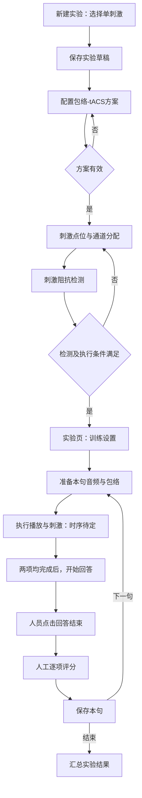

# EEG-tES 包络-tACS 单刺激言语训练 PRD

版本：V1.0 · 评审稿 · 2026-09-17

本轮补充：分阶段操作流程；刺激时长由本句最终音频决定。沿用当前文件，不另建平行版本。

| 版本 | 日期 | 修订人 | 说明 |
|---|---|---|---|
| V1.0 | 2026-09-17 | Codex／用户需求整理 | 单刺激入口、包络配置、刺激点位、训练执行与人工评分闭环 |
| V1.0 补充 | 2026-09-17 | Codex／用户需求整理 | 六阶段操作、动态主按钮、下一句循环；取消独立固定时长输入，保留联合执行时序待确认 |

**文档状态：**用户已确认总体方向；细节按“已确认”“设计建议”“待确认”区分。本文不是已实现功能说明，不构成设备参数或临床有效性认证。

**优先级：**本文最新的单刺激范围优先于此前含 EEG／录音采集的泳道图。本轮不修改或覆盖原 V2 交互文档、代码和原泳道图。

## 一、概述

### 1.1 背景、产品与目标

在现有 EEG-tES 产品中增加包络-tACS 言语训练流程。人员选择单刺激模式，完成刺激方案和刺激点位检测，进入实验页面配置语料，准备每句话的音频与包络，执行播放和刺激，组织患者回答并人工评分。

本版目标是形成可追溯的单句试次闭环，不要求接入 EEG、语音识别或康复评估模型。

| 目标 | 可验证结果 |
|---|---|
| 单刺激流程独立 | 无采集点位、采集阻抗或 EEG 数据依赖即可进入运行页面 |
| 配置职责清晰 | 刺激方案页设参数；点位页只分配与检测；实验页只设训练和执行 |
| 一句一记录 | 每个已保存试次可追溯句子、训练条件、刺激方案、执行事件和评分 |
| 防止误操作 | 切换页签不重复执行；重播音频不自动重启刺激；重复点击不创建重复操作 |
| 表现真实 | 计划波形不冒充实测输出；停止未确认不显示刺激已停止 |

### 1.2 名词

| 名词 | 定义 |
|---|---|
| 单刺激模式 | 本实验不执行 EEG 采集，仅执行刺激及言语任务 |
| 包络-tACS | 本需求的刺激方案名称；包络算法、幅值含义、协议映射尚待确认 |
| 实验 | 包含方案、点位、训练配置和多个句子试次的记录 |
| 试次 Trial | 一次具体句子的执行尝试；同句重新执行产生新试次 |
| 句表 | 语料库中的句子集合；与语料库名称分开显示 |
| 准备本句 | 加载并处理音频、生成包络、完成长度和设备能力校验，不播放、不刺激 |
| 计划刺激波形 | 软件计划下发的波形；没有设备实测反馈时不得称为实测波形 |
| 评分单元 | 人工判断的字、词或关键词；最终粒度和评分规则待确认 |

### 1.3 角色与权限

| 角色 | 本版职责 | 边界 |
|---|---|---|
| 操作人员 | 配置、检查、执行、停止、评分、保存 | 沿用现有登录与权限，不新增角色体系 |
| 患者／被试 | 听音与口头回答 | 不需要操作后台；不新增独立患者视图或双屏功能 |
| 设备／系统 | 参数校验、准备材料、执行反馈、保存 | 无法确认硬件状态时不得以界面计时替代设备事实 |

回答前不向患者展示标准答案的操作原则保留；本版不建设独立患者端，操作人员需控制现有屏幕展示。具体现场方式待确认。

### 1.4 阅读对象与依据

- 产品／设计：布局、字段、状态和范围。
- 前后端／设备研发：准备产物、状态反馈、版本绑定和数据契约。
- 测试：第 5.1 节验收场景及待确认阻塞项。
- 依据：本轮用户确认的流程、实验页面草图和此前提供的 MATLAB 476 行片段。
- MATLAB 片段末尾截断，未提供完整包络提取、硬件下发或评分算法。字段截图模糊处不推测，示例数值不视为默认值。

## 二、产品描述

### 2.1 范围

**已确认纳入：**单刺激入口、包络刺激方案、刺激点位和阻抗、训练配置、本句准备、音频／刺激执行、口头回答状态、人工对错评分、试次保存、重播与重新执行区分。

**明确不纳入：**EEG 采集、采集电极及采集阻抗、麦克风录音、自动转写、逐字时间对齐、REVE、CerebraGloss、自动评分、康复疗效判断、患者独立视图。

本版音频是“播放的题目音频”，不是回答录音。历史讨论的录音回听能力不在本版。

### 2.2 流程与状态

#### 2.2.1 主流程

“执行播放与刺激”是暂时封装的阶段，不表示二者同时启动。先后顺序、是否需要第二次点击是阻塞真实执行的待确认项。

当前设计建议是由“开始本句”统一调度声音与刺激，在听音期间保持受控的时间关系；这不代表已确认零延迟或具体相对延迟。不得靠人员先后点击两个按钮来声称精确同步。

#### 2.2.1a 六阶段页面操作（本轮补充）

| 阶段 | 页面重点 | 允许操作 | 进入下一阶段的条件 |
|---|---|---|---|
| ① 训练设置 | 语料库、句表、测试模式、语音形式与联动参数 | 修改设置、准备本句 | 人员提交且输入校验通过 |
| ② 本句准备 | 音频与包络生成状态、由音频推导的时长、校验结果 | 失败重试；就绪后开始本句 | 准备成功、执行条件有效且人员点击开始 |
| ③ 播放／刺激 | 音频进度、刺激进度和设备状态 | 停止；可切换视图但不得修改参数或重复启动 | 两项正常完成且设备确认停止 |
| ④ 患者回答 | 当前句序号、请患者回答提示；不展示标准答案 | 开始回答、回答结束 | 人员确认回答结束 |
| ⑤ 人工评分 | 标准句、逐项对错、全对／全错、统计 | 修改评分、保存并下一句 | 全部评分完成且保存成功 |
| ⑥ 完成实验 | 各句成绩、完成／中止／重做记录 | 查看结果、返回 | 最后一句保存或完成提前结束处理 |

第一句从①开始；后续“保存并下一句”返回②，继承训练条件，不要求重复设置，也不自动开始刺激。若人员修改影响材料的条件，须重新校验并准备。最后一句显示“保存并完成”。

页面顶部增加阶段指示：设置 → 准备 → 执行 → 回答 → 评分，完成后展示完成状态。阶段条是状态反馈，不允许点击绕过门禁；错误／中止另显示异常状态。

右侧突出当前阶段唯一主操作，其他动作按状态开放；刺激期间停止入口始终可见。左侧执行阶段以刺激监控为主，回答结束后展示评分内容。“刺激监控／训练页面”切换只是视图切换，不推进流程、不重置计时、不触发播放或刺激。

#### 2.2.2 单句执行与数据流

训练条件＋句子版本 → 音频处理 → 包络生成与时长校验 → 本句准备产物。

准备产物＋方案版本＋点位／阻抗有效性 → 执行事件 → 人工评分 → 同一 Trial ID 保存。

变更输入使旧准备产物失效，不能把新参数标签与旧音频／旧包络混用。

#### 2.2.3 试次状态

| 状态 | 含义 | 可用主操作 | 离开条件 |
|---|---|---|---|
| 未准备 | 已选本句，尚无有效准备产物 | 准备本句 | 输入校验通过 |
| 准备中 | 正在加载音频／生成包络 | 等待；不得重复触发 | 成功或失败 |
| 准备失败 | 材料或生成失败 | 查看原因、修正、重试准备 | 重新准备成功 |
| 就绪 | 音频、包络及方案版本一致 | 开始本句 | 执行前条件再次通过；内部调度按确认方案执行 |
| 执行中 | 播放／刺激子阶段正在进行 | 状态展示、停止 | 两项完成且刺激状态确认 |
| 待回答 | 播放与刺激均正常完成 | 开始回答 | 人员点击 |
| 回答中 | 患者口头回答，无录音／采集 | 回答结束 | 人员点击 |
| 待评分 | 回答结束 | 标记对错、全对、全错 | 无未评分项 |
| 保存中 | 正在持久化本句 | 等待 | 保存成功或失败 |
| 已保存 | 本句结果已确认保存 | 下一句、重新执行、结束 | 新试次或实验结束 |
| 停止待确认 | 已发停止请求但设备结果未知 | 保持告警、查询状态 | 设备反馈／人工按设备规程处理 |
| 中止 | 未按计划完整执行 | 保存中止记录、重新准备 | 不进入正常完成统计 |

播放和刺激分别保留子状态：未开始／执行中／已完成／失败／未知。总状态不能只由倒计时推断。暂停和断点续刺激不属于本版，避免把“继续”隐式实现为重新刺激。

### 2.3 全局交互与异常

- 当前状态决定按钮可用性，禁用项应说明原因。
- 异步按钮首击后进入处理中，使用请求标识防止重入。
- 标签页切换不触发开始／停止、不重置当前句。
- 执行中不允许修改方案、点位、语料、句表或模式；返回操作需先处理停止状态。
- 未执行时修改训练条件，应提示旧准备产物失效；已保存试次的历史快照不被覆盖。
- 刷新、关闭或崩溃后的设备停止保障依赖设备协议和独立保护机制，不能依赖浏览器卸载事件保证停止。
- 空语料显示“当前句表暂无可用句子”；不得自动跳到其他语料执行。
- 权限不足禁止实际命令；网络／设备异常不自动重试开始刺激。
- 本轮不增加通用记录管理、分页、批量删除或新导出格式。

### 2.4 版本规划

| 范围 | 本版定位 | 说明 |
|---|---|---|
| 页面与流程 | 评审后实施 | 本文不代表已授权执行硬件实验 |
| 训练模式兼容 | 字段覆盖原程序已知选项 | 真实算法／材料未接入的模式不得假装可执行 |
| 设备真实执行 | 待协议和安全约束确认 | 原型演示与实际设备模式须明确区分 |
| 采集及字词对齐 | 后续独立需求 | 不作为本版依赖，无承诺排期 |

### 2.5 页面框架

新建实验页 → 独立刺激方案页 → 现有头模点位页 → 实验运行页。

实验运行页：左侧“刺激监控／训练页面”双页签；右侧“运行监控、刺激方案摘要、训练设置、操作控制”。右侧可因左侧页签变化折叠非关键设置，但状态与停止入口持续可见。

### 2.6 功能清单

| 编号 | 功能 | 优先级 |
|---|---|---|
| F01 | 单刺激草稿和路由 | P0 |
| F02 | 包络方案字段、校验和保存 | P0；部分参数待确认 |
| F03 | 刺激点位与阻抗复用 | P0 |
| F04 | 实验双页签与只读方案摘要 | P0 |
| F05 | 训练条件联动和本句准备 | P0 |
| F06 | 状态驱动执行和停止 | P0；时序待确认 |
| F07 | 人工对错评分 | P0；计分细则待确认 |
| F08 | 试次保存、重播、重做和结束 | P0 |

## 三、功能需求

### 3.1 新建实验与单刺激模式（F01）

**用户故事：**作为操作人员，我希望明确选择单刺激，以免被采集相关步骤阻挡。

**前置：**已登录，沿用现有设备连接检查。**后置：**实验草稿保存成功，进入刺激方案。

| 字段／元素 | 类型／必填 | 默认与校验 | 数据键示意 |
|---|---|---|---|
| 实验 ID | 系统生成／是 | 不可手动覆盖 | experiment_id |
| 被试 ID | 输入或继承／是 | 沿用已有校验，不臆造新长度规则 | subject_id |
| 实验模式 | 单选／是 | 用户明确选择单刺激，不暗改其他模式 | experiment_mode=stimulation_only |
| 备注 | 文本／否 | 沿用现有规则 | note |
| 保存并配置刺激 | 按钮 | 保存成功才跳转，失败停留并保留输入 | — |

已有导入／复制配置需检查模式兼容性；不能静默把采集配置转换为本模式。历史其他模式不得因本功能回归失效。

### 3.2 包络-tACS 刺激方案（F02）

**用户故事：**人员先确定刺激方案，再分配点位。**前置：**单刺激草稿存在。**后置：**保存有版本号的有效方案，允许进入点位页。

#### 3.2.1 字段字典

所有数值示例均不是推荐参数；下表刻意不填截图示例值。设备范围、精度和单位确认前，不允许用随意默认值驱动真实设备。

| 字段 | 类型／单位 | 必填与默认 | 校验／联动 | 状态 |
|---|---|---|---|---|
| 刺激范式 paradigm | 产品样式选择器 | 是；包络-tACS | 不用浏览器原生 select 替换现有范式控件 | 名称待统一 |
| 开关通道设置 channel_mode | 枚举 | 条件必填；不预设 | 含义及选项由完整代码／协议确认 | 待确认 |
| 刺激波形 waveform_type | 枚举 | 是；不预设 | 原代码：正弦／方／三角／自定义；包络可用项未定 | 待确认 |
| 最大电流 max_current_ma | 数值／mA | 是；不预设 | 有限数值，设备允许范围与幅值定义待定 | 待确认 |
| 刺激时长 stimulation_duration | 系统计算／只读 | 跟随本句最终音频；不提供独立输入 | 准备后显示实际时长；设备上限和精度仍需校验 | 本轮已确认 |
| 占空比 duty_cycle_percent | 数值／% | 条件显示；不预设 | 仅在协议确认适用时显示；范围待定 | 待确认 |
| 包络来源 envelope_source | 配置／规则 | 不先做成开放字段 | 原始或处理后音频待定 | 待确认 |
| 频率／延迟／比例字段 | 未定 | 不生成猜测字段 | 原图模糊、代码片段缺失 | 阻塞完整实现 |

包络-tACS 与标准 tACS 的协议含义不得直接等同。字段是否可配置、是否由算法生成，需要设备和算法共同确认。

#### 3.2.2 展示、按钮和失效规则

- 显示方案预览、单位及错误提示；本句材料尚未加载时明确为“方案示意”，不冒充本句最终包络。
- 保存方案：允许保存不完整草稿，但进入点位页面需必填与约束全部通过。
- 芯片初始化：原界面存在；本版是否独立按钮待定，不能替代连接和执行校验。
- 修改方案产生新版本，使对应刺激阻抗结果失效；已执行试次保留旧快照。
- 现有耐受记录引用和设备约束沿用，不在点位页新增耐受测试；包络范式适用性待专业／协议确认。
- 刺激时长由当前句最终播放音频决定，不再由人员输入统一固定时长。方案页显示“跟随本句音频”，实验页准备完成后显示音频时长和刺激时长。
- 调整语速或其他改变音频的条件后，重新生成包络并推导时长。包络须与当前最终音频保持对应；提取源信号是纯语音还是加噪后音频仍待算法确认。
- 滤波、重采样、缓升缓降等产生的边界处理仍需算法／协议确认，不得默认截断、拉伸、循环或填充。相对延迟不等于刺激持续时间；存在延迟时总执行窗口可能长于音频，必须等两项都结束。

**异常：**保存失败保留输入；不支持的波形明确提示；断连可保留草稿但不能宣称设备配置已生效。

### 3.3 刺激点位和阻抗（F03）

**用户故事：**人员沿用现有头模完成刺激电极分配，不需要配置 EEG。**前置：**方案有效。**后置：**所需刺激点位、通道及检测条件满足，进入实验页。

- 隐藏本模式的采集任务和采集阻抗入口；不删除其他模式的采集能力。
- 头模大小、位置及 20 个电极坐标遵循共享基线，不因本模式重排。
- 未分配为白色；已选刺激点位为蓝色，显示极性／角色；检测后保留角色后缀并显示阻抗语义颜色。
- 分配清单字段：头部位置、物理通道、角色／极性、分配状态、阻抗值与单位、检测状态、检测时间。
- 未有效配置方案或缺少必要电极时，阻抗检测不可用。
- 点位冲突、通道不支持、检测失败均需就地提示；阈值和有效期沿用已批准的设备规则，不在本文发明数值。
- 修改刺激方案或分配后使先前刺激阻抗失效；训练条件若改变最终硬件约束也要重新校验，不能只看方案 ID。
- 保留现有可见性语义，不因页面跳转自动改变勾选；隐藏／淡化不修改分配。

**数据键示意：**assignment_version、electrode_position、physical_channel、polarity、impedance_value、impedance_unit、checked_at、validity、plan_version。

### 3.4 实验页面框架（F04）

**用户故事：**人员在同一页面监控刺激并完成训练评分。**前置：**点位与检测门禁满足。**后置：**所有操作作用于同一当前试次。

#### 3.4.1 顶部与右栏

| 区域 | 内容 | 交互规则 |
|---|---|---|
| 顶部 | 实验 ID、被试 ID、返回入口 | 返回名称与真实目的地一致；执行中不能静默离开 |
| 设备状态 | 当前模式相关连接状态 | 不将 EEG 未连接显示为阻塞本实验的错误 |
| 运行监控 | 当前阶段、通信状态、倒计时、异常 | 设备上报与本地估计明确区分 |
| 方案摘要 | 范式、电流、时长、点位／通道 | 只读；修改返回方案页 |
| 训练设置 | 语料、句表、模式、语音形式及参数 | 执行中锁定 |
| 操作控制 | 主按钮、停止、结束 | 两页签下共享状态，停止始终可找到 |

#### 3.4.2 左侧：刺激监控

- 移除本模式的 Fz／CP4 等 EEG 通道行、灵敏度、纸速、高低通、陷波和 EEG 游标工具。
- 显示当前句音频波形、对应计划刺激包络，二者分轨展示各自时长和进度。
- 音频单位随实际数据标注；不得沿用 EEG 的微伏刻度。刺激包络单位按已确认协议标注。
- 执行时序未确认前只展示各自相对时间，不绘制暗示二者同步的起始线。
- 无设备实际波形反馈时标题必须是“计划刺激波形／包络预览”；有回传也需标识来源。
- 刺激倒计时达到零不独立触发“设备已停止”；需按设备结束反馈规则处理。
- 未准备显示说明，不展示伪造波形；生成失败保留错误与重新准备入口。

#### 3.4.3 左侧：训练页面

- 展示当前句序号、回答状态及评分区。
- 在回答结束前不展示可误用的标准答案；不新增患者专用页面。
- 切换页签保留所有选择、进度和未保存评分；不能重放或重复刺激。
- 自动切到评分页属于设计建议，切换时机为“回答结束”；不允许自动提交评分。

### 3.5 训练设置和本句准备（F05）

**用户故事：**人员选择材料与条件并检查本句已准备好，再执行。**前置：**实验页可用。**后置：**有与当前配置版本一致的准备产物。

#### 3.5.1 基础字段

| 字段／键 | 类型 | 必填／默认 | 校验与示例 |
|---|---|---|---|
| 被试信息 subject_id | 只读文本 | 继承 | 不重复输入用户名 |
| 语料库 corpus_id | 下拉 | 是；默认待定 | MSP／MHINT／XXBKB／MSP10 |
| 句表 list_id | 联动下拉 | 是；无有效值须重新选 | 显示真实编号，不显示 MSP 代替编号 |
| 测试模式 test_mode | 单选／产品下拉 | 是；默认待定 | 固定语速／自适应语速／自适应SNR／固定SNR／混响 |
| 语音形式 speech_form | 单选／下拉 | 是；默认待定 | 原始语音／声码器仿真 |
| 语速 speaking_rate | 数值，字／秒 | 固定语速时必填 | 0 的原程序语义待定；正式范围待定 |
| 噪声类型 noise_type | 枚举 | 加噪模式必填 | SSN／Babble；按库验证素材可用性 |
| 信噪比 snr_db | 数值，dB | 对应模式必填 | 自适应显示“初始信噪比”，固定显示“信噪比” |

句表来源：MSP 1–5（每项一对相邻句表）；MHINT 1–12、P1、P2；XXBKB 07A、08B、09C、10D、11E、12F、13G、14H、15I、16J；MSP10 1–10。

#### 3.5.2 条件字段

| 条件 | 字段 | 控件／单位 | 规则 |
|---|---|---|---|
| 混响 | 早晚分界时间 | 数值／ms | 分界相对何处、范围及RIR加载接口待确认 |
| 混响 | 早期、晚期混响 | 两个开关 | 按现有算法能力验证 |
| 混响 | 添加噪声 | 开关 | 开启才显示噪声类型与SNR |
| 声码器 | 通道数 | 整数 | 范围待确认 |
| 声码器 | 方法 | 枚举 | 片段明确Classic、ACE；完整项待确认 |
| 特定声码器方法 | N-maxima | 整数 | 显示条件及约束待完整算法确认 |
| 声码器 | 载波类型 | 枚举 | 噪声／纯音，不沿用原代码数字倒置作为UI语义 |
| 播放设备 | 设备选择 | 枚举 | 是否迁移声卡／CCiMobile待定；未支持设备不可宣称可执行 |

自适应语速和 SNR 的步长、反转及结束规则不能仅凭初始化片段实现。自动根据成绩生成下一句条件前，须确认完整算法、使用哪次成绩及重播试次处理。未接入的模式应禁用并说明，不静默降为固定模式。

#### 3.5.3 本句准备步骤

1. 校验必填、材料权限与可用性，确定句子 ID／材料版本及训练配置版本。
2. 加载并按模式处理音频；显示进度与失败原因。
3. 按确认的包络规则生成刺激波形，按最终音频推导刺激持续时间，校验幅值、样本格式、时间对应和设备限制。
4. 建立不可变的准备产物引用；展示音频／包络和就绪状态。
5. 此时不播放、不刺激；用户显式执行才进入下一阶段。

更换句子、语料、句表或影响音频的参数后，需要重新准备。缓存可复用，但必须按输入版本校验，不能靠文件名判断一致。

**异常提示示例：**“句子音频不可用，请更换材料或重试”“包络生成失败，尚未开始刺激”“音频与刺激时长不匹配，处理规则尚未配置”。

### 3.6 播放、刺激、停止与回答（F06）

**用户故事：**人员明确知道正在播放、刺激还是等待回答，并能停止。**前置：**本句就绪、设备条件有效、执行时序已确认。**后置：**正常进入待回答，或记录异常／中止。

- 主操作名称随状态变化，不能始终显示“开始播放”却同时下发未知刺激。
- 本句执行入口命名“开始本句”；包络已经在准备阶段生成，不需要先播放才能提取。联合执行是建议方向，具体延迟、相位关系和实际同步能力须经确认与验证。
- 开始前再次验证连接、方案／点位版本、阻抗条件、本句产物及已配置时序。
- 播放与刺激分别记录请求、确认、结束、失败时间，不把按钮点击时间当成实际设备开始时间。
- 执行前锁定材料和配置；单次有效触发，重复点击不重复下发。
- “先播后刺激”与“同步执行”作为待确认分支，不自行选择任一方案。
- 正常结束需播放和刺激均完成；再允许开始回答。回答结束只改变流程状态，不采集任何音频或 EEG。
- 紧急停止在两个页签都可见，首次触发不先弹确认框延迟停止请求；停止后如何结束本试次按反馈处理。
- 停止无确认：持续显示“停止状态待确认”，禁止下一句刺激，提示按设备规程处理；不能反复自动发送开始命令。
- 通信断开不等于刺激停止。设备看门狗和独立停止机制由设备规范定义并需单独验证。
- 本轮不提供自动续刺激或暂停后继续；若需重新执行，创建新试次。

**数据：**execution_policy、audio_status、stim_status、command_id、request_at、ack_at、actual_start_at、actual_end_at、time_source、error_code。实际时间未知则为空，不填本地估计冒充。

### 3.7 人工答题与对错评分（F07）

**用户故事：**人员根据患者口头回答逐项评分，不依赖自动识别。**前置：**回答结束。**后置：**所有评分项完整，允许保存。

| 字段／元素 | 类型 | 初始值／规则 |
|---|---|---|
| 句序号、总句数 | 只读 | 来源句表清单，不硬编码 |
| 标准句 | 文本 | 供人员评分；回答阶段不提前展示 |
| 评分单元 | 字／词卡 | 根据已确认评分规则生成 |
| 单项状态 | 枚举 | unscored／correct／incorrect，默认未评分 |
| 错误类型 | 可选枚举 | 错答／漏答等是否第一版细分待确认 |
| 已评数／总数 | 自动统计 | 不以未评分代替错误 |
| 正确数／错误数 | 自动统计 | 与卡片状态一致 |
| 正确率 | 只读 | 未评完整显示“待完成”；总数为0不计算 |
| 全对／全错 | 按钮 | 批量设置所有项，之后仍可逐项修改 |
| 保存并下一句 | 按钮 | 无未评分项、保存成功后才前进 |

**设计建议：**点击评分卡提供清晰的“正确／错误”选择，可另设“恢复未评分”；具体手势由UI评审确认，不能只有颜色表达状态。

**计分规则待确认：**按字还是关键词、同音字、口音、重复、自我纠正、漏答、额外内容的处理。规则确定后以版本随试次保存。不能因为语料文本的书写不同就替人员自动判错。

**设计建议公式：**完整评分后的本句正确率＝正确评分单元数／总评分单元数。该公式须与最终评分规范一致，不直接解释为康复效果。

保存失败保留所有标记和当前句，提供重试；不能跳到下一句导致丢分。已保存评分若允许更改，须保留修改审计，权限和入口待确认。

### 3.8 重播、重新执行、保存与结束（F08）

**用户故事：**人员可以区别“再听一遍”和“再做一次”，并保留真实过程。**前置：**当前状态允许该动作。**后置：**事件和结果持久化，不覆盖原执行。

| 操作 | 业务规则 |
|---|---|
| 重播题目 | 只播放音频，不自动再次刺激；记录次数、时间和所在阶段 |
| 执行中重播 | 不开放，以免重复音频破坏本次执行时序 |
| 回答后重播 | 如用于让患者再次回答，需明确重新回答与旧评分处理规则；第一版建议不允许静默改答案 |
| 重新执行本句 | 新 Trial ID，引用原试次，明确确认重新执行包含刺激；重做前重新检查条件 |
| 保存并下一句 | 先保存当前结果，再创建下一试次并准备；不自动刺激 |
| 最后一句 | 按钮改为“保存并完成”，不得访问不存在的下一句 |
| 提前结束 | 已保存结果保留，当前未完成试次记中止；有未保存评分先提示保存或明确放弃 |
| 运行中结束 | 先请求停止并确认硬件状态，再结束实验，不以离开页面代替停止 |

**保存内容：**实验/试次/被试标识、句表/句子/材料版本、训练参数、方案/点位版本、准备产物引用、实际执行事件、重播次数、评分项与规则版本、中止原因、人员及保存时间。

**设计建议汇总：**完成试次数、中止试次数、重做次数、各句得分。总正确率若展示，应为有效纳入试次正确项合计／总项合计，不简单平均不同长度句子的百分比。重播／重做是否纳入主统计待确认；至少能单独识别，不能静默混入。

## 四、非功能需求

### 4.1 安全、隐私与可用性

- 不新增采集，不表示取消刺激相关连接、参数、阻抗和停止保障。
- 真实硬件参数必须来自经确认的协议和适用限制，本文不提供新的电流／频率推荐值。
- 仅保存本任务所需身份标识；日志避免记录不必要个人信息，材料路径与错误信息不泄露凭据。
- 模拟与真实设备模式明确标识，模拟倒计时不能伪装实测反馈。
- 关键状态同时使用文字与颜色；键盘操作不得因回车重复触发刺激。
- 刷新恢复只恢复记录和展示，绝不自动重新开始刺激；恢复前查询设备状态。

### 4.2 事件与审计

| 事件 | 触发时机 | 主要属性 |
|---|---|---|
| training_page_view | 进入实验页 | experiment_id、mode、page |
| plan_saved | 方案保存成功 | plan_version、validation_status |
| trial_prepare_started/completed/failed | 准备变化 | trial_id、config_version、duration、error_code |
| audio_start/end/replay | 音频实际事件 | trial_id、material_version、replay_count、time_source |
| stim_requested/acknowledged/completed | 命令与反馈 | command_id、trial_id、device_state、time_source |
| stop_requested/confirmed/unconfirmed | 停止流程 | command_id、reason、设备反馈 |
| answer_started/ended | 人员操作 | trial_id、operator_id、timestamp |
| score_saved | 保存成功 | trial_id、score_rule_version、计数、revision |
| trial_aborted/retried | 中止／重做 | trial_id、parent_trial_id、reason |
| experiment_completed | 完成／提前结束 | experiment_id、completion_type、试次计数 |

审计事件用于追溯，不要求本版新建运营分析平台。刺激命令记录与普通点击埋点不能混为同一成功事件。

### 4.3 性能与可靠性

- 准备阶段展示进度或明确等待状态；处理超时可恢复，不重复执行刺激。
- 界面反馈、包络准备时长、保存时延和停止反馈阈值均待结合部署与设备确认，不承诺未测试的毫秒级精度。
- 波形绘制不阻塞停止入口和设备事件处理。
- 保存采用幂等键，保存失败不导致句子推进；重复反馈不创建重复试次。
- 原始已保存记录不得因修改训练条件覆盖；存储位置、保留周期和备份策略待确认。

### 4.4 逻辑数据模型（不是已定数据库表结构）

| 对象 | 核心字段 | 关联 |
|---|---|---|
| Experiment | id、subject_id、mode、status、created_at | 方案与多试次 |
| StimPlan | id、version、paradigm、参数、validation | 点位与试次快照 |
| StimAssignment | version、位置/通道/角色、检测结果 | 指向方案版本 |
| TrainingConfig | version、corpus/list/mode、参数、algorithm_version | 准备产物和试次 |
| PreparedSentence | sentence_id、source_version、audio_ref、envelope_ref、hash、durations | 确定输入版本 |
| Trial | id、parent_trial_id、句序号、状态、各快照引用 | 事件与评分 |
| TrialEvent | id、trial_id、type、时间、来源、command_id、结果 | 审计时间线 |
| Score | trial_id、revision、unit_id、status、rule_version、operator_id | 逐项评分 |

建议唯一约束覆盖试次保存请求与命令ID；精确类型、索引和存储技术由研发评审确定。所有失败／未知时间允许空值，不能用0代表实际完成。

### 4.5 系统集成与依赖

| 依赖 | 输入／输出 | 缺失时策略 |
|---|---|---|
| 现有实验草稿 | 被试、模式、实验ID | 保存失败不跳转 |
| 刺激方案与协议校验 | 参数→校验结果 | 不支持参数不能执行 |
| 头模／阻抗模块 | 分配→检测结果 | 结果无效禁止开始 |
| 语料资源 | 句子文本、音频、句表 | 缺资源显示错误，不用假材料顶替 |
| 音频处理／包络生成 | 条件→准备产物 | 失败不允许进入就绪 |
| 音频播放 | 命令→实际播放反馈 | 播放失败记录异常并按确认策略处理刺激 |
| 刺激设备 | 下发／开始／停止→反馈 | 不自动重试开始；未知状态明确告警 |
| 结果保存 | 试次＋评分→持久化确认 | 保留界面并允许幂等重试 |

实际设备接口与算法完整性是上线依赖；页面原型能运行不等于这些依赖已完成。

## 五、附录

### 5.1 验收标准与测试要点

| ID | 场景与操作 | 预期结果 |
|---|---|---|
| AC01 | 新建选择单刺激并保存 | 草稿含正确模式，进入方案页，无采集必填 |
| AC02 | 缺失必填刺激参数进入点位页 | 阻止跳转并定位缺失项 |
| AC03 | 修改方案或刺激点位 | 旧刺激阻抗失效，不能直接开始 |
| AC04 | 仅配置刺激点位并通过检测 | 可进入实验页，不要求采集检测 |
| AC05 | 切换模式查看头模 | 共享坐标与尺寸不改变，分配和语义色符合现有规则 |
| AC06 | 单刺激实验页 | 不出现EEG通道、滤波／纸速工具及伪采集图 |
| AC07 | 无设备实测波形 | 图标题明确是计划波形／预览 |
| AC08 | 选择不同语料库 | 句表联动，旧非法选择失效 |
| AC09 | 切换训练模式 | 仅展示适用参数；未实现算法不伪执行 |
| AC10 | 点击准备本句 | 生成材料与包络，不播放、不刺激 |
| AC11 | 时长不匹配且无确认规则 | 无法进入真实执行，不擅自补齐／截断 |
| AC12 | 准备后更改训练条件 | 就绪状态失效，须重新准备 |
| AC13 | 连续点击开始／切换页签 | 只触发一次执行，进度保持 |
| AC14 | 播放或刺激任一未正常完成 | 不进入正常待回答 |
| AC15 | 刺激运行时切换训练页 | 停止入口持续可见可用 |
| AC16 | 停止请求无确认或设备断连 | 显示未知／待确认，不能宣称已停止或开始下一句 |
| AC17 | 点击开始回答／回答结束 | 仅状态变更，不启动录音或EEG |
| AC18 | 初次打开评分 | 所有项未评分，答案在回答阶段不提前展示 |
| AC19 | 全对后改单项错误 | 项目计数与正确率一致；未评完整不保存前进 |
| AC20 | 保存失败后重试 | 保留本句全部评分，不跳句、不重复记录 |
| AC21 | 重播题目 | 只播放音频并计数，不重启刺激 |
| AC22 | 重新执行同句 | 创建新Trial并关联旧试次，不覆盖原结果 |
| AC23 | 最后一句保存／提前结束 | 正确汇总，未完成试次标记，停止状态未确认不能假结束 |
| AC24 | 页面刷新恢复 | 不自动重新刺激；历史记录可追溯，运行状态需核对 |
| AC25 | 查已保存试次 | 可定位当时参数、材料、方案版本、事件与评分 |
| AC26 | 回归其他实验模式 | 原EEG模式、头模共享规则、现有tDCS原始波形资产不被替换 |
| AC27 | 选择不同长度句子或修改语速后准备 | 刺激时长跟随最终音频重新计算，不存在独立固定时长输入，旧包络失效 |
| AC28 | 完成一条非末句评分并保存 | 继承训练设置进入下一句准备，不重复设置且不自动刺激 |
| AC29 | 查看各阶段主操作及阶段条 | 仅开放当前状态允许的操作，不能点击阶段条跳过执行门禁 |
| AC30 | 设置经批准的相对延迟后执行 | 持续时间与相对延迟分开记录；不能仅音频结束就进入回答 |

真实设备执行相关 AC 项须在已确认的协议和受控验证环境下测试；原型通过不替代硬件验证。

### 5.2 待确认项索引

必须确认：Q01 播放—刺激时序及按钮；Q02 包络算法/字段/幅值定义；Q03 时长匹配；Q04 参数范围与设备协议；Q05 评分粒度与规则；Q06 训练算法/材料可用范围；Q07 停止反馈和异常策略。

影响完整度：Q08 重播/重做统计；Q09 默认值与语速0；Q10 芯片初始化与播放设备；Q11 保存、历史展示与保留；Q12 性能阈值；Q13 患者答案展示的现场安排。

详见同目录《包络tACS单刺激言语训练_待确认项_V1.0.md》。确认前可以完成界面结构和无设备原型，但不得用猜测值补齐真实刺激流程。

### 5.3 参考与变更范围

- 当前用户实验页面草图：左侧双页签，右侧运行监控及训练设置。
- 早期讨论产物：`deliverables/envelope-tacs-swimlane.html`，含采集/录音设想，与本版范围不同，仅作历史参考。
- 原始程序：`SpeechIntelligibility` MATLAB 粘贴片段，非完整代码。
- 本 PRD 使用需求结构化与边界补漏方法，增加状态、异常、逻辑数据模型和验收条款；尚未确认的技术或评分细节保留标记，不冒充用户已确认或系统已有功能。
