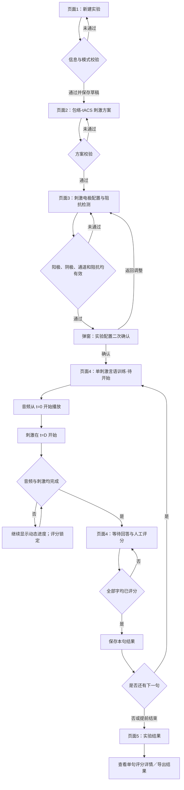

# EEG-tES 包络-tACS 单刺激页面交互流程图

版本：V1.0  
日期：2026-09-21  
文档类型：页面流程与交互说明  
适用范围：单刺激模式（包络-tACS），不包含 EEG 采集

## 1. 文档目的

本文按“页面 → 操作 → 校验 → 状态 → 跳转”的方式，说明包络-tACS 单刺激实验从新建到结果查看的完整页面闭环，可用于产品、设计、研发和测试共同评审。

设计依据：

- Figma 页面：`单刺激（包络）`
- 起始节点：`555:12471`（新建实验）
- 方案节点：`549:5914`（包络-tACS 参数）
- 电极节点：`549:6173`、`549:6329`
- 训练节点：`549:6797`、`554:7879`、`555:9521`
- 结果节点：`555:10353`
- 相关弹窗：`555:10250`、`555:12704`、`555:12298`

## 2. 本版关键口径

1. 本流程选择“单刺激模式”，只执行刺激和言语训练，不配置 EEG 采集点位，也不产生 EEG 数据。
2. 包络由当前句子的最终播放音频生成；刺激时长跟随该句音频，不另设独立固定时长。
3. “延时”统一命名为“刺激启动延时”。
4. 刺激启动延时的定义：音频在 `t = 0` 开始播放，经过设定延时 `D` 后，刺激在 `t = D` 开始。
5. 示例：`D = 40 ms = 0.04 s`，表示音频开始 0.04 秒后刺激才启动；刺激也相应晚 0.04 秒结束。
6. 音频包络和刺激波形在未播放前均不显示；播放后随各自时间进度从左向右逐步出现，不允许一开始完整展示。
7. 只有音频和刺激都完整结束后，才开放人工评分。
8. “重播题目音频”只重播音频，不再次执行刺激。

> 口径优先级：以“刺激方案配置”和“实验配置二次确认”中的新口径为准。旧稿中“相对延迟 13 s”“采集点位”等内容不进入本次单刺激流程。

## 3. 页面总流程图



## 4. 结构化页面交互图

```text
[页面1：新建实验]
    |
    | → 查看系统生成的实验 ID
    | → 选择实验日期
    | → 选择模式：
    |      [单刺激模式] / [单采集模式] / [采集-刺激模式]
    |      本流程必须选择：[单刺激模式]
    |
    | → 录入被试信息：
    |      * 被试 ID：必填
    |      * 备注：选填
    |
    | → 可选：[导入历史配置]
    |      → 仅接受与单刺激模式兼容的配置
    |      → 不允许静默带入 EEG 采集步骤
    |
    | → 可选：[导入实验参数包]
    |      → 选择本地 .expp 文件
    |      → 解析成功：回填可复用参数
    |      → 解析失败：停留当前页并显示原因
    |
    | → 点击 [确定并进入下一步]
    |      → 校验失败：定位必填项，不跳页
    |      → 校验成功：保存 Experiment Draft → 进入页面2
    |
    | → 点击 [返回]
    |      → 返回首页；未保存内容需二次确认
    ▼

[页面2：包络-tACS 刺激方案配置]
    |
    | ← 点击 [返回]：回到页面1，保留已保存草稿
    |
    | → 选择刺激范式：[包络-tACS]
    |      → 页面标题和示意图同步切换
    |      → 本流程不进入 tDCS / tACS / tRNS / tPCS / Sham
    |
    | → 设置 [最大电流]
    |      → 单位：mA
    |      → 页面允许范围：0～2 mA
    |      → 必须 > 0 且不能超过设备、方案及耐受记录上限
    |
    | → 设置 [刺激启动延时]
    |      → 单位：ms
    |      → 页面允许范围：0～300 ms
    |      → 含义：音频开始后等待 D，再启动刺激
    |      → 示例：40 ms = 0.04 s
    |
    | → 查看 [示意图]
    |      → 横轴：时间 0～10 s
    |      → 纵轴：电流 -2～2 mA
    |      → 仅表示方案形态，不代表真实设备回传
    |
    | → 参数发生变化
    |      → 重新校验方案
    |      → 已有刺激阻抗结果失效（如存在）
    |
    | → 点击 [确定并进入下一步]
    |      → 校验失败：停留当前页，显示字段错误
    |      → 校验通过：保存刺激方案版本 → 进入页面3
    ▼

[页面3：刺激电极配置与阻抗检测]
    |
    | ← 点击 [返回]：回到页面2
    |      → 已保存方案继续保留
    |      → 修改方案后必须重新检测阻抗
    |
    | → 头模和点位
    |      → 使用全流程统一的头模尺寸、位置和点位坐标
    |      → 点位默认未分配：白色
    |      → 当前支持：FP2、F3、FC5、T7、Cz、T8、CP5、P3
    |
    | → 选择 [阳极]
    |      → 点击支持的头模点位
    |      → 点位变为蓝色，显示“点位·A”
    |      → 选择物理通道，如 CH2
    |
    | → 选择 [阴极]
    |      → 点击另一支持点位
    |      → 点位变为蓝色，显示“点位·C”
    |      → 选择另一物理通道，如 CH4
    |
    | → 系统即时校验：
    |      → 阳极与阴极是否都已分配
    |      → 阳极与阴极是否使用不同头部点位
    |      → 阳极与阴极是否使用不同物理通道
    |      → 点位是否属于当前范式支持范围
    |      → 刺激方案版本是否仍有效
    |
    | → 点击 [检测]
    |      → 状态：未检测 → 检测中
    |      → 检测中按钮变为 [停止检测]
    |      → 实时显示各刺激通道阻抗值和等级
    |
    | → 检测结果分支：
    |      → 任一通道未通过：
    |          → 标记问题点位及阻抗等级
    |          → 禁止进入实验
    |          → 提示调整电极接触后 [重新检测]
    |      → 全部通道通过：
    |          → 点位保留 ·A / ·C 后缀
    |          → 按阻抗语义颜色显示
    |          → 开放 [查看并确认实验配置]
    |
    | → 修改点位、极性或物理通道
    |      → 旧阻抗结果立即失效
    |      → 必须重新检测
    |
    | → 点击 [查看并确认实验配置]
    ▼

[弹窗A：实验配置二次确认]
    |
    | → 展示只读摘要：
    |      → 刺激范式：包络-tACS · 单刺激
    |      → 最大电流
    |      → 刺激启动延时：同时显示 ms 和 s
    |      → 阳极点位 / 通道
    |      → 阴极点位 / 通道
    |      → 阻抗检测结果
    |
    | → 点击 [返回调整]
    |      → 关闭弹窗，回到页面3
    |
    | → 点击 [确认并进入言语训练]
    |      → 锁定本次刺激配置快照
    |      → 进入页面4-状态A
    ▼

[页面4：单刺激言语训练]
    |
    |-- [状态A：待开始]
    |      |
    |      | → 显示刺激方案摘要：范式、电流、启动延时、A/C 点位
    |      | → 设置训练条件：
    |      |      → 语料库
    |      |      → 句表号
    |      |      → 测试模式
    |      |      → 语音形式
    |      |      → 语速
    |      |
    |      | → 显示当前句序号，例如 01 / 20
    |      | → 音频包络区：只显示空坐标网格，不显示波形
    |      | → 刺激波形区：只显示空坐标网格，不显示波形
    |      | → 所有逐字评分控件禁用
    |      |
    |      | → 点击 [开始播放音频并刺激]
    |      |      → 再次校验设备连接、方案、点位、阻抗和音频
    |      |      → 校验失败：不启动，显示失败原因
    |      |      → 校验通过：进入状态B
    |      ▼
    |
    |-- [状态B：音频与刺激执行中]
    |      |
    |      | → t = 0：
    |      |      → 开始播放题目音频
    |      |      → 语音包络从左向右随音频进度逐步出现
    |      |      → 播放游标随时间移动
    |      |
    |      | → 0 < t < D：
    |      |      → 音频继续播放
    |      |      → 刺激尚未启动
    |      |      → 刺激波形区仍为空
    |      |
    |      | → t = D（D 为刺激启动延时）：
    |      |      → 启动刺激
    |      |      → 刺激波形从左向右随刺激进度逐步出现
    |      |      → 刺激游标从起点开始移动
    |      |
    |      | → 执行期间：
    |      |      → 训练设置锁定
    |      |      → 逐字评分继续禁用
    |      |      → 禁止重复点击开始
    |      |      → 显示 [紧急停止]
    |      |
    |      | → 点击 [紧急停止]
    |      |      → 停止音频并发出停止刺激指令
    |      |      → 当前句标记为中止，不进入正常评分
    |      |      → 可选择重新执行本句或结束实验
    |      |
    |      | → 自然完成条件：
    |      |      → 音频播放完成
    |      |      → 刺激执行完成（通常比音频晚 D 结束）
    |      |      → 两项均完成后进入状态C
    |      ▼
    |
    |-- [状态C：等待回答与人工评分]
    |      |
    |      | → 两条完整波形保留在界面中
    |      | → 显示标准句的逐字评分卡
    |      | → 开放每个字的 [正确] / [错误]
    |      | → 支持 [全对]、[全错]、[重置]
    |      | → 实时计算：已评数、正确数、错误数、正确率
    |      |
    |      | → 点击顶部 [重播题目音频]
    |      |      → 只重播音频
    |      |      → 不再次启动刺激
    |      |      → 不清除已有评分
    |      |
    |      | → 存在未评分字：
    |      |      → [保存本句结果] 禁用
    |      |      → [下一句] 禁用
    |      |
    |      | → 全部字已评分：
    |      |      → 开放 [保存本句结果]
    |      |      → 保存 Trial 快照：句子、训练条件、刺激配置、执行状态、评分
    |      |
    |      | → 保存成功：
    |      |      → 开放 [下一句]
    |      |      → 点击后进入下一句的状态A
    |      |      → 新句波形重新为空，不能沿用上一句进度
    |      |
    |      | → 点击 [结束实验]
    |      |      → 打开弹窗B
    ▼

[弹窗B：结束本次实验？]
    |
    | → 显示已保存句数
    | → 若当前句未保存，明确提示“不计入结果”
    | → 点击 [取消]：返回页面4，保留当前状态
    | → 点击 [确认结束]：结束实验 → 进入页面5
    ▼

[页面5：实验结果]
    |
    | → 展示实验概览：
    |      → 已完成句数
    |      → 已评分字数
    |      → 总正确率
    |      → 异常事件数
    |
    | → 展示逐句结果列表：
    |      → 句次
    |      → 题目
    |      → 正确字数 / 总字数
    |      → 正确率
    |      → 备注
    |
    | → 展示只读刺激方案快照：
    |      → 最大电流
    |      → 刺激启动延时
    |      → 阳极 / 阴极点位及通道
    |
    | → 展示只读训练设置快照
    | → 支持 [导出实验结果]
    | → 支持 [导出参数]
    | → 支持 [复制配置]
    |
    | → 点击某一句
    |      → 打开弹窗C：单句评分详情
    ▼

[弹窗C：单句评分详情]
    |
    | → 展示句次及每个字的评分结果
    | → 支持 [上一句] / [下一句]
    | → 只读查看，不修改已保存评分
```

## 5. 页面与状态对应表

| 页面／弹窗 | Figma 节点 | 核心状态 | 主操作 | 进入下一步的门禁 |
|---|---|---|---|---|
| 页面1：新建实验 | `555:12471` | 编辑草稿 | 确定并进入下一步 | 单刺激模式、被试信息和必要字段有效 |
| 页面2：刺激方案 | `549:5914` | 方案编辑 | 确定并进入下一步 | 最大电流与刺激启动延时有效 |
| 页面3：电极待配置 | `549:6173` | 未分配／未检测 | 检测 | A/C 点位与通道完整且无冲突 |
| 页面3：阻抗结果 | `549:6329` | 检测中／失败／通过 | 查看并确认实验配置 | 所有必需刺激通道检测通过 |
| 弹窗A：配置确认 | `555:10250` | 最终确认 | 确认并进入言语训练 | 配置和阻抗仍有效 |
| 页面4：待开始 | `549:6797` | Ready | 开始播放音频并刺激 | 音频、方案、设备和阻抗均就绪 |
| 页面4：执行中 | `554:7879` | Running | 紧急停止 | 等待音频与刺激全部结束 |
| 页面4：待评分 | `555:9521` | Scoring | 保存本句结果 | 每个字都有明确评分 |
| 弹窗B：结束确认 | `555:12704` | End Confirm | 确认结束 | 明确处理未保存当前句 |
| 页面5：实验结果 | `555:10353` | Finished | 查看／导出 | 无 |
| 弹窗C：单句详情 | `555:12298` | Readonly Detail | 上一句／下一句 | 只读 |

## 6. 播放与刺激时间关系

设：

- 音频时长为 `T`
- 刺激启动延时为 `D`
- 包络刺激时长跟随音频，为 `T`

则：

| 事件 | 时间 |
|---|---:|
| 音频开始 | `0` |
| 刺激开始 | `D` |
| 音频结束 | `T` |
| 刺激结束 | `T + D` |
| 开放评分 | `max(T, T + D)`，即两项均结束后 |

```text
时间        0                         T       T+D
            |-------------------------|--------|
音频        [======== 播放 T ========]
刺激             D [======== 刺激 T ========]
评分锁定    [===============================]
评分开放                                     ↑
```

波形显示规则：

- 未开始：只有坐标网格。
- 音频开始后：语音包络按音频进度逐步揭示。
- 到达 `D` 前：刺激轨道仍为空。
- 到达 `D` 后：刺激波形按刺激进度逐步揭示。
- 两项结束后：完整波形保留，供操作人员评分时参考。

## 7. 核心校验与失效规则

| 触发操作 | 必须失效的旧状态 | 用户需要重新完成 |
|---|---|---|
| 修改最大电流或启动延时 | 刺激方案确认、刺激阻抗结果 | 方案校验、阻抗检测、配置确认 |
| 修改阳极／阴极点位 | 刺激阻抗结果 | 阻抗检测、配置确认 |
| 修改物理通道 | 刺激阻抗结果 | 阻抗检测、配置确认 |
| 修改语料、句表、模式或语速 | 当前句音频与包络准备结果 | 重新准备当前句 |
| 进入下一句 | 上一句播放进度和未保存临时评分 | 新句重新播放；评分从未评开始 |
| 紧急停止 | 当前句正常完成资格 | 记录中止；重新执行或结束 |

## 8. 异常与边界

1. 音频加载失败：不得启动刺激，显示重试入口。
2. 刺激启动失败：立即停止当前联合执行，不能只继续播放并当作成功试次。
3. 设备断连：进入异常状态，评分保持锁定；停止结果以设备反馈为准。
4. 阻抗过期或方案被修改：开始按钮禁用，要求返回重新检测。
5. 重复点击开始：首击后立即锁定按钮，防止重复播放或重复刺激。
6. 执行中返回：先处理停止确认，不允许静默离开。
7. 未评分完整：不能保存本句，也不能直接进入下一句。
8. 保存失败：保留当前评分，允许重试，不清空页面。
9. 当前句未保存而结束：明确提示该句不计入结果。
10. 本流程所有波形均为计划／演示波形；若无硬件回传，不得标记为“实测刺激波形”。

## 9. 验收主路径

1. 创建新实验并选择单刺激模式。
2. 设置包络-tACS 最大电流和刺激启动延时。
3. 分配不同的阳极、阴极点位及物理通道。
4. 完成阻抗检测并通过二次确认。
5. 进入训练页，确认播放前两条波形均为空。
6. 点击开始后，确认音频包络立即按进度出现。
7. 到达启动延时前，确认刺激波形仍为空。
8. 到达启动延时后，确认刺激波形按进度出现。
9. 音频结束但刺激未结束时，确认评分仍锁定。
10. 两项全部结束后，确认评分开放且完整波形保留。
11. 完成逐字评分并保存本句。
12. 进入下一句，确认波形、进度和评分恢复初始状态。
13. 结束实验，确认结果页数据与各句保存记录一致。

